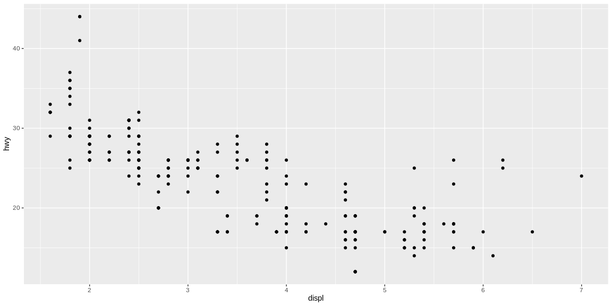

```r
# Use this R-Chunk to import all your datasets!
library(nycflights13)
```

## Background

    [X] Make an R script that has the code examples from Chapter 4 of R for data science (Links to an external site.) and Chapter 1 of Modern Drive (Links to an external site.)
    
## Data Wrangling


```r
# Use this R-Chunk to clean & wrangle your data!

#some little experiments to get familiar
r_rocks <- 2 ^ 3
r_rocks
```

```
## [1] 8
```

```r
seq(1,10)
```

```
##  [1]  1  2  3  4  5  6  7  8  9 10
```

```r
x <- "hello world"
y <- seq(1, 10, length.out = 5)
```

## Data Visualization


```r
# Use this R-Chunk to plot & visualize your data!
#Exercise
#Tweak each of the following R commands so that they run correctly:
ggplot(data = mpg) + geom_point(mapping = aes(x = displ, y = hwy))
```

<!-- -->

```r
filter(mpg, cyl == 8)
```

```
## # A tibble: 70 x 11
##    manufacturer model     displ  year   cyl trans  drv     cty   hwy fl    class
##    <chr>        <chr>     <dbl> <int> <int> <chr>  <chr> <int> <int> <chr> <chr>
##  1 audi         a6 quatt…   4.2  2008     8 auto(… 4        16    23 p     mids…
##  2 chevrolet    c1500 su…   5.3  2008     8 auto(… r        14    20 r     suv  
##  3 chevrolet    c1500 su…   5.3  2008     8 auto(… r        11    15 e     suv  
##  4 chevrolet    c1500 su…   5.3  2008     8 auto(… r        14    20 r     suv  
##  5 chevrolet    c1500 su…   5.7  1999     8 auto(… r        13    17 r     suv  
##  6 chevrolet    c1500 su…   6    2008     8 auto(… r        12    17 r     suv  
##  7 chevrolet    corvette    5.7  1999     8 manua… r        16    26 p     2sea…
##  8 chevrolet    corvette    5.7  1999     8 auto(… r        15    23 p     2sea…
##  9 chevrolet    corvette    6.2  2008     8 manua… r        16    26 p     2sea…
## 10 chevrolet    corvette    6.2  2008     8 auto(… r        15    25 p     2sea…
## # … with 60 more rows
```

```r
filter(diamonds, carat > 3)
```

```
## # A tibble: 32 x 10
##    carat cut     color clarity depth table price     x     y     z
##    <dbl> <ord>   <ord> <ord>   <dbl> <dbl> <int> <dbl> <dbl> <dbl>
##  1  3.01 Premium I     I1       62.7    58  8040  9.1   8.97  5.67
##  2  3.11 Fair    J     I1       65.9    57  9823  9.15  9.02  5.98
##  3  3.01 Premium F     I1       62.2    56  9925  9.24  9.13  5.73
##  4  3.05 Premium E     I1       60.9    58 10453  9.26  9.25  5.66
##  5  3.02 Fair    I     I1       65.2    56 10577  9.11  9.02  5.91
##  6  3.01 Fair    H     I1       56.1    62 10761  9.54  9.38  5.31
##  7  3.65 Fair    H     I1       67.1    53 11668  9.53  9.48  6.38
##  8  3.24 Premium H     I1       62.1    58 12300  9.44  9.4   5.85
##  9  3.22 Ideal   I     I1       62.6    55 12545  9.49  9.42  5.92
## 10  3.5  Ideal   H     I1       62.8    57 12587  9.65  9.59  6.03
## # … with 22 more rows
```

```r
flights
```

```
## # A tibble: 336,776 x 19
##     year month   day dep_time sched_dep_time dep_delay arr_time sched_arr_time
##    <int> <int> <int>    <int>          <int>     <dbl>    <int>          <int>
##  1  2013     1     1      517            515         2      830            819
##  2  2013     1     1      533            529         4      850            830
##  3  2013     1     1      542            540         2      923            850
##  4  2013     1     1      544            545        -1     1004           1022
##  5  2013     1     1      554            600        -6      812            837
##  6  2013     1     1      554            558        -4      740            728
##  7  2013     1     1      555            600        -5      913            854
##  8  2013     1     1      557            600        -3      709            723
##  9  2013     1     1      557            600        -3      838            846
## 10  2013     1     1      558            600        -2      753            745
## # … with 336,766 more rows, and 11 more variables: arr_delay <dbl>,
## #   carrier <chr>, flight <int>, tailnum <chr>, origin <chr>, dest <chr>,
## #   air_time <dbl>, distance <dbl>, hour <dbl>, minute <dbl>, time_hour <dttm>
```

```r
View(flights)
glimpse(flights)
```

```
## Observations: 336,776
## Variables: 19
## $ year           <int> 2013, 2013, 2013, 2013, 2013, 2013, 2013, 2013, 2013, …
## $ month          <int> 1, 1, 1, 1, 1, 1, 1, 1, 1, 1, 1, 1, 1, 1, 1, 1, 1, 1, …
## $ day            <int> 1, 1, 1, 1, 1, 1, 1, 1, 1, 1, 1, 1, 1, 1, 1, 1, 1, 1, …
## $ dep_time       <int> 517, 533, 542, 544, 554, 554, 555, 557, 557, 558, 558,…
## $ sched_dep_time <int> 515, 529, 540, 545, 600, 558, 600, 600, 600, 600, 600,…
## $ dep_delay      <dbl> 2, 4, 2, -1, -6, -4, -5, -3, -3, -2, -2, -2, -2, -2, -…
## $ arr_time       <int> 830, 850, 923, 1004, 812, 740, 913, 709, 838, 753, 849…
## $ sched_arr_time <int> 819, 830, 850, 1022, 837, 728, 854, 723, 846, 745, 851…
## $ arr_delay      <dbl> 11, 20, 33, -18, -25, 12, 19, -14, -8, 8, -2, -3, 7, -…
## $ carrier        <chr> "UA", "UA", "AA", "B6", "DL", "UA", "B6", "EV", "B6", …
## $ flight         <int> 1545, 1714, 1141, 725, 461, 1696, 507, 5708, 79, 301, …
## $ tailnum        <chr> "N14228", "N24211", "N619AA", "N804JB", "N668DN", "N39…
## $ origin         <chr> "EWR", "LGA", "JFK", "JFK", "LGA", "EWR", "EWR", "LGA"…
## $ dest           <chr> "IAH", "IAH", "MIA", "BQN", "ATL", "ORD", "FLL", "IAD"…
## $ air_time       <dbl> 227, 227, 160, 183, 116, 150, 158, 53, 140, 138, 149, …
## $ distance       <dbl> 1400, 1416, 1089, 1576, 762, 719, 1065, 229, 944, 733,…
## $ hour           <dbl> 5, 5, 5, 5, 6, 5, 6, 6, 6, 6, 6, 6, 6, 6, 6, 5, 6, 6, …
## $ minute         <dbl> 15, 29, 40, 45, 0, 58, 0, 0, 0, 0, 0, 0, 0, 0, 0, 59, …
## $ time_hour      <dttm> 2013-01-01 05:00:00, 2013-01-01 05:00:00, 2013-01-01 …
```

```r
kable(airlines)
```


carrier   name                        
--------  ----------------------------
9E        Endeavor Air Inc.           
AA        American Airlines Inc.      
AS        Alaska Airlines Inc.        
B6        JetBlue Airways             
DL        Delta Air Lines Inc.        
EV        ExpressJet Airlines Inc.    
F9        Frontier Airlines Inc.      
FL        AirTran Airways Corporation 
HA        Hawaiian Airlines Inc.      
MQ        Envoy Air                   
OO        SkyWest Airlines Inc.       
UA        United Air Lines Inc.       
US        US Airways Inc.             
VX        Virgin America              
WN        Southwest Airlines Co.      
YV        Mesa Airlines Inc.          

```r
airlines$name
```

```
##  [1] "Endeavor Air Inc."           "American Airlines Inc."     
##  [3] "Alaska Airlines Inc."        "JetBlue Airways"            
##  [5] "Delta Air Lines Inc."        "ExpressJet Airlines Inc."   
##  [7] "Frontier Airlines Inc."      "AirTran Airways Corporation"
##  [9] "Hawaiian Airlines Inc."      "Envoy Air"                  
## [11] "SkyWest Airlines Inc."       "United Air Lines Inc."      
## [13] "US Airways Inc."             "Virgin America"             
## [15] "Southwest Airlines Co."      "Mesa Airlines Inc."
```

```r
glimpse(airports)
```

```
## Observations: 1,458
## Variables: 8
## $ faa   <chr> "04G", "06A", "06C", "06N", "09J", "0A9", "0G6", "0G7", "0P2", …
## $ name  <chr> "Lansdowne Airport", "Moton Field Municipal Airport", "Schaumbu…
## $ lat   <dbl> 41.13047, 32.46057, 41.98934, 41.43191, 31.07447, 36.37122, 41.…
## $ lon   <dbl> -80.61958, -85.68003, -88.10124, -74.39156, -81.42778, -82.1734…
## $ alt   <dbl> 1044, 264, 801, 523, 11, 1593, 730, 492, 1000, 108, 409, 875, 1…
## $ tz    <dbl> -5, -6, -6, -5, -5, -5, -5, -5, -5, -8, -5, -6, -5, -5, -5, -5,…
## $ dst   <chr> "A", "A", "A", "A", "A", "A", "A", "A", "U", "A", "A", "U", "A"…
## $ tzone <chr> "America/New_York", "America/Chicago", "America/Chicago", "Amer…
```

```r
?flights
```

## Conclusions
