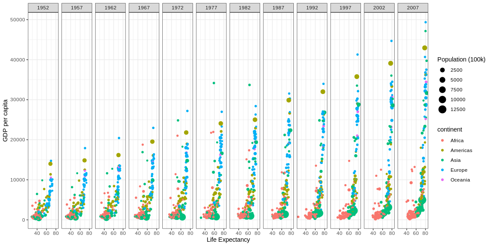
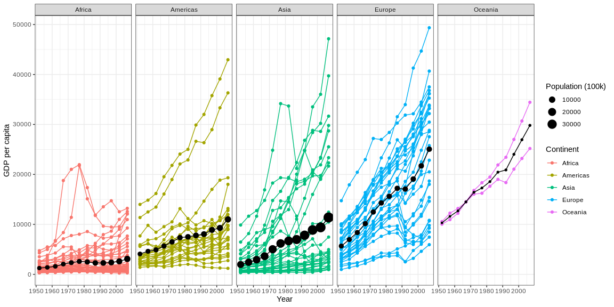

```r
# Use this R-Chunk to import all your datasets!
library(gapminder)
```

## Background

[ ] Recreate the two graphics shown below using gapminder dataset from library(gapminder) (get them to match as closely as you can)

    [ ] Remove Kuwait from the data
    [ ] Use library(tidyverse) to load ggplot2 and dplyr and the theme_bw() to duplicate the first plot
    [ ] Use scale_y_continuous(trans = "sqrt") to get the correct scale on the y-axis.
    [ ] Build weighted average data set using weighted.mean() and GDP with summarise() and group_by() that will be the black continent average line on the second plot
    [ ] Use theme_bw() to duplicate the second plot. You will need to use the new data to make the black lines and dots showing the continent average.
    [ ] Use ggsave() and save each plot as a .png with a width of 15 inches


## Data Wrangling


```r
# Use this R-Chunk to clean & wrangle your data!
# remove Kuwait from the data frame
data <- filter(gapminder, country != "Kuwait")
data2 <- filter(gapminder, country != "Kuwait")

weighted_mean <- data2 %>%
  group_by(continent, year) %>%
  summarise(
    weighted_mean = weighted.mean(gdpPercap, na.rm = TRUE), 
    pop2 = sum(as.numeric(pop), na.rm = TRUE)
  )
#default theme 
theme_set(theme_bw()) 
#View(data)
```

## Data Visualization


```r
# Use this R-Chunk to plot & visualize your data!
#first plot
ggplot(data = data, mapping = aes(x=lifeExp, y=gdpPercap)) + 
  geom_point(aes(col = continent, size = pop/100000)) + 
  facet_wrap(~year, nrow = 1) + 
  labs(y = "GDP per capita", x = "Life Expectancy", size = "Population (100k)")
```

<!-- -->

```r
#second plot
ggplot(data = data2) + 
  geom_line(mapping = aes(x = year, y = gdpPercap, group = country,  color = continent)) +  
  geom_point(data = data2, aes(x = year, y = gdpPercap, color = continent)) + 
  geom_line(data = weighted_mean, aes(x = year, y = weighted_mean)) + 
  geom_point(data = weighted_mean, aes(x = year, y = weighted_mean, size = pop2/100000)) +  
  facet_wrap(~continent, nrow = 1) +
  labs(y = "GDP per capita", x = "Year", size = "Population (100k)", color = "Continent")
```

<!-- -->

## Conclusions


GDP over the years has favored Europe and Americas, Oceania also seems high but there might be some factors that are not clear.
