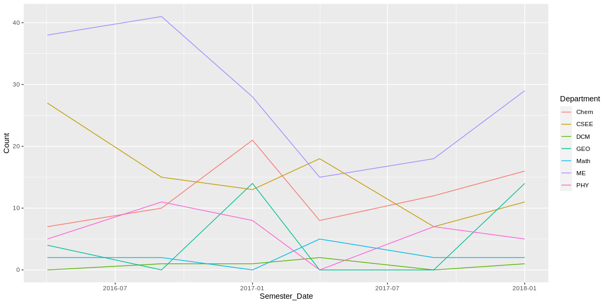
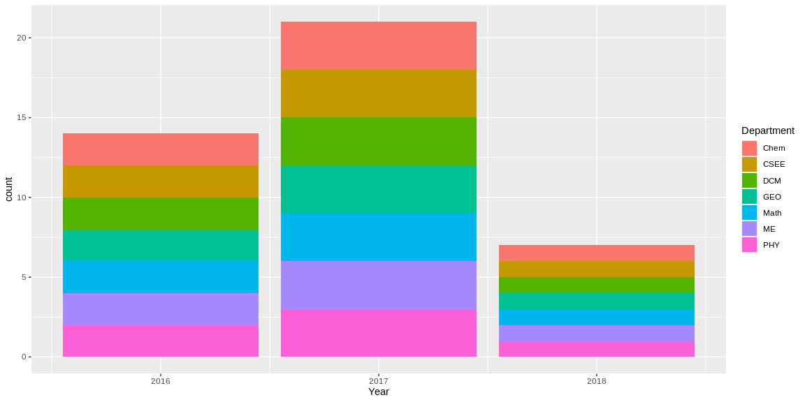

```r
# Use this R-Chunk to import all your datasets!
```

## Background

[ ] Take notes on your reading of the specified ‘R for Data Science’ chapter in a ‘.R’ script or ‘.md’ file.

## Notes

View() shows you all the data.
Tibbles are DataFrames

DataTypes
int -  stands for integers.
dbl - stands for doubles, or real numbers.
chr - stands for character vectors, or strings.
dttm - stands for date-times (a date + a time).
lgl - stands for logical, vectors that contain only TRUE or FALSE.
fctr - stands for factors, which R uses to represent categorical variables with fixed possible values.
date - stands for dates.

dplyr

Pick observations by their values - (filter()).
Reorder the rows - (arrange()).
Pick variables by their names - (select()).
Create new variables with functions of existing variables - (mutate()).
Collapse many values down to a single summary - (summarise()).

filter() allows you to subset observations based on their values.

Instead of relying on ==, use near()
 
arrange() works similarly to filter() except that instead of selecting rows, it changes their order.

How could you use arrange() to sort all missing values to the start? (Hint: use is.na()).


starts_with("abc"): matches names that begin with “abc”.

ends_with("xyz"): matches names that end with “xyz”.

contains("ijk"): matches names that contain “ijk”.

matches("(.)\\1"): selects variables that match a regular expression. This one matches any variables that contain repeated characters. You’ll learn more about regular expressions in strings.

num_range("x", 1:3): matches x1, x2 and x3.

use select() in conjunction with the everything() helper

mutate() always adds new columns at the end of your dataset so we’ll start by creating a narrower dataset so we can see the new variables.

summarise(). It collapses a data frame to a single row

na.rm argument which removes the missing values prior to computation

Measures of spread: sd(x), IQR(x), mad(x). The root mean squared deviation, or standard deviation sd(x), is the standard measure of spread. The interquartile range IQR(x) and median absolute deviation mad(x) are robust equivalents that may be more useful if you have outliers.

Measures of rank: min(x), quantile(x, 0.25), max(x). Quantiles are a generalisation of the median.

Measures of position: first(x), nth(x, 2), last(x)

## Questions Data can Answer

Do stocks follow a patter for growth?

-On a very basic level stock chart patterns are a way of viewing a series of price actions which occur during a stock trading period. It can be over any time frame – monthly, weekly, daily and intra-day. The great thing about chart patterns is that they tend to repeat themselves over and over again. This repetition helps to appeal to our human psychology and trader psychology in particular. (Data Scientis Feedback) Kirk Du Plessis

https://optionalpha.com/13-stock-chart-patterns-that-you-cant-afford-to-forget-10585.html

How does the value of stocks change through the passing of time?

-According to Bloomberg, "The history of stock prices is relatively thin. Say you’re trying to predict how stocks will perform over a one-year horizon. Because we only have decent records back to 1900, there are only 118 nonoverlapping one-year periods to look at in the United States." 
-“Alternative data are these weird, proxy signals to help track the underlying financials of a company,” says first author Michael Fleder, a postdoc in the Laboratory for Information and Decision Systems (LIDS), in an MIT News article. “We asked, ‘Can you combine these noisy signals with quarterly numbers to estimate the true financials of a company at high frequencies?’ Turns out the answer is yes.”
57 percent might not seem like a lot, but even a small advantage can net investors billions of dollars.
https://blog.galvanize.com/can-data-science-predict-the-stock-market/ 


## Data Wrangling


```r
# Use this R-Chunk to clean & wrangle your data!
data <- read_csv("https://byuistats.github.io/M335/data/rcw.csv", col_types = cols(Semester_Date = col_date(format = "%m/%d/%y"), Semester = col_factor(levels = c("Winter", "Spring", "Fall"))))
View(data)
```

## Data Visualization


```r
# Use this R-Chunk to plot & visualize your data!
# Visualitation 1
ggplot(data, aes(Semester_Date, Count, colour = Department)) + geom_line()
```

<!-- -->

```r
# Visualization 2
g <- ggplot(data, aes(Year))
g + geom_bar(aes(fill = Department))
```

<!-- -->

## Conclusions

What is the growth over time trend by department of RC&W attendance?
-The most obvious thing at first glance is that in general the participation of every department has decreased over the years.
-The ME department has the highest participation.
-The CSEE deparment had an increase in 2017 contrary to almost all other departments.
-DCM has the lowest participation rates amongst all the departments.
