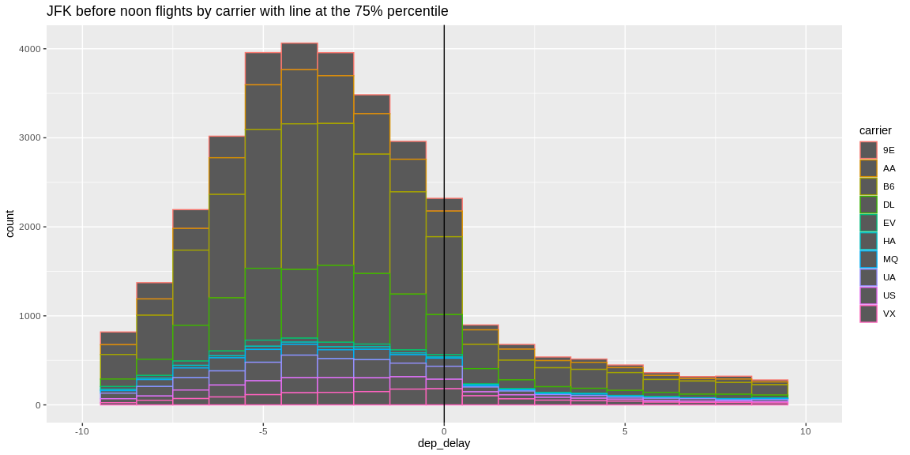
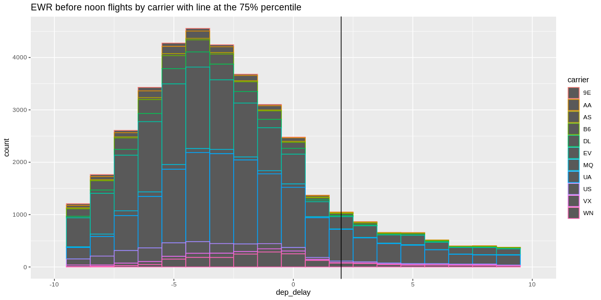
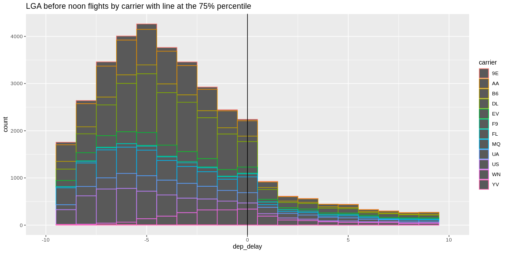
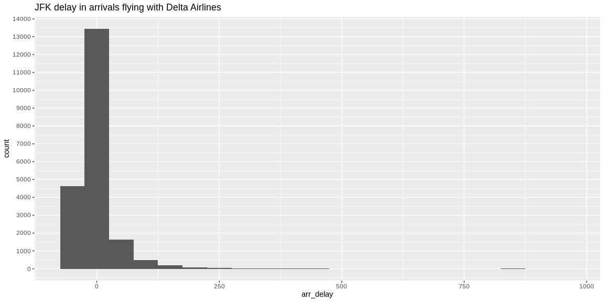
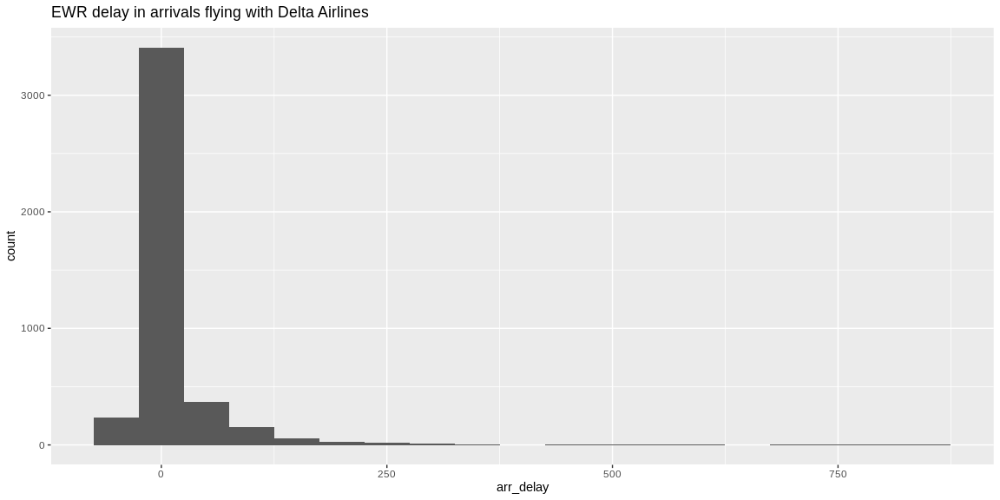
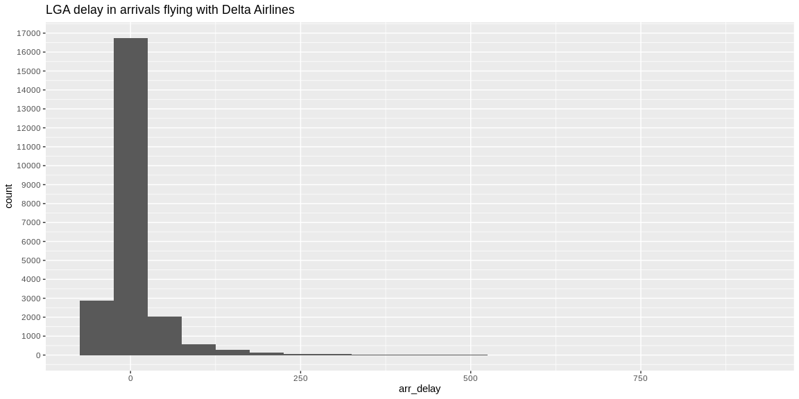

```r
# Use this R-Chunk to import all your datasets!
flights <- flights
airlines <- airlines
View(airlines)
```

## Background

You just started your internship at a big firm in New York, and your manager gave you an extensive file of flights that departed JFK, LGA, or EWR in 2013. From this data (nycflights13::flights), your manager wants you to answer the following questions:

    1.If I am leaving before noon, which two airlines do you recommend at each airport (JFK, LGA, EWR) that will       have the lowest delay time at the 75th percentile?
    2.Which origin airport is best to minimize my chances of a late arrival when I am using Delta Airlines?
    3.Which destination airport is the worst (you decide on the metric for worst) airport for arrival time?
    

Tasks

    [ ] Address at least two of the three questions in the background description (if you have time try to tackle all three)
    [ ] Make sure to include one or more visualization that shows the complexity of the data. (i.e. avoid bar graphs of summaries only)
    [ ] Create one .rmd file that has your report
        [ ] Have a section for each question
        [ ] Make sure your code is in the report but defaults to hidden
        [ ] Write an introduction section that describes your results
        [ ] Make a plot of the data to show the answer to the specific question
    [ ] Push your .Rmd, .md, and .html to your GitHub repo
    [ ] Be prepared to discuss your analysis in the upcoming class
    [ ] Complete the recommended reading on posting issues.
    [ ] Find two other student’s compiled files in their repository and provide feedback using the issues feature in GitHub (If they already have three issues find a different student to critique). Just leave the issue at the top level of the repository.
    [ ] Address 1-2 of the issues posted on your project and push the updates to GitHub


## Data Wrangling


```r
# question 1
# get all flights before noon by airport
flights_before_noon <- filter(flights, hour < 12)
summary(flights_before_noon)
```

```
##       year          month             day           dep_time   
##  Min.   :2013   Min.   : 1.000   Min.   : 1.00   Min.   : 445  
##  1st Qu.:2013   1st Qu.: 4.000   1st Qu.: 8.00   1st Qu.: 705  
##  Median :2013   Median : 7.000   Median :16.00   Median : 827  
##  Mean   :2013   Mean   : 6.562   Mean   :15.72   Mean   : 842  
##  3rd Qu.:2013   3rd Qu.:10.000   3rd Qu.:23.00   3rd Qu.: 959  
##  Max.   :2013   Max.   :12.000   Max.   :31.00   Max.   :2324  
##                                                  NA's   :2079  
##  sched_dep_time     dep_delay           arr_time    sched_arr_time
##  Min.   : 106.0   Min.   : -26.000   Min.   :  17   Min.   : 245  
##  1st Qu.: 700.0   1st Qu.:  -6.000   1st Qu.: 929   1st Qu.: 933  
##  Median : 829.0   Median :  -3.000   Median :1049   Median :1052  
##  Mean   : 840.6   Mean   :   3.944   Mean   :1074   Mean   :1077  
##  3rd Qu.: 959.0   3rd Qu.:   1.000   3rd Qu.:1222   3rd Qu.:1221  
##  Max.   :1159.0   Max.   :1301.000   Max.   :2308   Max.   :1653  
##                   NA's   :2079       NA's   :2194                 
##    arr_delay          carrier              flight       tailnum         
##  Min.   : -79.000   Length:131021      Min.   :   1   Length:131021     
##  1st Qu.: -18.000   Class :character   1st Qu.: 507   Class :character  
##  Median :  -8.000   Mode  :character   Median :1415   Mode  :character  
##  Mean   :  -1.823                      Mean   :1893                     
##  3rd Qu.:   5.000                      3rd Qu.:3363                     
##  Max.   :1272.000                      Max.   :8500                     
##  NA's   :2435                                                           
##     origin              dest              air_time        distance   
##  Length:131021      Length:131021      Min.   : 20.0   Min.   :  17  
##  Class :character   Class :character   1st Qu.: 88.0   1st Qu.: 541  
##  Mode  :character   Mode  :character   Median :133.0   Median : 944  
##                                        Mean   :153.1   Mean   :1065  
##                                        3rd Qu.:191.0   3rd Qu.:1389  
##                                        Max.   :691.0   Max.   :4983  
##                                        NA's   :2435                  
##       hour            minute        time_hour                  
##  Min.   : 1.000   Min.   : 0.00   Min.   :2013-01-01 05:00:00  
##  1st Qu.: 7.000   1st Qu.: 5.00   1st Qu.:2013-04-04 10:00:00  
##  Median : 8.000   Median :25.00   Median :2013-07-04 06:00:00  
##  Mean   : 8.162   Mean   :24.44   Mean   :2013-07-03 10:38:04  
##  3rd Qu.: 9.000   3rd Qu.:40.00   3rd Qu.:2013-10-01 08:00:00  
##  Max.   :11.000   Max.   :59.00   Max.   :2013-12-31 11:00:00  
## 
```

```r
jfk_before_noon <- filter(flights_before_noon, origin == "JFK")
ewr_before_noon <- filter(flights_before_noon, origin == "EWR")
lga_before_noon <- filter(flights_before_noon, origin == "LGA")
#question 2
jfk_origin_delta <- filter(flights, origin == "JFK" & carrier == "DL")
ewr_origin_delta <- filter(flights, origin == "EWR" & carrier == "DL")
lga_origin_delta <- filter(flights, origin == "LGA" & carrier == "DL")
```

## Data Visualization


```r
#JFK
ggplot(data = jfk_before_noon, aes(x = dep_delay, color = carrier)) + geom_histogram(binwidth = 1) + xlim(-10,10) + labs(title = "JFK before noon flights by carrier with line at the 75% percentile") + geom_vline(aes(xintercept = quantile(dep_delay,0.75, na.rm = TRUE)))
```

<!-- -->

```r
#EWR
ggplot(data = ewr_before_noon, aes(x = dep_delay, color = carrier)) + geom_histogram(binwidth = 1) + xlim(-10,10) + labs(title = "EWR before noon flights by carrier with line at the 75% percentile") + geom_vline(aes(xintercept = quantile(dep_delay,0.75, na.rm = TRUE)))
```

<!-- -->

```r
#LGA
ggplot(data = lga_before_noon, aes(x = dep_delay, color = carrier)) + geom_histogram(binwidth = 1) + xlim(-10,10) + labs(title = "LGA before noon flights by carrier with line at the 75% percentile") + geom_vline(aes(xintercept = quantile(dep_delay,0.75, na.rm = TRUE)))
```

<!-- -->

## Question 1

If I am leaving before noon, which two airlines do you recommend at each airport (JFK, LGA, EWR) that will  have the lowest delay time at the 75th percentile?

Response: as we can see in the graphs which is already filtered for the data of all flights before noon, the  two most recommendable airlines are:
<br>
-JFK -> VX (Virgin America) and US (US Airways Inc.)<br>
-EWR -> VX (Virgin America) and WN (Southwest Airlines Co.)<br>
-LGA -> YV (Mesa Airlines Inc.) and WN (Southwest Airlines Co.)
  
As marked by the black vertical line representing the 75% percentile.


```r
# Use this R-Chunk to plot & visualize your data!
#JFK
ggplot(data = jfk_origin_delta, aes(x = arr_delay)) + geom_histogram(binwidth = 50) + scale_y_continuous(breaks = seq(0, 20000, by = 1000)) + labs(title = "JFK delay in arrivals flying with Delta Airlines")
```

<!-- -->

```r
#EWR
ggplot(data = ewr_origin_delta, aes(x = arr_delay)) + geom_histogram(binwidth = 50) + scale_y_continuous(breaks = seq(0, 20000, by = 1000)) + labs(title = "EWR delay in arrivals flying with Delta Airlines")
```

<!-- -->

```r
#LGA
ggplot(data = lga_origin_delta, aes(x = arr_delay)) + geom_histogram(binwidth = 50) + scale_y_continuous(breaks = seq(0, 20000, by = 1000)) + labs(title = "LGA delay in arrivals flying with Delta Airlines")
```

<!-- -->

```r
c(count(jfk_origin_delta), count(ewr_origin_delta), count(lga_origin_delta))
```

```
## $n
## [1] 20701
## 
## $n
## [1] 4342
## 
## $n
## [1] 23067
```

## Question 2
Which origin airport is best to minimize my chances of a late arrival when I am using Delta Airlines?

Response:
There is this number of flights in time in each origin airport flying with delta, compared with the number of flights:<br>
-JFK: approx 13400 of 20559<br>
-EWR: approx 3800 of 4295<br>
-LGA: approx 16700 of 22804<br>
dividing and getting the accuracies we can conclude that:<br>
-JFK: approx 65%<br>
-EWR: approx 88%<br>
-LGA: approx 73%<br>
The best airport to avoid arrival delays is EWR


