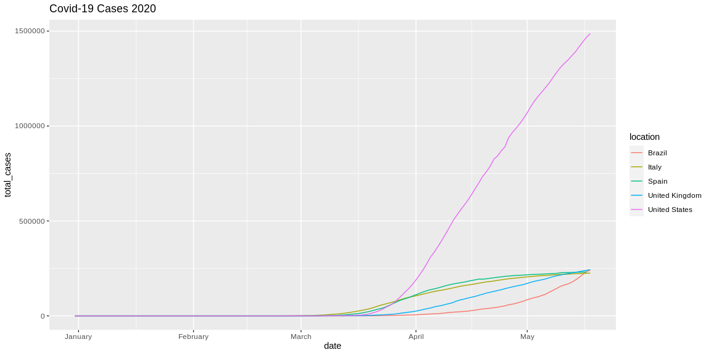
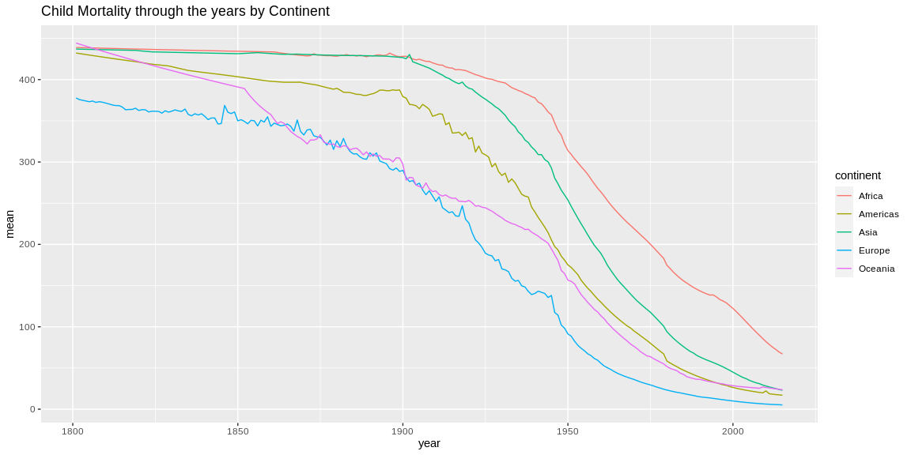

```r
# Use this R-Chunk to import all your datasets!
path <- getwd()
if (!is.null(path)) setwd(path)
covid <- read.csv("./owid-covid-data.csv")
```

## Background

    [ ] Take notes on your reading of the specified ‘R for Data Science’ chapter in the README.md or in a ‘.R’ script in the class task folder
    [ ] Review the Our World in Data (Links to an external site.) webpage and find a graphic that interests you.
        [ ] Recreate that graphic in R after downloading the data from their website
    [ ] Explore the world data on child_mortality and create an interesting graphic that highlights this dataset.
        [ ] Use devtools::install_github("drsimonj/ourworldindata") to get a larger dataset on child_mortality. This will require install.packages("devtools").
        [ ] Create a graphic that you could use in a presentation to summarize world child mortality
    [ ] Include your plots in an .Rmd file with short paragraph describing your plots
    [ ] Push your .Rmd, .md, and .html to your GitHub repo

## Notes

-Cmd/Ctrl + Enter. This executes the current R expression in the console
-Cmd/Ctrl + Shift + S. Execute the complete script in one step 
-Always start your script with the packages that you need. That way, if you share your code with others, they can easily see what packages they need to install.
-Never include install.packages() or setwd() in a script that you share. 

READ FILES

-read_csv() reads comma delimited files
-read_csv2() reads semicolon separated files
-read_tsv() reads tab delimited files
-read_delim() reads in files with any delimiter
-read_fwf() reads fixed width files. You can specify fields either by their widths with fwf_widths() or their position with fwf_positions()
-read_table() reads a common variation of fixed width files where columns are separated by white space
-read_log() reads Apache style log files

HANDLE DF

-skip = n to skip the first n lines; or use comment = "#" to drop all lines that start with (e.g.) #
-col_names = FALSE to tell read_csv() not to treat the first row as headings, and instead label them sequentially from X1 to Xn
- you can pass col_names a character vector which will be used as the column names
-na = "replacement char" takes care of values labled as NA
-parse_*() functions. These functions take a character vector and return a more specialised vector like a logical, integer, or date
-If there are many parsing failures, you’ll need to use problems() to get the complete set. This returns a tibble, wparse_logical(), hich you can then manipulate with dplyr.
-parse_integer(), parse_logical(), parse_double(), parse_number(), parse_character(), parse_factor(), parse_datetime(), parse_date(), parse_time()
-guess_parser(), which returns readr’s best guess, and parse_guess() which uses that guess to parse the column
-If you’re having major parsing problems, sometimes it’s easier to just read into a character vector of lines with read_lines(), or even a character vector of length 1 with read_file()
-write_csv() and write_tsv(). Both functions increase the chances of the output file being read back in correctly
-If you want to export a csv file to Excel, use write_excel_csv()
-write_rds() and read_rds() are uniform wrappers around the base functions readRDS() and saveRDS(). These store data in R’s custom binary format called RDS
-haven reads SPSS, Stata, and SAS files
-readxl reads excel files (both .xls and .xlsx)
-DBI, along with a database specific backend (e.g. RMySQL, RSQLite, RPostgreSQL etc) allows you to run SQL queries against a database and return a data frame
-jsonlite (by Jeroen Ooms) for json, and xml2 for XML

Graphics for Communication

-You add labels with the labs() function
-subtitle adds additional detail in a smaller font beneath the title
-caption adds text at the bottom right of the plot, often used to describe the source of the data
-switch "" out for quote() to use mathematical equations
-geom_label() which draws a rectangle behind the text
-nudge_y parameter to move the labels slightly above the corresponding points
-theme(legend.position = "none") turns the legend off 
-place the text exactly on the borders of the plot, you can use +Inf and -Inf
-stringr::str_wrap() to automatically add line breaks, given the number of characters you want per line
-Use geom_hline() and geom_vline() to add reference lines
-To zoom in on a region of the plot, it’s generally best to use coord_cartesian()
-ggplot2 includes eight themes by default,
-ggsave() and knitr. ggsave() will save the most recent plot to disk

## Data Wrangling


```r
# Use this R-Chunk to clean & wrangle your data!
covid_narrowed <- select(filter(covid, location == "United Kingdom" | location == "Brazil" | location == "Spain" | location == "United States" | location == "Italy"), location, date, total_cases)
covid_narrowed$date <- as.Date(covid_narrowed$date)

#child mortality narrowed
cm <- child_mortality
child_mort_narrowed <- na.omit(select(filter(cm, year > 1800), year, continent, child_mort))
mean_cm <- child_mort_narrowed %>%
  group_by(year, continent) %>%
  summarise(
    mean = mean(child_mort, na.rm = TRUE)
  )
```

## Data Visualization


```r
# Covid-19 cases from .csv
ggplot() + geom_line(data = covid_narrowed, aes(x = date, y = total_cases, group = location, colour = location)) + scale_x_date( date_labels = "%B") + ggtitle("Covid-19 Cases 2020")
```

<!-- -->

```r
#child mortality
ggplot() + geom_line(data = mean_cm, aes(x = year, y = mean, group = continent, colour = continent))  + ggtitle("Child Mortality through the years by Continent")
```

<!-- -->


## Conclusions
For plot number 1 we can clearly see that the US cases are the most, however from their population this might still represent a small percentage.
For the second plot we see that child mortality has decreased significantly in all continents, however Africa is still fighting.
