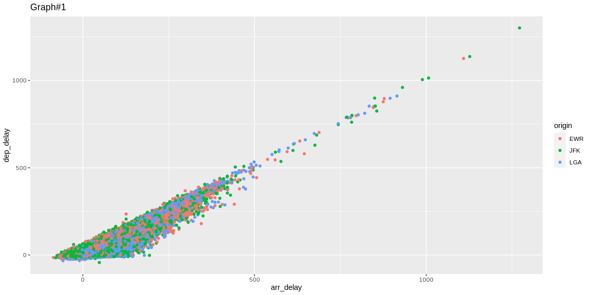
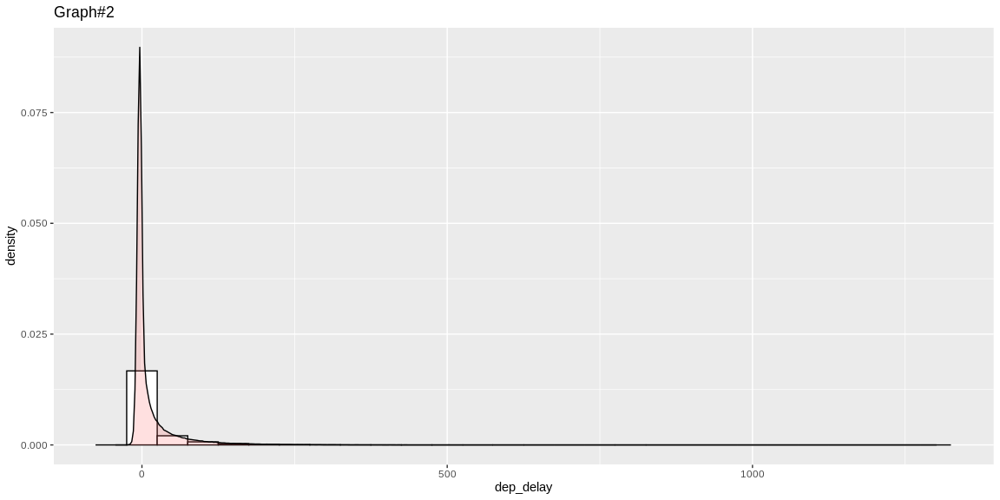
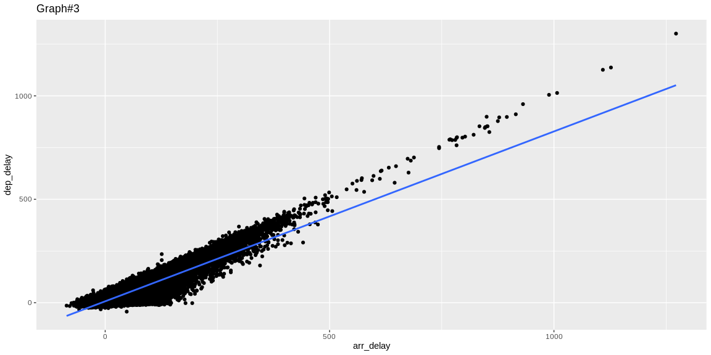

```r
# Use this R-Chunk to import all your datasets!
flights <- flights
```

## Background

Use nycflights13::flights to practice your data summary and data investigation through visualization skills.
    [ ] Find an insightfull relationship between two of the variables (columns) and display that relationship in a table or graphic
        [ ] Provide a distributional summary of the relevant variable in nycflights13::flights
        [ ] Build bivariate summaries of the relevant variables
        [ ] Keep a record of all the code your wrote as you explored the dataset looking for an insightfull relationship
    [ ] Create an .R script that has your data visualization development with 1-2 commented paragraphs summarizing your 2 finalized graphics and the choices you made in the data presentation
    [ ] Save your .png images using of each your final graphics and push all your work to your repository.


## Data Wrangling


```r
# Use this R-Chunk to clean & wrangle your data!

flights <- na.omit(flights)
```

## Data Visualization


```r
# Use this R-Chunk to plot & visualize your data!
#d <- count(flights , vars = origin)

ggplot(data = flights, mapping = aes(x = arr_delay, y = dep_delay, color = origin )) + geom_point() + labs(title = "Graph#1")
```

<!-- -->

```r
# Use this R-Chunk to plot & visualize your data!
quantile(flights$dep_delay)
```

```
##   0%  25%  50%  75% 100% 
##  -43   -5   -2   11 1301
```

```r
summary(flights$dep_delay)
```

```
##    Min. 1st Qu.  Median    Mean 3rd Qu.    Max. 
##  -43.00   -5.00   -2.00   12.56   11.00 1301.00
```

```r
ggplot(flights, aes(x=dep_delay)) + geom_histogram(aes(y=..density..), binwidth=50, colour="black", fill="white") + geom_density(alpha=.2, fill="#FF6666") + labs(title = "Graph#2")
```

<!-- -->

```r
#bivariate summary
summary(c(flights$dep_delay, flights$arr_delay))
```

```
##     Min.  1st Qu.   Median     Mean  3rd Qu.     Max. 
##  -86.000   -8.000   -2.000    9.725   12.000 1301.000
```

```r
t.test(flights$dep_delay, flights$arr_delay)
```

```
## 
## 	Welch Two Sample t-test
## 
## data:  flights$dep_delay and flights$arr_delay
## t = 53.989, df = 647205, p-value < 2.2e-16
## alternative hypothesis: true difference in means is not equal to 0
## 95 percent confidence interval:
##  5.454313 5.865245
## sample estimates:
## mean of x mean of y 
## 12.555156  6.895377
```

```r
ggplot(d=flights, aes(x = arr_delay, y = dep_delay)) + geom_point() + stat_smooth(method ="lm", se = FALSE) + labs(title = "Graph#3")
```

<!-- -->
## Conclusions

Graph#1:
Some observations from Graph#1 are that most of the delayed flights come from the JFK airport, from this relationship between departure and arraival time we can also see, obviously, that they have a strong linear correlation.

Graph#2:
From the summary and the graph we can see that the departure delay in its majority is distributed around 0 with a few negative values (meaning that it departed early), and some extreme outliers over 1000 minutes of delay which is around 16.6 hours

Graph#3:
The straight line is a first order polynomial with two parameters, arr_delay and dep_delay, that define an equation that best describes the relationship between the two variables
