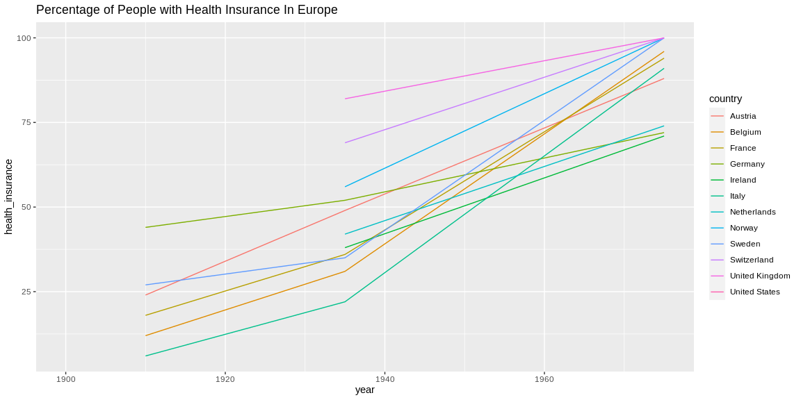

```r
# Use this R-Chunk to import all your datasets!
financing_healthcare <- financing_healthcare
#View(financing_healthcare)
```

## Background


    [ ] Take notes on your reading of the specified ‘R for Data Science’ chapter in the README.md or in a ‘.R’ script in the class task folder
    [ ] Explore the world data on financing_healthcare and create an interesting graphic that highlights this dataset in relation to child mortality.
        [ ] Use devtools::install_github("drsimonj/ourworldindata") to get a larger dataset on financing_healthcare
        [ ] Create a graphic that you could use in a final presentation to summarize world child mortality (child_mort column)
    [ ] Push your .Rmd, .md, and .html to your GitHub repo

## R for Data Science - Chapter 7

-A variable is a quantity, quality, or property that you can measure.

-A value is the state of a variable when you measure it. The value of a variable may change from measurement to measurement.

-An observation is a set of measurements made under similar conditions (you usually make all of the measurements in an observation at the same time and on the same object). An observation will contain several values, each associated with a different variable. I’ll sometimes refer to an observation as a data point.

-Tabular data is a set of values, each associated with a variable and an observation. Tabular data is tidy if each value is placed in its own “cell”, each variable in its own column, and each observation in its own row.

-Variation is the tendency of the values of a variable to change from measurement to measurement

-A variable is categorical if it can only take one of a small set of values
-A variable is continuous if it can take any of an infinite set of ordered values

-If you wish to overlay multiple histograms in the same plot, I recommend using geom_freqpoly() instead of geom_histogram(). geom_freqpoly() performs the same calculation as geom_histogram()
-To make it easy to see the unusual values, we need to zoom to small values of the y-axis with coord_cartesian()

-Drop the entire row with the strange values diamonds2 <- diamonds %>% filter(between(y, 3, 20))
-replacing the unusual values with missing values. The easiest way to do this is to use mutate() to replace the variable with a modified copy. You can use the ifelse() function to replace unusual values with NA diamonds2 <- diamonds %>% mutate(y = ifelse(y < 3 | y > 20, NA, y))

-Covariation is the tendency for the values of two or more variables to vary together in a related way

-If you have long variable names, geom_boxplot() will work better if you flip it 90°. You can do that with coord_flip()

## Data Wrangling


```r
# Use this R-Chunk to clean & wrangle your data!
summary(financing_healthcare)
```

```
##       year        country           continent         health_exp_total 
##  Min.   :1761   Length:36873       Length:36873       Min.   :   4.93  
##  1st Qu.:1859   Class :character   Class :character   1st Qu.:  93.05  
##  Median :1921   Mode  :character   Mode  :character   Median : 298.79  
##  Mean   :1917                                         Mean   : 653.20  
##  3rd Qu.:1977                                         3rd Qu.: 828.20  
##  Max.   :2015                                         Max.   :6863.65  
##                                                       NA's   :33311    
##  health_exp_public health_insurance    nhs_exp      health_exp_private
##  Min.   :0.00      Min.   :  6.00   Min.   :3.36    Min.   :3.03      
##  1st Qu.:0.48      1st Qu.: 34.00   1st Qu.:5.42    1st Qu.:3.27      
##  Median :2.55      Median : 54.00   Median :5.69    Median :4.58      
##  Mean   :3.14      Mean   : 58.18   Mean   :6.16    Mean   :5.38      
##  3rd Qu.:5.80      3rd Qu.: 88.75   3rd Qu.:7.54    3rd Qu.:7.23      
##  Max.   :8.80      Max.   :100.00   Max.   :9.10    Max.   :9.05      
##  NA's   :36775     NA's   :36845    NA's   :36846   NA's   :36856     
##  health_insurance_govt health_insurance_private health_insurance_any
##  Min.   :23.30         Min.   :63.90            Min.   :83.70       
##  1st Qu.:24.77         1st Qu.:67.30            1st Qu.:84.60       
##  Median :26.40         Median :70.30            Median :84.85       
##  Mean   :27.25         Mean   :69.49            Mean   :85.31       
##  3rd Qu.:28.10         3rd Qu.:71.65            3rd Qu.:86.03       
##  Max.   :36.50         Max.   :75.50            Max.   :89.60       
##  NA's   :36845         NA's   :36845            NA's   :36845       
##  health_exp_public_percent health_exp_oop_percent no_health_insurance
##  Min.   : 0.33             Min.   : 0.03          Min.   : 9.10      
##  1st Qu.:42.08             1st Qu.:17.62          1st Qu.:13.25      
##  Median :57.77             Median :31.56          Median :14.60      
##  Mean   :57.26             Mean   :34.13          Mean   :14.29      
##  3rd Qu.:73.31             3rd Qu.:49.08          3rd Qu.:14.90      
##  Max.   :99.97             Max.   :99.67          Max.   :24.30      
##  NA's   :33330             NA's   :33330          NA's   :36834      
##       gdp           life_expectancy   child_mort   
##  Min.   :   246.7   Min.   :19.50   Min.   :  2.0  
##  1st Qu.:  2897.2   1st Qu.:54.98   1st Qu.:124.8  
##  Median :  8348.8   Median :66.32   Median :369.2  
##  Mean   : 14733.5   Mean   :63.26   Mean   :293.6  
##  3rd Qu.: 20018.4   3rd Qu.:71.81   3rd Qu.:425.2  
##  Max.   :136135.5   Max.   :83.83   Max.   :756.3  
##  NA's   :31510      NA's   :24569   NA's   :3632
```

```r
colSums(is.na(financing_healthcare))
```

```
##                      year                   country                 continent 
##                         0                         0                      2097 
##          health_exp_total         health_exp_public          health_insurance 
##                     33311                     36775                     36845 
##                   nhs_exp        health_exp_private     health_insurance_govt 
##                     36846                     36856                     36845 
##  health_insurance_private      health_insurance_any health_exp_public_percent 
##                     36845                     36845                     33330 
##    health_exp_oop_percent       no_health_insurance                       gdp 
##                     33330                     36834                     31510 
##           life_expectancy                child_mort 
##                     24569                      3632
```

```r
insurance <- filter(financing_healthcare, health_insurance != is.na(health_insurance) | no_health_insurance != is.na(no_health_insurance))
#View(insurance)
#colSums(is.na(financing_healthcare_no_na))
```

## Data Visualization


```r
# General Child Mortality
ggplot(financing_healthcare, aes(x=child_mort, color= continent, fill = continent)) + geom_histogram(binwidth = 20) + geom_vline(aes(xintercept = mean(subset(child_mort, continent == "Africa"), na.rm = TRUE), color="Africa")) +
geom_vline(aes(xintercept = mean(subset(child_mort, continent == "Americas"), na.rm = TRUE), color="Americas")) +
geom_vline(aes(xintercept = mean(subset(child_mort, continent == "Asia"), na.rm = TRUE), color="Asia")) +
geom_vline(aes(xintercept = mean(subset(child_mort, continent == "Europe"), na.rm = TRUE), color="Europe")) +
geom_vline(aes(xintercept = mean(subset(child_mort, continent == "Oceania"), na.rm = TRUE), color="Oceania")) +
scale_x_continuous(breaks = seq(0,600, by = 50)) + labs(title = "Child Mortality in each continent with the mean as a vertical line")
```

<!-- -->

```r
#no health insurance USA
ggplot(insurance, aes(x=year, y = no_health_insurance)) + geom_line() + scale_x_continuous(breaks = seq(1950,2020, by = 10)) + labs(title = "Percentage of People without healh insurance in the USA")
```

<!-- -->

```r
# health insurance coverage Europe
ggplot(insurance, aes(x=year, y = health_insurance, color = country)) + geom_line() + xlim(1900,1975) + labs(title = "Percentage of People with Health Insurance In Europe")
```

<!-- -->

## Conclusions

We can observe that the mean (average) for Africa (~350) and Asia (~320) are the highest.
Also the data is distributed most frequently in the ~400 for most of the continents. Meaning that most of the countries in that continent ahve around that score.
