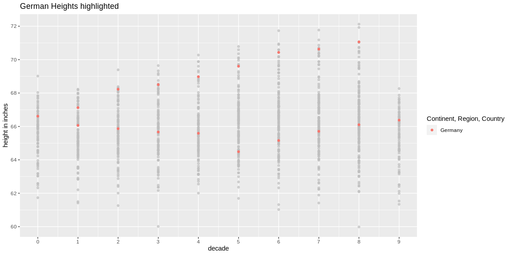
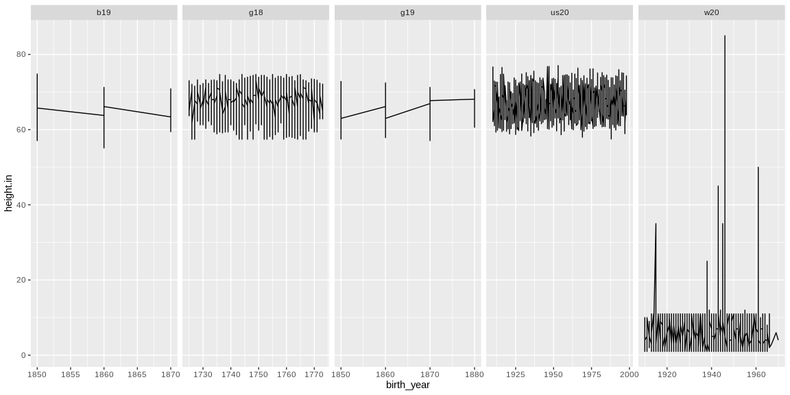

```r
tmp <- tempfile(fileext = ".xlsx")
download(url = "https://byuistats.github.io/M335/data/heights/Height.xlsx", destfile = tmp, mode="wb")
estimates <- read_xlsx(tmp, col_names = TRUE, range = "A3:GU309")
unlink(tmp)
#View(estimates)

#PART 2
german_male <- read_dta("https://byuistats.github.io/M335/data/heights/germanconscr.dta")

german_conscripts <- read_dta("https://byuistats.github.io/M335/data/heights/germanprison.dta")

tmp2 <- tempfile(fileext = ".zip")
download(url = "https://byuistats.github.io/M335/data/heights/Heights_south-east.zip", destfile = tmp2, mode="wb")
#check what files are in there
unzip(as.character(tmp2), list = TRUE)
```

```
##        Name  Length                Date
## 1 B6090.DBF 2519688 1996-08-15 16:23:00
## 2 b6090.rtf    6873 2002-04-19 14:18:00
```

```r
german_18_cen <- read.dbf(unzip(as.character(tmp2), "B6090.DBF"))
unlink(tmp2)

#There is no birth year, so just assume mid-20th century and use 1950 as birth year
bureau_height <- read_csv("https://github.com/hadley/r4ds/raw/master/data/heights.csv")

wisconsin <- read_sav("http://www.ssc.wisc.edu/nsfh/wave3/NSFH3%20Apr%202005%20release/main05022005.sav")
```

## Background

The Scientific American argues that humans have been getting taller over the years. As the data scientists that we are becoming, we would like to find data that validates this concept. Our challenge is to show different male heights across the centuries. (https://www.scientificamerican.com/article/why-are-we-getting-taller/)

## Data Wrangling


```r
# PART 1
col <- colnames(estimates)
col <- col[c(-1,-2)]
estimates <- estimates %>% pivot_longer(all_of(col) , names_to = "year", values_to = "height", values_drop_na = TRUE) %>%
  extract(year, into = c("decade"), regex = "([0-9]{2}$)", remove = FALSE, convert = TRUE) %>% 
  mutate(year, decade = ((decade+10)/10 )-1)
saveRDS(estimates, file = "heights_countries.rds")
# PART 2
#g19
g19 <- german_male %>% select(bdec, height) %>% mutate (height.in = height * 0.393701, study = "g19")
names(g19)[names(g19) == "height"] <- "height.cm"
names(g19)[names(g19) == "bdec"] <- "birth_year"
#b19
b19 <- german_conscripts %>% select(bdec, height) %>% mutate(height.in = height * 0.393701, study = "b19")
names(b19)[names(b19) == "height"] <- "height.cm"
names(b19)[names(b19) == "bdec"] <- "birth_year"
#g18
g18 <- german_18_cen %>% select(GEBJ, CMETER) %>% mutate(height.in = CMETER * 0.393701, study = "g18")
names(g18)[names(g18) == "CMETER"] <- "height.cm"
names(g18)[names(g18) == "GEBJ"] <- "birth_year"
#us20
#since there is no birth year data, we'll just put random numbers from 1910 to 1999
us20 <- bureau_height %>% select(height) %>% mutate( birth_year = as.numeric(str_c("19", floor(runif(1192, min=10, max=99)))), height.cm = height / 0.393701, study = "us20")
names(us20)[names(us20) == "height"] <- "height.in"
#w20
#there are low heights, we'll get rid of them and start counting from 50 on up
w20 <- wisconsin %>% filter(as.numeric(DOBY) > 9 & as.numeric(RT216I)>0) %>% select(DOBY, RT216I) %>% mutate(DOBY = as.numeric(str_c("19", DOBY)), height.cm = RT216I / 0.393701, study = "w20")
names(w20)[names(w20) == "RT216I"] <- "height.in"
names(w20)[names(w20) == "DOBY"] <- "birth_year"

#colnames(wisconsin)
alld <- bind_rows(b19, g18, g19, us20, w20)
summary(alld)
```

```
##    birth_year     height.cm        height.in        study          
##  Min.   :1725   Min.   :  2.54   Min.   : 1.00   Length:27836      
##  1st Qu.:1750   1st Qu.:157.00   1st Qu.:61.81   Class :character  
##  Median :1762   Median :167.82   Median :66.07   Mode  :character  
##  Mean   :1813   Mean   :133.75   Mean   :52.66                     
##  3rd Qu.:1924   3rd Qu.:172.68   3rd Qu.:67.98                     
##  Max.   :1998   Max.   :215.90   Max.   :85.00
```

```r
saveRDS(alld, file = "heights_centuries.rds")
```

## Data Visualization


```r
# PART 1
ggplot(estimates, aes(decade, height * 0.393701, color = `Continent, Region, Country` )) + geom_point() + gghighlight(label_key = type, `Continent, Region, Country` == "Germany") + scale_x_continuous(breaks = seq(0,9, by = 1)) + scale_y_continuous(breaks = seq(60,75, by = 2)) + labs(title = "German Heights highlighted", y = "height in inches")
```

<!-- -->

```r
# PART 2
ggplot(alld, aes(birth_year, height.in)) + geom_line() + facet_wrap(~study, nrow = 1, scales = "free_x") 
```

<!-- -->

## Conclusions

From the 2 datasets we can observe a slight rise in the height throughout the years. In the first graph we can see this more clearly in the heights of German people, another phenomenon that we can see is that the height in general is more varied, compared to almost a standard height in the early decades of the century.
In the second set of graphs, which show the data through the centuries, we can see some increase and dicrease in variation, more than a significant increase in height. It is also worthy to note that the last graph contains heights that are lower due to age in the participants of the wisconsin dataset.
In conclusion, from this data we learn that the range of height has been getting wider, rather than all the general population getting taller.
