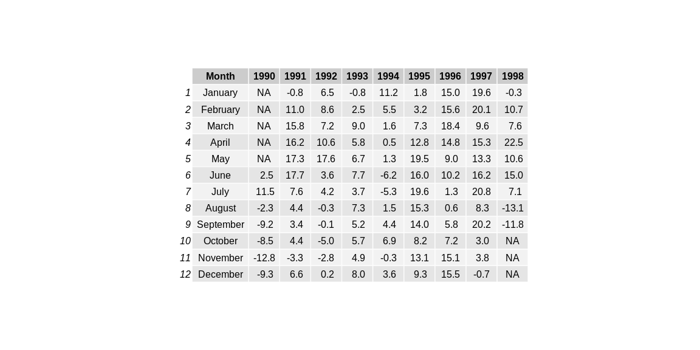
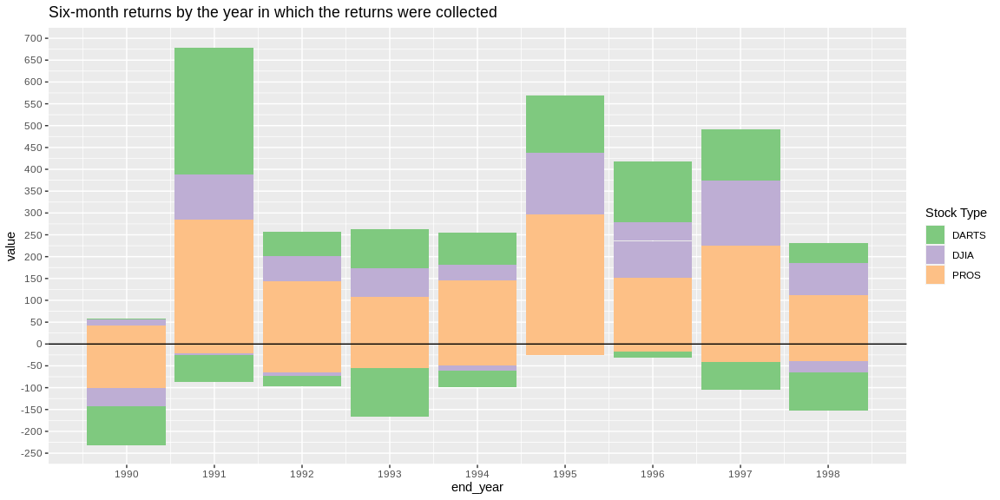

```r
# RDS
data <- read_rds(url("https://github.com/byuistats/data/blob/master/Dart_Expert_Dow_6month_anova/Dart_Expert_Dow_6month_anova.RDS?raw=true"))
```

## Background

With stock return data from the previous task, we need to tidy this data for the creation of a time series plot. We want to look at the returns for each six-month period of the year in which the returns were reported. Your plot should highlight the tighter spread of the DJIA as compared to the other two selection methods (DARTS and PROS). We also need to display a table of the DJIA returns with months on the rows and years in the columns (i.e. pivot wider on the data).

[ ] Take notes on your reading of the specified ‘R for Data Science’ chapter in the README.md or in a ‘.R’ script in the class task folder
[ ] Import the Dart_Expert_Dow_6month_anova data from GitHub (see details in previous task)
[ ] The contestant_period column is not “tidy” we want to create a month_end and year_end column from the information it contains
[ ] Save your “tidy” data as an .rds object
[ ] Create a plot that shows the six-month returns by the year in which the returns are collected
[ ] Include your plot in an .Rmd file with a short paragraph describing your plots. Make sure to display the tidyr code in your file
[ ] Use code to create a table the DJIA returns that matches the table shown below (“pivot_wider” the data)

## R for Data Science - Chapter 12

-There are three interrelated rules which make a dataset tidy:

    Each variable must have its own column.
    Each observation must have its own row.
    Each value must have its own cell.

-dplyr, ggplot2, and all the other packages in the tidyverse are designed to work with tidy data
-To fix these problems (tidy), you’ll need the two most important functions in tidyr: pivot_longer() and pivot_wider()
-pivot_longer() makes datasets longer by increasing the number of rows and decreasing the number of columns. I don’t believe it makes sense to describe a dataset as being in “long form”
-pivot_wider() is the opposite of pivot_longer(). You use it when an observation is scattered across multiple rows
-separate() pulls apart one column into multiple columns, by splitting wherever a separator character appears
-unite() is the inverse of separate(): it combines multiple columns into a single column.
-complete() takes a set of columns, and finds all unique combinations. It then ensures the original dataset contains all those values, filling in explicit NAs where necessary.
-You can fill in these missing values with fill(). It takes a set of columns where you want missing values to be replaced by the most recent non-missing value (sometimes called last observation carried forward).

## Data Wrangling


```r
# Use this R-Chunk to clean & wrangle your data!
head(data)
```

```
## # A tibble: 6 x 3
##   contest_period      variable value
##   <chr>               <chr>    <dbl>
## 1 January-June1990    PROS      12.7
## 2 February-July1990   PROS      26.4
## 3 March-August1990    PROS       2.5
## 4 April-September1990 PROS     -20  
## 5 May-October1990     PROS     -37.8
## 6 June-November1990   PROS     -33.3
```

```r
separated <- data %>% separate(contest_period, into = c("start_month","end_month"), sep = "-") %>% 
  extract(end_month, into = c("end_year"), regex = "([0-9]{4})", remove = FALSE, convert = TRUE) %>% 
  extract(end_month, into = c("end_month"), regex = "([^0-9]{1,9})", remove = TRUE, convert = TRUE) %>%
  extract(start_month, into = c("start_year"), regex = "([0-9]{4})", remove = FALSE, convert = TRUE) %>% 
  extract(start_month, into = c("start_month"), regex = "([^0-9]{1,9})", remove = TRUE, convert = TRUE)

#check if months are spelled right
count(separated,"start_month")
```

```
##    start_month freq
## 1        April   27
## 2       August   24
## 3     December   24
## 4     February   24
## 5      Febuary    3
## 6      January   27
## 7         July   24
## 8         June   24
## 9        March   27
## 10         May   24
## 11    November   24
## 12     October   24
## 13   September   24
```

```r
count(separated,"end_month")
```

```
##    end_month freq
## 1      April   24
## 2     August   27
## 3       Dec.    3
## 4   December   21
## 5   February   21
## 6    Febuary    3
## 7    January   24
## 8       July   27
## 9       June   27
## 10     March   24
## 11       May   24
## 12  November   24
## 13   October   24
## 14 September   27
```

```r
#clean months
separated <- separated %>% mutate(end_month = ifelse(end_month == "Dec.", "December", end_month))
separated <- separated %>% mutate(end_month = ifelse(end_month == "Febuary", "February", end_month))
separated <- separated %>% mutate(start_month = ifelse(start_month == "Febuary", "February", start_month))
#check if months are spelled right
count(separated,"start_month")
```

```
##    start_month freq
## 1        April   27
## 2       August   24
## 3     December   24
## 4     February   27
## 5      January   27
## 6         July   24
## 7         June   24
## 8        March   27
## 9          May   24
## 10    November   24
## 11     October   24
## 12   September   24
```

```r
count(separated,"end_month")
```

```
##    end_month freq
## 1      April   24
## 2     August   27
## 3   December   24
## 4   February   24
## 5    January   24
## 6       July   27
## 7       June   27
## 8      March   24
## 9        May   24
## 10  November   24
## 11   October   24
## 12 September   27
```

```r
separated <- separated %>% complete(start_year)
head(separated)
```

```
## # A tibble: 6 x 6
##   start_year start_month end_month end_year variable value
##        <int> <chr>       <chr>        <int> <chr>    <dbl>
## 1       1990 August      January       1991 PROS     -20.3
## 2       1990 September   February      1991 PROS      38.9
## 3       1990 October     March         1991 PROS      20.2
## 4       1990 November    April         1991 PROS      50.6
## 5       1990 December    May           1991 PROS      66.9
## 6       1990 August      January       1991 DARTS    -37.3
```

```r
saveRDS(separated, file = "tidy_Dart_Expert_Dow_6month_anova.rds")

#pivoting for table
dija <- select(filter(separated, variable == "DJIA"), end_month, end_year, value)
wide <- dija %>% pivot_wider(names_from = end_year, values_from = value)
wide <- wide %>% select("end_month",sort(colnames(wide)))
names(wide)[names(wide) == "end_month"] <- "Month"
View(wide)
```

## Data Visualization


```r
#table
grid.table(wide)
```

<!-- -->

```r
# Use this R-Chunk to plot & visualize your data!
ggplot(separated, aes(end_year, value, fill = variable)) + geom_bar(stat = "identity") + scale_fill_brewer(palette = "Accent") + scale_x_continuous(breaks = seq(1990,1999, by = 1)) + scale_y_continuous(breaks = seq(-250, 750 ,by = 50)) + labs(title = "Six-month returns by the year in which the returns were collected", fill = "Stock Type") + geom_hline(aes(yintercept = 0))
```

<!-- -->

## Comment
The Stocks had more return on 1991 and 1995 (years of collection from the 6 months period), of all the DARTS Stock is the one with better return in every year except 1990 and 1993, where the negative return (or loss) was greater.

