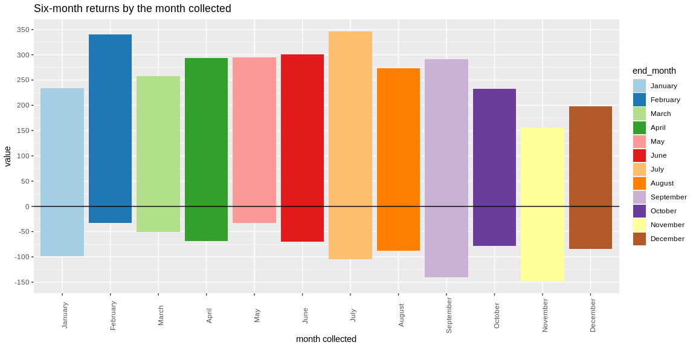

```r
# Use this R-Chunk to import all your datasets!
stocks <- read_rds("./tidy_Dart_Expert_Dow_6month_anova.rds")
```

## Background

When we are visualizing data with categorical variables, we have to deal with character strings as groupings. The problem with summarizing categorical data in a table or a plot is how to order the groups. Using the concept of Factors allows us to dictate the order of these groupings for presentation. We will revisit the stock data (https://github.com/byuistats/data/tree/master/Dart_Expert_Dow_6month_anova) from a previous task to create a table and a plot that has the months correctly labeled and ordered.

## R for Data Science - Chapter 15

-To create a factor you must start by creating a list of the valid levels, then you can create a factor
-any values not in the set will be silently converted to NA
-If you want a warning, you can use readr::parse_factor()

-fct_reorder() takes three arguments:

    f, the factor whose levels you want to modify.
    x, a numeric vector that you want to use to reorder the levels.
    Optionally, fun, a function that’s used if there are multiple values of x for each value of f. The default value is median.

-fct_relevel() takes a factor, f, and then any number of levels that you want to move to the front of the line.

-use fct_infreq() to order levels in increasing frequency: this is the simplest type of reordering because it doesn’t need any extra variables. You may want to combine with fct_rev()

-fct_recode(). It allows you to recode, or change, the value of each level.

-If you want to collapse a lot of levels, fct_collapse() is a useful variant of fct_recode(). For each new variable, you can provide a vector of old levels

-Sometimes you just want to lump together all the small groups to make a plot or table simpler. That’s the job of fct_lump()

## Data Wrangling


```r
# Use this R-Chunk to clean & wrangle your data!
View(stocks)
month_levels <- c(
  "January", "February", "March", "April", "May", "June", 
  "July", "August", "September", "October", "November", "December"
)
stocks$end_month <- factor(stocks$end_month, levels = month_levels)
levels(stocks$end_month)
```

```
##  [1] "January"   "February"  "March"     "April"     "May"       "June"     
##  [7] "July"      "August"    "September" "October"   "November"  "December"
```

```r
stocks %>% count(end_month)
```

```
## # A tibble: 12 x 2
##    end_month     n
##    <fct>     <int>
##  1 January      24
##  2 February     24
##  3 March        24
##  4 April        24
##  5 May          24
##  6 June         27
##  7 July         27
##  8 August       27
##  9 September    27
## 10 October      24
## 11 November     24
## 12 December     24
```

## Data Visualization


```r
# Use this R-Chunk to plot & visualize your data!
ggplot(stocks, aes(end_month, value, fill = end_month)) + geom_bar(stat = "identity") + scale_y_continuous(breaks = seq(-150,350, by = 50)) + labs(title = "Six-month returns by the month collected ", y = "value", x = "month collected" ) +  geom_hline(aes(yintercept = 0)) + scale_fill_brewer(palette = "Paired") + theme(axis.text.x = element_text(angle = 90))
```

<!-- -->

