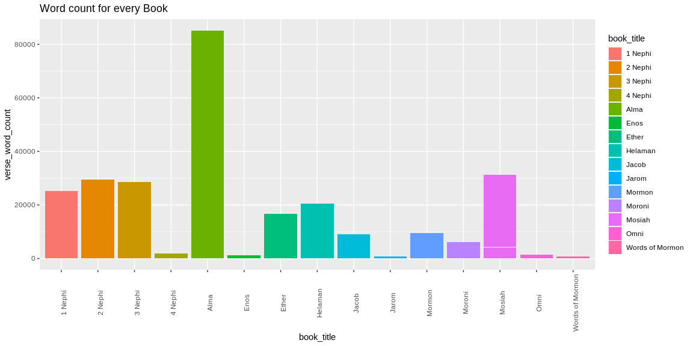
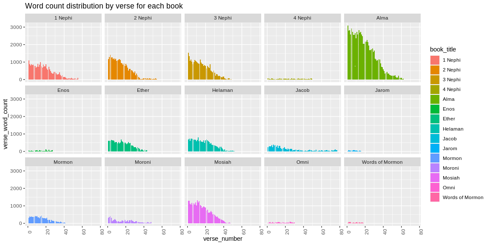

```r
# Use this R-Chunk to import all your datasets!
tmp <- tempfile(fileext = ".zip")
download(url = "http://scriptures.nephi.org/downloads/lds-scriptures.csv.zip", destfile = tmp, mode="wb")
unzip(as.character(tmp), list = TRUE)
```

```
##                 Name   Length                Date
## 1 lds-scriptures.csv 13104856 2016-03-13 22:24:00
```

```r
scriptures <- read_csv(unzip(as.character(tmp), "lds-scriptures.csv"))
unlink(tmp)
```

## Background

In 1978 Susan Easton Black penned an article (https://www.lds.org/ensign/1978/07/discovery?lang=eng) in the Ensign title Even statistically, he is the dominant figure of the Book of Mormon. which makes some statistical claims about the Book of Mormon. We are going to use some of our “string” skills to count words and occurrences in the New Testament and in the Book of Mormon.

    What is the average verse length (number of words) in the New Testament compared to the Book of Mormon?
    How often is the word Jesus in the New Testament compared to the Book of Mormon?
    How does the word count distribution by verse look for each book in the Book of Mormon?
    
## R for Data Science - Chapter 21

-Another tool for reducing duplication is iteration, which helps you when you need to do the same thing to multiple inputs
-Every for loop has three components:

    The output: output <- vector("double", length(x)). Before you start the loop, you must always allocate sufficient space for the output. This is very important for efficiency: if you grow the for loop at each iteration using c() (for example), your for loop will be very slow.

    A general way of creating an empty vector of given length is the vector() function. It has two arguments: the type of the vector (“logical”, “integer”, “double”, “character”, etc) and the length of the vector.

    The sequence: i in seq_along(df). This determines what to loop over: each run of the for loop will assign i to a different value from seq_along(df). It’s useful to think of i as a pronoun, like “it”.
    The body: output[[i]] <- median(df[[i]]). This is the code that does the work. It’s run repeatedly, each time with a different value for i. The first iteration will run output[[1]] <- median(df[[1]]), the second will run output[[2]] <- median(df[[2]]), and so on.
    
-Other forms pf looping:

    Loop over the elements: for (x in xs). This is most useful if you only care about side-effects, like plotting or saving a file, because it’s difficult to save the output efficiently.

    Loop over the names: for (nm in names(xs)). This gives you name, which you can use to access the value with x[[nm]]. This is useful if you want to use the name in a plot title or a file name. If you’re creating named output, make sure to name the results vector like so
    
-use unlist() to flatten a list of vectors into a single vector. A stricter option is to use purrr::flatten_dbl() — it will throw an error if the input isn’t a list of doubles.

-A while loop is also more general than a for loop, because you can rewrite any for loop as a while loop, but you can’t rewrite every while loop as a for loop

-The idea of passing a function to another function is an extremely powerful idea, and it’s one of the behaviours that makes R a functional programming language.

-use the purrr package, which provides functions that eliminate the need for many common for loops. The apply family of functions in base R (apply(), lapply(), tapply(), etc) solve a similar problem, but purrr is more consistent and thus is easier to learn.

-The pattern of looping over a vector, doing something to each element and saving the results is so common that the purrr package provides a family of functions to do it for you. There is one function for each type of output:

    map() makes a list.
    map_lgl() makes a logical vector.
    map_int() makes an integer vector.
    map_dbl() makes a double vector.
    map_chr() makes a character vector.

-safely() is an adverb: it takes a function (a verb) and returns a modified version. In this case, the modified function will never throw an error. Instead, it always returns a list with two elements:

    result is the original result. If there was an error, this will be NULL.

    error is an error object. If the operation was successful, this will be NULL.
-Purrr provides two other useful adverbs:

    Like safely(), possibly() always succeeds. It’s simpler than safely(), because you give it a default value to return when there is an error.
    quietly() performs a similar role to safely(), but instead of capturing errors, it captures printed output, messages, and warnings:
    
-Walk is an alternative to map that you use when you want to call a function for its side effects, rather than for its return value. You typically do this because you want to render output to the screen or save files to disk - the important thing is the action, not the return value. 
-walk() is generally not that useful compared to walk2() or pwalk(). For example, if you had a list of plots and a vector of file names, you could use pwalk() to save each file to the corresponding location on disk

## Data Wrangling
### question 1
NT stats: 1. characters 2. words <br>
BOM stats: 3. characters 4. words <br>


```r
# Use this R-Chunk to clean & wrangle your data!
new_testament <- scriptures %>% filter(volume_title == "New Testament")
book_of_mormon <- scriptures %>% filter(volume_title == "Book of Mormon")

verse_stats <- function(verse_column) {
  if (length(verse_column) > 0) {
    num_words <- c()
    num_chars <- c()
    for (i in 1:length(verse_column)) {
      stat <- stri_stats_latex(verse_column[i])
      num_chars[i] <- stat[1]
      num_words[i] <- stat[4]
    }
    return(list("chars" = num_chars, "words" = num_words))
  } else {
    return(list())
  }
}

nt_verse_stats <- verse_stats(new_testament$scripture_text)
bom_verse_stats <- verse_stats(book_of_mormon$scripture_text)

summary(nt_verse_stats[["chars"]])
```

```
##    Min. 1st Qu.  Median    Mean 3rd Qu.    Max. 
##     9.0    67.0    89.0    92.9   114.0   284.0
```

```r
summary(nt_verse_stats[["words"]])
```

```
##    Min. 1st Qu.  Median    Mean 3rd Qu.    Max. 
##    2.00   17.00   22.00   22.71   28.00   68.00
```

```r
summary(bom_verse_stats[["chars"]])
```

```
##    Min. 1st Qu.  Median    Mean 3rd Qu.    Max. 
##    12.0   110.0   157.0   168.2   214.0   577.0
```

```r
summary(bom_verse_stats[["words"]])
```

```
##    Min. 1st Qu.  Median    Mean 3rd Qu.    Max. 
##    4.00   27.00   38.00   40.51   51.00  142.00
```
### question 2
1. number of times the word "Jesus" (case insensitive) appears in the New Testament
2. stats
3. number of times the word "Jesus" (case insensitive) appears in the Book of Mormon
4. stats

```r
# Use this R-Chunk to clean & wrangle your data!
j_name_num_nt <- str_count(new_testament$scripture_text, "(?i)jesus")
sum(j_name_num_nt)
```

```
## [1] 984
```

```r
summary(j_name_num_nt)
```

```
##    Min. 1st Qu.  Median    Mean 3rd Qu.    Max. 
##  0.0000  0.0000  0.0000  0.1237  0.0000  3.0000
```

```r
j_name_num_bom <- str_count(book_of_mormon$scripture_text, "(?i)jesus")
sum(j_name_num_bom)
```

```
## [1] 184
```

```r
summary(j_name_num_bom)
```

```
##    Min. 1st Qu.  Median    Mean 3rd Qu.    Max. 
## 0.00000 0.00000 0.00000 0.02786 0.00000 3.00000
```
## Data Visualization
### question 3

```r
# Use this R-Chunk to plot & visualize your data!
myfun <- function(st) {
  return(stri_stats_latex(st)[4])
}
length_of_verse <- map_int(book_of_mormon$scripture_text,myfun)
bom_verse_word_count <- book_of_mormon %>% mutate(verse_word_count = length_of_verse)

ggplot(bom_verse_word_count, aes(book_title, verse_word_count, fill = book_title)) + geom_bar(stat = "identity") + theme(axis.text.x = element_text(angle = 90)) + labs(title = "Word count for every Book")
```

<!-- -->

```r
ggplot(bom_verse_word_count, aes(verse_number, verse_word_count, fill = book_title)) + geom_bar(stat = "identity") + theme(axis.text.x = element_text(angle = 90)) + facet_wrap(~book_title, nrow = 3) + labs(title = "Word count distribution by verse for each book")
```

<!-- -->

## Conclusions

    What is the average verse length (number of words) in the New Testament compared to the Book of Mormon?
    ---NT = 22 ; BOM = 38
    How often is the word Jesus in the New Testament compared to the Book of Mormon?
    --- 984 in the New Testament and 184 in the Book of Mormon
    How does the word count distribution by verse look for each book in the Book of Mormon?
    --- See Graph #3
