```r
# Use this R-Chunk to import all your datasets!
sales <- read_csv("https://byuistats.github.io/M335/data/sales.csv")
```

## Background

We have transaction data for a few businesses that have been in operation for three months. Each of these companies has come to your investment company for a loan to expand their business. Your boss has asked you to go through the transactions for each business and provide daily, weekly, and monthly gross revenue summaries and comparisons. Your boss would like a short write up with tables and visualizations that help with the decision of which company did the best over the three month period. You will also need to provide a short paragraph with your recommendation after building your analysis.

## Data Wrangling


```r
# Check data
summary(sales)
```

```
##      Name               Type                Time                    
##  Length:15656       Length:15656       Min.   :2016-04-20 19:01:00  
##  Class :character   Class :character   1st Qu.:2016-05-31 19:46:00  
##  Mode  :character   Mode  :character   Median :2016-06-15 17:16:00  
##                                        Mean   :2016-06-16 05:58:39  
##                                        3rd Qu.:2016-07-02 00:30:00  
##                                        Max.   :2016-07-20 15:53:00  
##      Amount        
##  Min.   :-194.500  
##  1st Qu.:   2.500  
##  Median :   3.000  
##  Mean   :   5.294  
##  3rd Qu.:   4.500  
##  Max.   :1026.000
```

```r
summary(is.na(sales))
```

```
##     Name            Type            Time           Amount       
##  Mode :logical   Mode :logical   Mode :logical   Mode :logical  
##  FALSE:15656     FALSE:15656     FALSE:15656     FALSE:15656
```

```r
count(sales, "Name")
```

```
##            Name freq
## 1       Frozone 1674
## 2    HotDiggity 5887
## 3       LeBelle  634
## 4       Missing    2
## 5     ShortStop 2593
## 6 SplashandDash  533
## 7    Tacontento 4333
```

```r
count(sales, "Type")
```

```
##                 Type  freq
## 1 Food(pre-packaged)  4267
## 2     Food(prepared) 10220
## 3              Goods   634
## 4            Missing     2
## 5           Services   533
```

```r
sales <- filter(sales, Name != "Missing")
sales_specific <- sales %>% mutate(day = day(Time) , week = week(Time) , month = month(Time), hour = hour(Time), hour_pretty = str_c(hour(Time),":00",sep = ""))
#little factor
hour_levels <- c(
  "0:00", "1:00", "2:00", "3:00", "4:00", "5:00", 
  "6:00", "7:00", "8:00", "9:00", "10:00", "11:00",
  "12:00", "13:00", "14:00", "15:00", "16:00", "17:00",
  "18:00", "19:00", "20:00", "21:00", "22:00", "23:00",
  "24:00"
)
sales_specific$hour_pretty <- factor(sales_specific$hour_pretty, levels = hour_levels)

# we need to specify dplyr:: cause plyr:: summarise is weird
hourly_sales<- sales_specific %>% group_by(Name, hour) %>% dplyr::summarise(Amount = sum(Amount))
daily_sales <- sales_specific %>% group_by(Name, day, month) %>% dplyr::summarise(Amount = sum(Amount))
weekly_sales <- sales_specific %>% group_by(Name, week, month) %>% dplyr::summarise(Amount = sum(Amount))
monthly_sales <- sales_specific %>% group_by(Name, month) %>% dplyr::summarise(Amount = sum(Amount))
total_sales <- sales_specific %>% group_by(Name) %>% dplyr::summarise(Amount = sum(Amount))
```

## Data Visualization


```r
# hours suggestion
business <- unique(sales_specific$Name)
for (i in seq_along(business)) {
  plot <- ggplot(filter(sales_specific, Name == business[i]), aes(hour_pretty)) + geom_histogram(stat="count") +  theme(axis.text.x = element_text(angle = 90)) + labs(title = str_c("Customer Traffic by hours for", business[i], sep = " "), y = "number of purchases", x = "24 hours")
  print(plot)
}
```

<!-- -->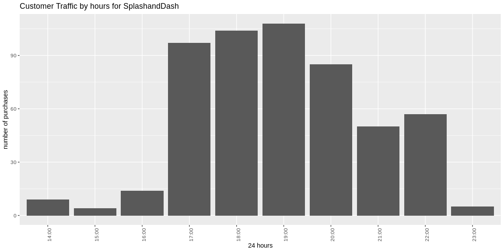<!-- -->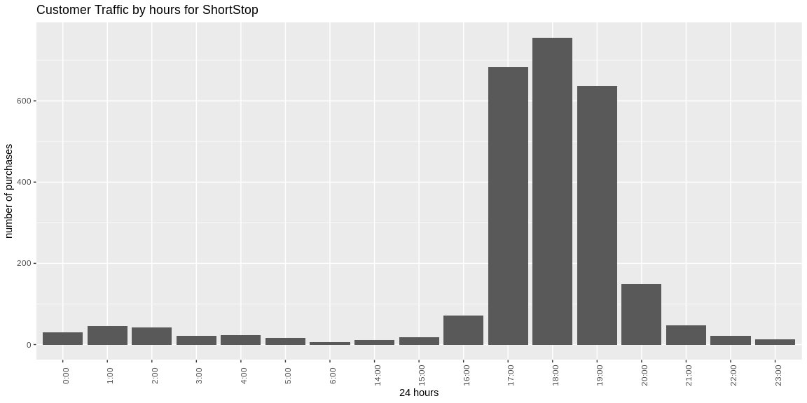<!-- -->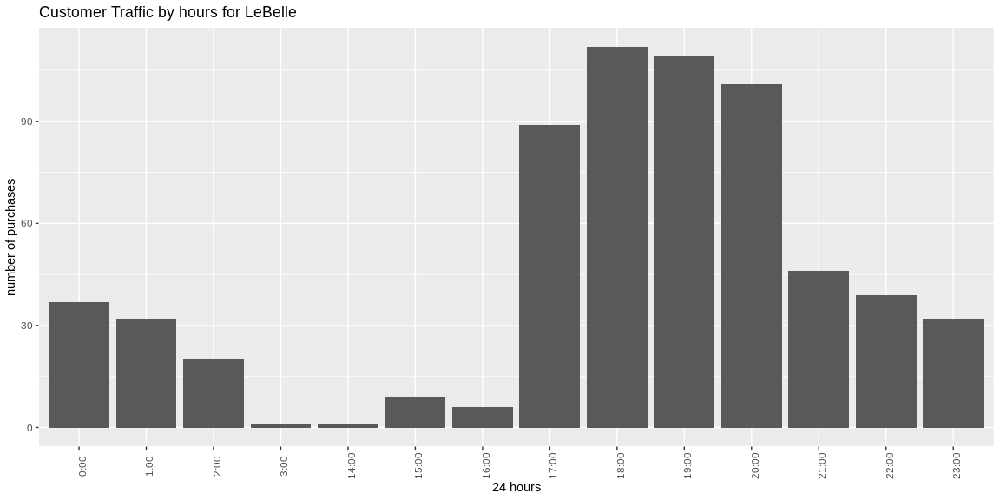<!-- -->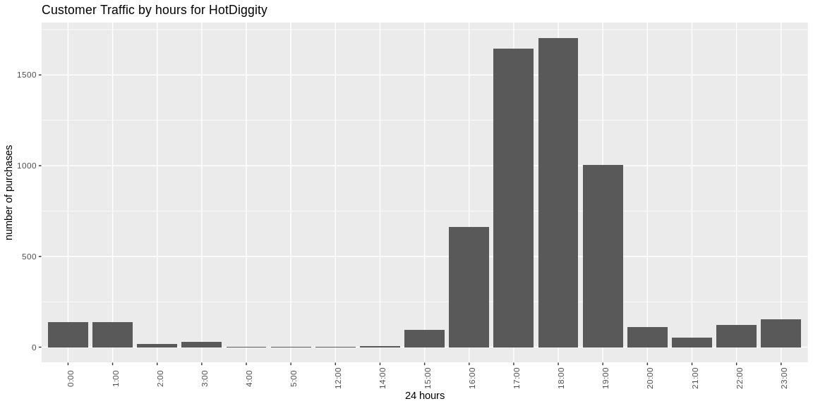<!-- -->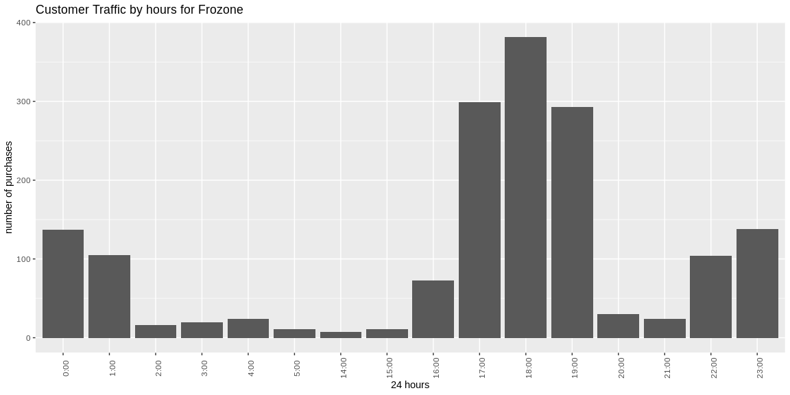<!-- -->

```r
for (i in seq_along(business)) {
  plot <- ggplot(filter(sales_specific, Name == business[i]), aes(hour_pretty)) + geom_histogram(stat="count") +  theme(axis.text.x = element_text(angle = 90)) + labs(title = str_c("Customer Traffic by hours from May-July for", business[i], sep = " "), y = "number of purchases", x = "24 hours") + facet_wrap(~month, ncol = 2)
  print(plot)
}
```

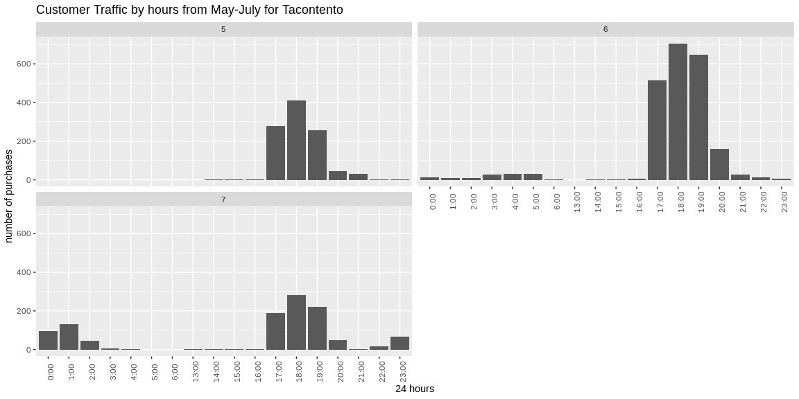<!-- -->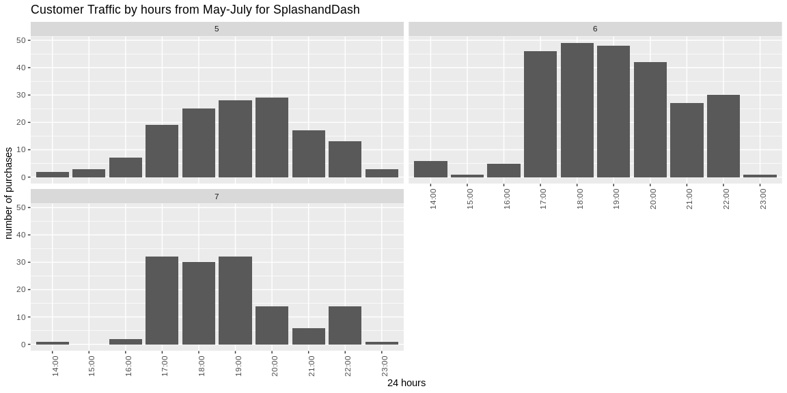<!-- -->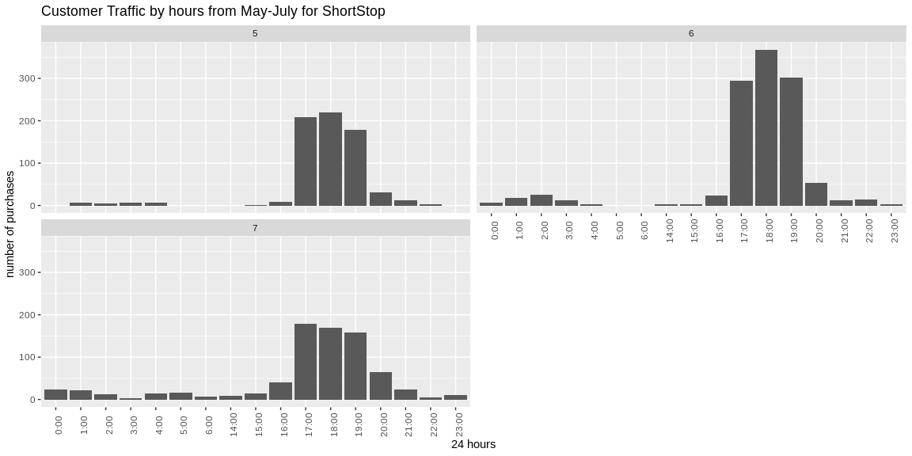<!-- -->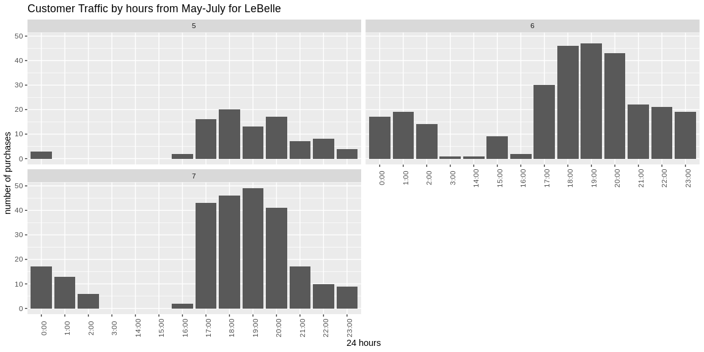<!-- -->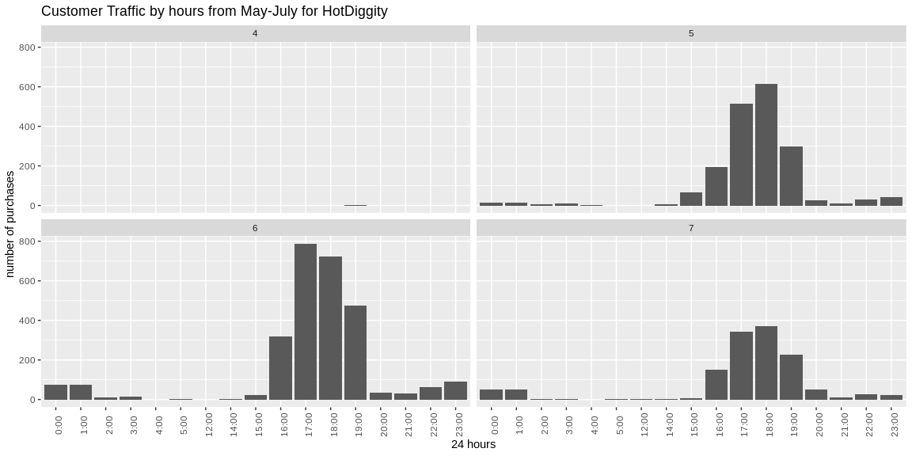<!-- -->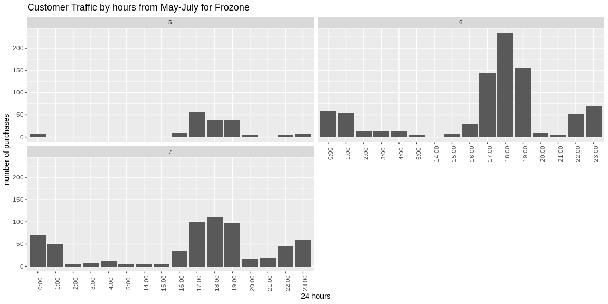<!-- -->
### Hours of Operation Recommendation

By observing these 12 graphs (2 for each business) we can conclude the most of the traffic goes on between 4pm (16:00) and 2am (02:00).
There are some special cases like SplashAndDash and LeBelle which are open only until midnight.
We would also recommend utilize more staff from 4pm (16:00) to 7pm (19:00)


```r
# 
grid.table(total_sales)
```

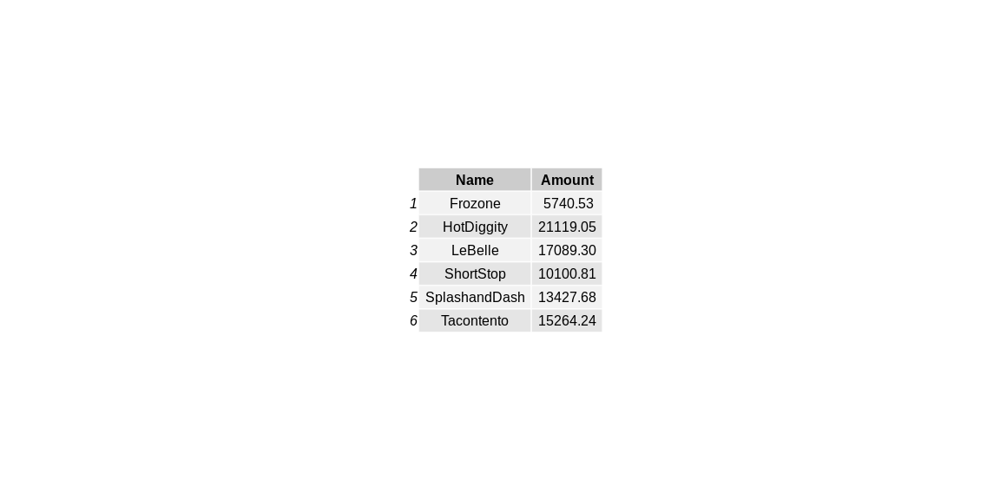<!-- -->

```r
ggplot(sales_specific, aes(Time, Amount, color = Name)) + geom_line() + labs(title = str_c("Sales through the May-July Trimester", business[i], sep = " "), y = "Sakes", x = "Month")
```

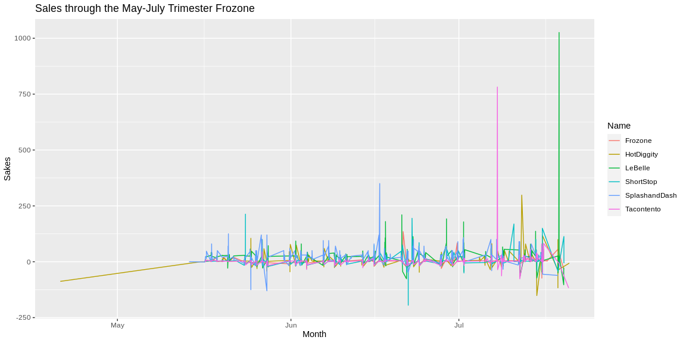<!-- -->

```r
ggplot(sales_specific, aes(Time, Amount, color = Name)) + geom_line() +  theme(axis.text.x = element_text(angle = 90)) + labs(title = str_c("Sales through the May-July Trimester", business[i], sep = " "), y = "Sakes", x = "Month") + facet_wrap(~Name, nrow = 2)
```

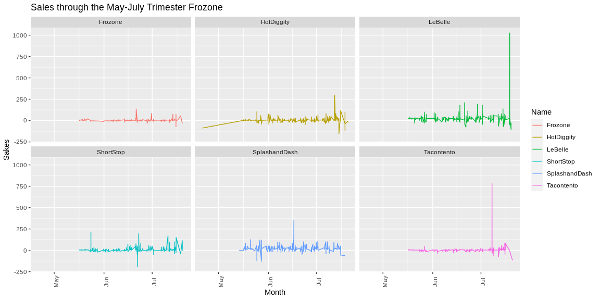<!-- -->

### Final Recommendation
For the companies that close at midnight:
LeBelle is the company that performed better over this trimester, with more sales, however, SplashnadDash also did good in a consistent basis, with less variation.
In general:
HotDiggity was the most profitable company which is open 24 hours.
