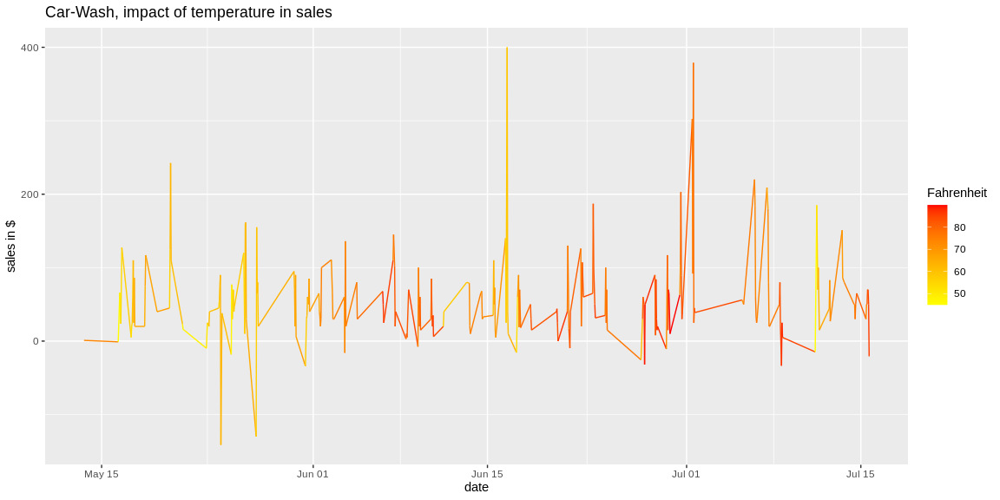

```r
# Use this R-Chunk to import all your datasets!
car_data <- read_csv("https://byuistats.github.io/M335/data/carwash.csv")
```

## Background

A car wash business wants to see if the temperature hurts their bottom line. They have point of sale data for the months of April, May, June, and July. You will need to aggregate the data into hourly sales totals and merge the sales data together with the temperature data to provide insight into the relationship between temperature and car wash sales.

## Data Wrangling
Use riem and lubridate packages to get temperatures hourly converted to MST.

```r
# modify car data to be mst and then group by hour
mst_car_data <- car_data %>% select(amount, time) %>% mutate(mst_time = with_tz(time, "MST"), valid = ceiling_date(mst_time, "hour"))
grouped_car_data <- mst_car_data %>% group_by(valid) %>% summarise(amount = sum(amount))
# get weather conditions for that date range
riem <- riem_measures(station = "RXE", date_start = "2016-05-13", date_end = "2016-07-18") %>%
  mutate(valid = ceiling_date(valid, "hour"), valid = with_tz(valid, "MST")) %>%
  select(valid, tmpf)
#filter to 1 measurement per hour
riem <- riem[!is.na(riem$tmpf),]
riem <- riem %>% group_by(valid) %>% summarise(tmpf = mean(tmpf))
# join
final_table <- grouped_car_data %>% inner_join(riem, by = "valid")
```

## Data Visualization


```r
# Use this R-Chunk to plot & visualize your data!
ggplot(final_table, aes(valid,amount, color = tmpf)) + geom_line() + scale_color_gradient(low = "yellow", high = "red") + labs(title = "Car-Wash, impact of temperature in sales", y = "sales in $", x = "date", color = "Fahrenheit")
```

<!-- -->

## Conclusions

We observe that the lower temperatures affect sales negatively, and that high temperatures represent a slight increase in sales.
