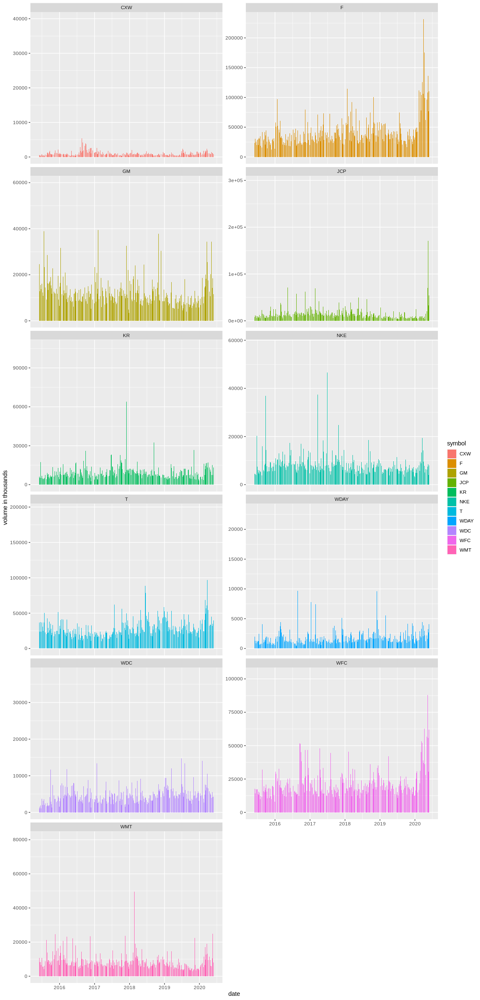
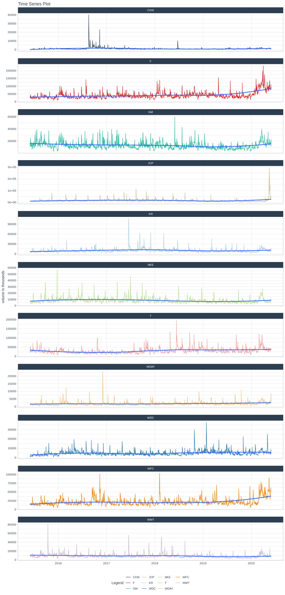

```r
# Use this R-Chunk to import all your datasets!
tickers_today <- c("CXW", "F", "GM", "JCP", "KR", "WDC", "NKE","T", "WDAY", "WFC", "WMT")
multpl_stocks <- tq_get(tickers_today, from = "2015-06-01", to = "2020-06-01", get = "stock.prices")
```

## Background

Your data science income has ballooned, and you need to find somewhere to invest $25,000 that you have saved over the last year. You have a savvy investment friend that is kind enough to tell you ten stocks he has been watching during the last year. You will need to visualize the last five years performance to help in the conversation with your friend.

Your friend is going to give you his tickers at the beginning of your half-hour meeting with him (he is a busy friend). You will need to build an .Rmd file that will build a suite of visualizations rapidly for your conversation. You will need a series of stock performance graphics using library(dygraphs) and library(ggplot2). In real life, you might use one or the other, but this task is built to help you move from ts and xts to tidy objects for visualization.


## Data Wrangling


```r
# Use this R-Chunk to clean & wrangle your data!
filtered_multpl_stocks <- multpl_stocks %>% select(symbol, date, adjusted) %>% pivot_wider(names_from = symbol, values_from = adjusted)
```

## Data Visualization

### 5 year Timeline

Adjusted value shown for each stock
<br>
<div id="labels"></div>


```r
# Use this R-Chunk to plot & visualize your data!

stocks <- cbind(filtered_multpl_stocks$CXW, filtered_multpl_stocks$F, filtered_multpl_stocks$GM, filtered_multpl_stocks$JCP, filtered_multpl_stocks$KR, filtered_multpl_stocks$WDC, filtered_multpl_stocks$NKE, filtered_multpl_stocks$T, filtered_multpl_stocks$WDAY, filtered_multpl_stocks$WFC, filtered_multpl_stocks$WMT, as.xts(filtered_multpl_stocks$date))

dygraph(stocks, main = "Multiple stocks from 06/2015-06/2020", ylab = "adjusted stock price") %>% dySeries("filtered_multpl_stocks.CXW", label = "CXW") %>%
  dySeries("filtered_multpl_stocks.F", label = "F") %>%
  dySeries("filtered_multpl_stocks.GM", label = "GM") %>%
  dySeries("filtered_multpl_stocks.JCP", label = "JCP") %>%
  dySeries("filtered_multpl_stocks.KR", label = "KR") %>%
  dySeries("filtered_multpl_stocks.WDC", label = "WDC") %>%
  dySeries("filtered_multpl_stocks.NKE", label = "NKE") %>%
  dySeries("filtered_multpl_stocks.T", label = "T") %>%
  dySeries("filtered_multpl_stocks.WDAY", label = "WDAY") %>%
  dySeries("filtered_multpl_stocks.WFC", label = "WFC") %>%
  dySeries("filtered_multpl_stocks.WMT", label = "WMT") %>%
  dyLegend(width = 100, labelsDiv = "labels")
```

<!--html_preserve--><div id="htmlwidget-d532323605215118fb37" style="width:864px;height:384px;" class="dygraphs html-widget"></div>
<script type="application/json" data-for="htmlwidget-d532323605215118fb37">{"x":{"attrs":{"title":"Multiple stocks from 06/2015-06/2020","ylabel":"adjusted stock price","labels":["day","CXW","F","GM","JCP","KR","WDC","NKE","T","WDAY","WFC","WMT"],"retainDateWindow":false,"axes":{"x":{"pixelsPerLabel":60}},"series":{"CXW":{"axis":"y"},"F":{"axis":"y"},"GM":{"axis":"y"},"JCP":{"axis":"y"},"KR":{"axis":"y"},"WDC":{"axis":"y"},"NKE":{"axis":"y"},"T":{"axis":"y"},"WDAY":{"axis":"y"},"WFC":{"axis":"y"},"WMT":{"axis":"y"}},"legend":"auto","labelsDivWidth":100,"labelsShowZeroValues":true,"labelsDiv":"labels","labelsSeparateLines":false,"hideOverlayOnMouseOut":true},"scale":"daily","annotations":[],"shadings":[],"events":[],"format":"date","data":[["2015-06-01T00:00:00.000Z","2015-06-02T00:00:00.000Z","2015-06-03T00:00:00.000Z","2015-06-04T00:00:00.000Z","2015-06-05T00:00:00.000Z","2015-06-08T00:00:00.000Z","2015-06-09T00:00:00.000Z","2015-06-10T00:00:00.000Z","2015-06-11T00:00:00.000Z","2015-06-12T00:00:00.000Z","2015-06-15T00:00:00.000Z","2015-06-16T00:00:00.000Z","2015-06-17T00:00:00.000Z","2015-06-18T00:00:00.000Z","2015-06-19T00:00:00.000Z","2015-06-22T00:00:00.000Z","2015-06-23T00:00:00.000Z","2015-06-24T00:00:00.000Z","2015-06-25T00:00:00.000Z","2015-06-26T00:00:00.000Z","2015-06-29T00:00:00.000Z","2015-06-30T00:00:00.000Z","2015-07-01T00:00:00.000Z","2015-07-02T00:00:00.000Z","2015-07-06T00:00:00.000Z","2015-07-07T00:00:00.000Z","2015-07-08T00:00:00.000Z","2015-07-09T00:00:00.000Z","2015-07-10T00:00:00.000Z","2015-07-13T00:00:00.000Z","2015-07-14T00:00:00.000Z","2015-07-15T00:00:00.000Z","2015-07-16T00:00:00.000Z","2015-07-17T00:00:00.000Z","2015-07-20T00:00:00.000Z","2015-07-21T00:00:00.000Z","2015-07-22T00:00:00.000Z","2015-07-23T00:00:00.000Z","2015-07-24T00:00:00.000Z","2015-07-27T00:00:00.000Z","2015-07-28T00:00:00.000Z","2015-07-29T00:00:00.000Z","2015-07-30T00:00:00.000Z","2015-07-31T00:00:00.000Z","2015-08-03T00:00:00.000Z","2015-08-04T00:00:00.000Z","2015-08-05T00:00:00.000Z","2015-08-06T00:00:00.000Z","2015-08-07T00:00:00.000Z","2015-08-10T00:00:00.000Z","2015-08-11T00:00:00.000Z","2015-08-12T00:00:00.000Z","2015-08-13T00:00:00.000Z","2015-08-14T00:00:00.000Z","2015-08-17T00:00:00.000Z","2015-08-18T00:00:00.000Z","2015-08-19T00:00:00.000Z","2015-08-20T00:00:00.000Z","2015-08-21T00:00:00.000Z","2015-08-24T00:00:00.000Z","2015-08-25T00:00:00.000Z","2015-08-26T00:00:00.000Z","2015-08-27T00:00:00.000Z","2015-08-28T00:00:00.000Z","2015-08-31T00:00:00.000Z","2015-09-01T00:00:00.000Z","2015-09-02T00:00:00.000Z","2015-09-03T00:00:00.000Z","2015-09-04T00:00:00.000Z","2015-09-08T00:00:00.000Z","2015-09-09T00:00:00.000Z","2015-09-10T00:00:00.000Z","2015-09-11T00:00:00.000Z","2015-09-14T00:00:00.000Z","2015-09-15T00:00:00.000Z","2015-09-16T00:00:00.000Z","2015-09-17T00:00:00.000Z","2015-09-18T00:00:00.000Z","2015-09-21T00:00:00.000Z","2015-09-22T00:00:00.000Z","2015-09-23T00:00:00.000Z","2015-09-24T00:00:00.000Z","2015-09-25T00:00:00.000Z","2015-09-28T00:00:00.000Z","2015-09-29T00:00:00.000Z","2015-09-30T00:00:00.000Z","2015-10-01T00:00:00.000Z","2015-10-02T00:00:00.000Z","2015-10-05T00:00:00.000Z","2015-10-06T00:00:00.000Z","2015-10-07T00:00:00.000Z","2015-10-08T00:00:00.000Z","2015-10-09T00:00:00.000Z","2015-10-12T00:00:00.000Z","2015-10-13T00:00:00.000Z","2015-10-14T00:00:00.000Z","2015-10-15T00:00:00.000Z","2015-10-16T00:00:00.000Z","2015-10-19T00:00:00.000Z","2015-10-20T00:00:00.000Z","2015-10-21T00:00:00.000Z","2015-10-22T00:00:00.000Z","2015-10-23T00:00:00.000Z","2015-10-26T00:00:00.000Z","2015-10-27T00:00:00.000Z","2015-10-28T00:00:00.000Z","2015-10-29T00:00:00.000Z","2015-10-30T00:00:00.000Z","2015-11-02T00:00:00.000Z","2015-11-03T00:00:00.000Z","2015-11-04T00:00:00.000Z","2015-11-05T00:00:00.000Z","2015-11-06T00:00:00.000Z","2015-11-09T00:00:00.000Z","2015-11-10T00:00:00.000Z","2015-11-11T00:00:00.000Z","2015-11-12T00:00:00.000Z","2015-11-13T00:00:00.000Z","2015-11-16T00:00:00.000Z","2015-11-17T00:00:00.000Z","2015-11-18T00:00:00.000Z","2015-11-19T00:00:00.000Z","2015-11-20T00:00:00.000Z","2015-11-23T00:00:00.000Z","2015-11-24T00:00:00.000Z","2015-11-25T00:00:00.000Z","2015-11-27T00:00:00.000Z","2015-11-30T00:00:00.000Z","2015-12-01T00:00:00.000Z","2015-12-02T00:00:00.000Z","2015-12-03T00:00:00.000Z","2015-12-04T00:00:00.000Z","2015-12-07T00:00:00.000Z","2015-12-08T00:00:00.000Z","2015-12-09T00:00:00.000Z","2015-12-10T00:00:00.000Z","2015-12-11T00:00:00.000Z","2015-12-14T00:00:00.000Z","2015-12-15T00:00:00.000Z","2015-12-16T00:00:00.000Z","2015-12-17T00:00:00.000Z","2015-12-18T00:00:00.000Z","2015-12-21T00:00:00.000Z","2015-12-22T00:00:00.000Z","2015-12-23T00:00:00.000Z","2015-12-24T00:00:00.000Z","2015-12-28T00:00:00.000Z","2015-12-29T00:00:00.000Z","2015-12-30T00:00:00.000Z","2015-12-31T00:00:00.000Z","2016-01-04T00:00:00.000Z","2016-01-05T00:00:00.000Z","2016-01-06T00:00:00.000Z","2016-01-07T00:00:00.000Z","2016-01-08T00:00:00.000Z","2016-01-11T00:00:00.000Z","2016-01-12T00:00:00.000Z","2016-01-13T00:00:00.000Z","2016-01-14T00:00:00.000Z","2016-01-15T00:00:00.000Z","2016-01-19T00:00:00.000Z","2016-01-20T00:00:00.000Z","2016-01-21T00:00:00.000Z","2016-01-22T00:00:00.000Z","2016-01-25T00:00:00.000Z","2016-01-26T00:00:00.000Z","2016-01-27T00:00:00.000Z","2016-01-28T00:00:00.000Z","2016-01-29T00:00:00.000Z","2016-02-01T00:00:00.000Z","2016-02-02T00:00:00.000Z","2016-02-03T00:00:00.000Z","2016-02-04T00:00:00.000Z","2016-02-05T00:00:00.000Z","2016-02-08T00:00:00.000Z","2016-02-09T00:00:00.000Z","2016-02-10T00:00:00.000Z","2016-02-11T00:00:00.000Z","2016-02-12T00:00:00.000Z","2016-02-16T00:00:00.000Z","2016-02-17T00:00:00.000Z","2016-02-18T00:00:00.000Z","2016-02-19T00:00:00.000Z","2016-02-22T00:00:00.000Z","2016-02-23T00:00:00.000Z","2016-02-24T00:00:00.000Z","2016-02-25T00:00:00.000Z","2016-02-26T00:00:00.000Z","2016-02-29T00:00:00.000Z","2016-03-01T00:00:00.000Z","2016-03-02T00:00:00.000Z","2016-03-03T00:00:00.000Z","2016-03-04T00:00:00.000Z","2016-03-07T00:00:00.000Z","2016-03-08T00:00:00.000Z","2016-03-09T00:00:00.000Z","2016-03-10T00:00:00.000Z","2016-03-11T00:00:00.000Z","2016-03-14T00:00:00.000Z","2016-03-15T00:00:00.000Z","2016-03-16T00:00:00.000Z","2016-03-17T00:00:00.000Z","2016-03-18T00:00:00.000Z","2016-03-21T00:00:00.000Z","2016-03-22T00:00:00.000Z","2016-03-23T00:00:00.000Z","2016-03-24T00:00:00.000Z","2016-03-28T00:00:00.000Z","2016-03-29T00:00:00.000Z","2016-03-30T00:00:00.000Z","2016-03-31T00:00:00.000Z","2016-04-01T00:00:00.000Z","2016-04-04T00:00:00.000Z","2016-04-05T00:00:00.000Z","2016-04-06T00:00:00.000Z","2016-04-07T00:00:00.000Z","2016-04-08T00:00:00.000Z","2016-04-11T00:00:00.000Z","2016-04-12T00:00:00.000Z","2016-04-13T00:00:00.000Z","2016-04-14T00:00:00.000Z","2016-04-15T00:00:00.000Z","2016-04-18T00:00:00.000Z","2016-04-19T00:00:00.000Z","2016-04-20T00:00:00.000Z","2016-04-21T00:00:00.000Z","2016-04-22T00:00:00.000Z","2016-04-25T00:00:00.000Z","2016-04-26T00:00:00.000Z","2016-04-27T00:00:00.000Z","2016-04-28T00:00:00.000Z","2016-04-29T00:00:00.000Z","2016-05-02T00:00:00.000Z","2016-05-03T00:00:00.000Z","2016-05-04T00:00:00.000Z","2016-05-05T00:00:00.000Z","2016-05-06T00:00:00.000Z","2016-05-09T00:00:00.000Z","2016-05-10T00:00:00.000Z","2016-05-11T00:00:00.000Z","2016-05-12T00:00:00.000Z","2016-05-13T00:00:00.000Z","2016-05-16T00:00:00.000Z","2016-05-17T00:00:00.000Z","2016-05-18T00:00:00.000Z","2016-05-19T00:00:00.000Z","2016-05-20T00:00:00.000Z","2016-05-23T00:00:00.000Z","2016-05-24T00:00:00.000Z","2016-05-25T00:00:00.000Z","2016-05-26T00:00:00.000Z","2016-05-27T00:00:00.000Z","2016-05-31T00:00:00.000Z","2016-06-01T00:00:00.000Z","2016-06-02T00:00:00.000Z","2016-06-03T00:00:00.000Z","2016-06-06T00:00:00.000Z","2016-06-07T00:00:00.000Z","2016-06-08T00:00:00.000Z","2016-06-09T00:00:00.000Z","2016-06-10T00:00:00.000Z","2016-06-13T00:00:00.000Z","2016-06-14T00:00:00.000Z","2016-06-15T00:00:00.000Z","2016-06-16T00:00:00.000Z","2016-06-17T00:00:00.000Z","2016-06-20T00:00:00.000Z","2016-06-21T00:00:00.000Z","2016-06-22T00:00:00.000Z","2016-06-23T00:00:00.000Z","2016-06-24T00:00:00.000Z","2016-06-27T00:00:00.000Z","2016-06-28T00:00:00.000Z","2016-06-29T00:00:00.000Z","2016-06-30T00:00:00.000Z","2016-07-01T00:00:00.000Z","2016-07-05T00:00:00.000Z","2016-07-06T00:00:00.000Z","2016-07-07T00:00:00.000Z","2016-07-08T00:00:00.000Z","2016-07-11T00:00:00.000Z","2016-07-12T00:00:00.000Z","2016-07-13T00:00:00.000Z","2016-07-14T00:00:00.000Z","2016-07-15T00:00:00.000Z","2016-07-18T00:00:00.000Z","2016-07-19T00:00:00.000Z","2016-07-20T00:00:00.000Z","2016-07-21T00:00:00.000Z","2016-07-22T00:00:00.000Z","2016-07-25T00:00:00.000Z","2016-07-26T00:00:00.000Z","2016-07-27T00:00:00.000Z","2016-07-28T00:00:00.000Z","2016-07-29T00:00:00.000Z","2016-08-01T00:00:00.000Z","2016-08-02T00:00:00.000Z","2016-08-03T00:00:00.000Z","2016-08-04T00:00:00.000Z","2016-08-05T00:00:00.000Z","2016-08-08T00:00:00.000Z","2016-08-09T00:00:00.000Z","2016-08-10T00:00:00.000Z","2016-08-11T00:00:00.000Z","2016-08-12T00:00:00.000Z","2016-08-15T00:00:00.000Z","2016-08-16T00:00:00.000Z","2016-08-17T00:00:00.000Z","2016-08-18T00:00:00.000Z","2016-08-19T00:00:00.000Z","2016-08-22T00:00:00.000Z","2016-08-23T00:00:00.000Z","2016-08-24T00:00:00.000Z","2016-08-25T00:00:00.000Z","2016-08-26T00:00:00.000Z","2016-08-29T00:00:00.000Z","2016-08-30T00:00:00.000Z","2016-08-31T00:00:00.000Z","2016-09-01T00:00:00.000Z","2016-09-02T00:00:00.000Z","2016-09-06T00:00:00.000Z","2016-09-07T00:00:00.000Z","2016-09-08T00:00:00.000Z","2016-09-09T00:00:00.000Z","2016-09-12T00:00:00.000Z","2016-09-13T00:00:00.000Z","2016-09-14T00:00:00.000Z","2016-09-15T00:00:00.000Z","2016-09-16T00:00:00.000Z","2016-09-19T00:00:00.000Z","2016-09-20T00:00:00.000Z","2016-09-21T00:00:00.000Z","2016-09-22T00:00:00.000Z","2016-09-23T00:00:00.000Z","2016-09-26T00:00:00.000Z","2016-09-27T00:00:00.000Z","2016-09-28T00:00:00.000Z","2016-09-29T00:00:00.000Z","2016-09-30T00:00:00.000Z","2016-10-03T00:00:00.000Z","2016-10-04T00:00:00.000Z","2016-10-05T00:00:00.000Z","2016-10-06T00:00:00.000Z","2016-10-07T00:00:00.000Z","2016-10-10T00:00:00.000Z","2016-10-11T00:00:00.000Z","2016-10-12T00:00:00.000Z","2016-10-13T00:00:00.000Z","2016-10-14T00:00:00.000Z","2016-10-17T00:00:00.000Z","2016-10-18T00:00:00.000Z","2016-10-19T00:00:00.000Z","2016-10-20T00:00:00.000Z","2016-10-21T00:00:00.000Z","2016-10-24T00:00:00.000Z","2016-10-25T00:00:00.000Z","2016-10-26T00:00:00.000Z","2016-10-27T00:00:00.000Z","2016-10-28T00:00:00.000Z","2016-10-31T00:00:00.000Z","2016-11-01T00:00:00.000Z","2016-11-02T00:00:00.000Z","2016-11-03T00:00:00.000Z","2016-11-04T00:00:00.000Z","2016-11-07T00:00:00.000Z","2016-11-08T00:00:00.000Z","2016-11-09T00:00:00.000Z","2016-11-10T00:00:00.000Z","2016-11-11T00:00:00.000Z","2016-11-14T00:00:00.000Z","2016-11-15T00:00:00.000Z","2016-11-16T00:00:00.000Z","2016-11-17T00:00:00.000Z","2016-11-18T00:00:00.000Z","2016-11-21T00:00:00.000Z","2016-11-22T00:00:00.000Z","2016-11-23T00:00:00.000Z","2016-11-25T00:00:00.000Z","2016-11-28T00:00:00.000Z","2016-11-29T00:00:00.000Z","2016-11-30T00:00:00.000Z","2016-12-01T00:00:00.000Z","2016-12-02T00:00:00.000Z","2016-12-05T00:00:00.000Z","2016-12-06T00:00:00.000Z","2016-12-07T00:00:00.000Z","2016-12-08T00:00:00.000Z","2016-12-09T00:00:00.000Z","2016-12-12T00:00:00.000Z","2016-12-13T00:00:00.000Z","2016-12-14T00:00:00.000Z","2016-12-15T00:00:00.000Z","2016-12-16T00:00:00.000Z","2016-12-19T00:00:00.000Z","2016-12-20T00:00:00.000Z","2016-12-21T00:00:00.000Z","2016-12-22T00:00:00.000Z","2016-12-23T00:00:00.000Z","2016-12-27T00:00:00.000Z","2016-12-28T00:00:00.000Z","2016-12-29T00:00:00.000Z","2016-12-30T00:00:00.000Z","2017-01-03T00:00:00.000Z","2017-01-04T00:00:00.000Z","2017-01-05T00:00:00.000Z","2017-01-06T00:00:00.000Z","2017-01-09T00:00:00.000Z","2017-01-10T00:00:00.000Z","2017-01-11T00:00:00.000Z","2017-01-12T00:00:00.000Z","2017-01-13T00:00:00.000Z","2017-01-17T00:00:00.000Z","2017-01-18T00:00:00.000Z","2017-01-19T00:00:00.000Z","2017-01-20T00:00:00.000Z","2017-01-23T00:00:00.000Z","2017-01-24T00:00:00.000Z","2017-01-25T00:00:00.000Z","2017-01-26T00:00:00.000Z","2017-01-27T00:00:00.000Z","2017-01-30T00:00:00.000Z","2017-01-31T00:00:00.000Z","2017-02-01T00:00:00.000Z","2017-02-02T00:00:00.000Z","2017-02-03T00:00:00.000Z","2017-02-06T00:00:00.000Z","2017-02-07T00:00:00.000Z","2017-02-08T00:00:00.000Z","2017-02-09T00:00:00.000Z","2017-02-10T00:00:00.000Z","2017-02-13T00:00:00.000Z","2017-02-14T00:00:00.000Z","2017-02-15T00:00:00.000Z","2017-02-16T00:00:00.000Z","2017-02-17T00:00:00.000Z","2017-02-21T00:00:00.000Z","2017-02-22T00:00:00.000Z","2017-02-23T00:00:00.000Z","2017-02-24T00:00:00.000Z","2017-02-27T00:00:00.000Z","2017-02-28T00:00:00.000Z","2017-03-01T00:00:00.000Z","2017-03-02T00:00:00.000Z","2017-03-03T00:00:00.000Z","2017-03-06T00:00:00.000Z","2017-03-07T00:00:00.000Z","2017-03-08T00:00:00.000Z","2017-03-09T00:00:00.000Z","2017-03-10T00:00:00.000Z","2017-03-13T00:00:00.000Z","2017-03-14T00:00:00.000Z","2017-03-15T00:00:00.000Z","2017-03-16T00:00:00.000Z","2017-03-17T00:00:00.000Z","2017-03-20T00:00:00.000Z","2017-03-21T00:00:00.000Z","2017-03-22T00:00:00.000Z","2017-03-23T00:00:00.000Z","2017-03-24T00:00:00.000Z","2017-03-27T00:00:00.000Z","2017-03-28T00:00:00.000Z","2017-03-29T00:00:00.000Z","2017-03-30T00:00:00.000Z","2017-03-31T00:00:00.000Z","2017-04-03T00:00:00.000Z","2017-04-04T00:00:00.000Z","2017-04-05T00:00:00.000Z","2017-04-06T00:00:00.000Z","2017-04-07T00:00:00.000Z","2017-04-10T00:00:00.000Z","2017-04-11T00:00:00.000Z","2017-04-12T00:00:00.000Z","2017-04-13T00:00:00.000Z","2017-04-17T00:00:00.000Z","2017-04-18T00:00:00.000Z","2017-04-19T00:00:00.000Z","2017-04-20T00:00:00.000Z","2017-04-21T00:00:00.000Z","2017-04-24T00:00:00.000Z","2017-04-25T00:00:00.000Z","2017-04-26T00:00:00.000Z","2017-04-27T00:00:00.000Z","2017-04-28T00:00:00.000Z","2017-05-01T00:00:00.000Z","2017-05-02T00:00:00.000Z","2017-05-03T00:00:00.000Z","2017-05-04T00:00:00.000Z","2017-05-05T00:00:00.000Z","2017-05-08T00:00:00.000Z","2017-05-09T00:00:00.000Z","2017-05-10T00:00:00.000Z","2017-05-11T00:00:00.000Z","2017-05-12T00:00:00.000Z","2017-05-15T00:00:00.000Z","2017-05-16T00:00:00.000Z","2017-05-17T00:00:00.000Z","2017-05-18T00:00:00.000Z","2017-05-19T00:00:00.000Z","2017-05-22T00:00:00.000Z","2017-05-23T00:00:00.000Z","2017-05-24T00:00:00.000Z","2017-05-25T00:00:00.000Z","2017-05-26T00:00:00.000Z","2017-05-30T00:00:00.000Z","2017-05-31T00:00:00.000Z","2017-06-01T00:00:00.000Z","2017-06-02T00:00:00.000Z","2017-06-05T00:00:00.000Z","2017-06-06T00:00:00.000Z","2017-06-07T00:00:00.000Z","2017-06-08T00:00:00.000Z","2017-06-09T00:00:00.000Z","2017-06-12T00:00:00.000Z","2017-06-13T00:00:00.000Z","2017-06-14T00:00:00.000Z","2017-06-15T00:00:00.000Z","2017-06-16T00:00:00.000Z","2017-06-19T00:00:00.000Z","2017-06-20T00:00:00.000Z","2017-06-21T00:00:00.000Z","2017-06-22T00:00:00.000Z","2017-06-23T00:00:00.000Z","2017-06-26T00:00:00.000Z","2017-06-27T00:00:00.000Z","2017-06-28T00:00:00.000Z","2017-06-29T00:00:00.000Z","2017-06-30T00:00:00.000Z","2017-07-03T00:00:00.000Z","2017-07-05T00:00:00.000Z","2017-07-06T00:00:00.000Z","2017-07-07T00:00:00.000Z","2017-07-10T00:00:00.000Z","2017-07-11T00:00:00.000Z","2017-07-12T00:00:00.000Z","2017-07-13T00:00:00.000Z","2017-07-14T00:00:00.000Z","2017-07-17T00:00:00.000Z","2017-07-18T00:00:00.000Z","2017-07-19T00:00:00.000Z","2017-07-20T00:00:00.000Z","2017-07-21T00:00:00.000Z","2017-07-24T00:00:00.000Z","2017-07-25T00:00:00.000Z","2017-07-26T00:00:00.000Z","2017-07-27T00:00:00.000Z","2017-07-28T00:00:00.000Z","2017-07-31T00:00:00.000Z","2017-08-01T00:00:00.000Z","2017-08-02T00:00:00.000Z","2017-08-03T00:00:00.000Z","2017-08-04T00:00:00.000Z","2017-08-07T00:00:00.000Z","2017-08-08T00:00:00.000Z","2017-08-09T00:00:00.000Z","2017-08-10T00:00:00.000Z","2017-08-11T00:00:00.000Z","2017-08-14T00:00:00.000Z","2017-08-15T00:00:00.000Z","2017-08-16T00:00:00.000Z","2017-08-17T00:00:00.000Z","2017-08-18T00:00:00.000Z","2017-08-21T00:00:00.000Z","2017-08-22T00:00:00.000Z","2017-08-23T00:00:00.000Z","2017-08-24T00:00:00.000Z","2017-08-25T00:00:00.000Z","2017-08-28T00:00:00.000Z","2017-08-29T00:00:00.000Z","2017-08-30T00:00:00.000Z","2017-08-31T00:00:00.000Z","2017-09-01T00:00:00.000Z","2017-09-05T00:00:00.000Z","2017-09-06T00:00:00.000Z","2017-09-07T00:00:00.000Z","2017-09-08T00:00:00.000Z","2017-09-11T00:00:00.000Z","2017-09-12T00:00:00.000Z","2017-09-13T00:00:00.000Z","2017-09-14T00:00:00.000Z","2017-09-15T00:00:00.000Z","2017-09-18T00:00:00.000Z","2017-09-19T00:00:00.000Z","2017-09-20T00:00:00.000Z","2017-09-21T00:00:00.000Z","2017-09-22T00:00:00.000Z","2017-09-25T00:00:00.000Z","2017-09-26T00:00:00.000Z","2017-09-27T00:00:00.000Z","2017-09-28T00:00:00.000Z","2017-09-29T00:00:00.000Z","2017-10-02T00:00:00.000Z","2017-10-03T00:00:00.000Z","2017-10-04T00:00:00.000Z","2017-10-05T00:00:00.000Z","2017-10-06T00:00:00.000Z","2017-10-09T00:00:00.000Z","2017-10-10T00:00:00.000Z","2017-10-11T00:00:00.000Z","2017-10-12T00:00:00.000Z","2017-10-13T00:00:00.000Z","2017-10-16T00:00:00.000Z","2017-10-17T00:00:00.000Z","2017-10-18T00:00:00.000Z","2017-10-19T00:00:00.000Z","2017-10-20T00:00:00.000Z","2017-10-23T00:00:00.000Z","2017-10-24T00:00:00.000Z","2017-10-25T00:00:00.000Z","2017-10-26T00:00:00.000Z","2017-10-27T00:00:00.000Z","2017-10-30T00:00:00.000Z","2017-10-31T00:00:00.000Z","2017-11-01T00:00:00.000Z","2017-11-02T00:00:00.000Z","2017-11-03T00:00:00.000Z","2017-11-06T00:00:00.000Z","2017-11-07T00:00:00.000Z","2017-11-08T00:00:00.000Z","2017-11-09T00:00:00.000Z","2017-11-10T00:00:00.000Z","2017-11-13T00:00:00.000Z","2017-11-14T00:00:00.000Z","2017-11-15T00:00:00.000Z","2017-11-16T00:00:00.000Z","2017-11-17T00:00:00.000Z","2017-11-20T00:00:00.000Z","2017-11-21T00:00:00.000Z","2017-11-22T00:00:00.000Z","2017-11-24T00:00:00.000Z","2017-11-27T00:00:00.000Z","2017-11-28T00:00:00.000Z","2017-11-29T00:00:00.000Z","2017-11-30T00:00:00.000Z","2017-12-01T00:00:00.000Z","2017-12-04T00:00:00.000Z","2017-12-05T00:00:00.000Z","2017-12-06T00:00:00.000Z","2017-12-07T00:00:00.000Z","2017-12-08T00:00:00.000Z","2017-12-11T00:00:00.000Z","2017-12-12T00:00:00.000Z","2017-12-13T00:00:00.000Z","2017-12-14T00:00:00.000Z","2017-12-15T00:00:00.000Z","2017-12-18T00:00:00.000Z","2017-12-19T00:00:00.000Z","2017-12-20T00:00:00.000Z","2017-12-21T00:00:00.000Z","2017-12-22T00:00:00.000Z","2017-12-26T00:00:00.000Z","2017-12-27T00:00:00.000Z","2017-12-28T00:00:00.000Z","2017-12-29T00:00:00.000Z","2018-01-02T00:00:00.000Z","2018-01-03T00:00:00.000Z","2018-01-04T00:00:00.000Z","2018-01-05T00:00:00.000Z","2018-01-08T00:00:00.000Z","2018-01-09T00:00:00.000Z","2018-01-10T00:00:00.000Z","2018-01-11T00:00:00.000Z","2018-01-12T00:00:00.000Z","2018-01-16T00:00:00.000Z","2018-01-17T00:00:00.000Z","2018-01-18T00:00:00.000Z","2018-01-19T00:00:00.000Z","2018-01-22T00:00:00.000Z","2018-01-23T00:00:00.000Z","2018-01-24T00:00:00.000Z","2018-01-25T00:00:00.000Z","2018-01-26T00:00:00.000Z","2018-01-29T00:00:00.000Z","2018-01-30T00:00:00.000Z","2018-01-31T00:00:00.000Z","2018-02-01T00:00:00.000Z","2018-02-02T00:00:00.000Z","2018-02-05T00:00:00.000Z","2018-02-06T00:00:00.000Z","2018-02-07T00:00:00.000Z","2018-02-08T00:00:00.000Z","2018-02-09T00:00:00.000Z","2018-02-12T00:00:00.000Z","2018-02-13T00:00:00.000Z","2018-02-14T00:00:00.000Z","2018-02-15T00:00:00.000Z","2018-02-16T00:00:00.000Z","2018-02-20T00:00:00.000Z","2018-02-21T00:00:00.000Z","2018-02-22T00:00:00.000Z","2018-02-23T00:00:00.000Z","2018-02-26T00:00:00.000Z","2018-02-27T00:00:00.000Z","2018-02-28T00:00:00.000Z","2018-03-01T00:00:00.000Z","2018-03-02T00:00:00.000Z","2018-03-05T00:00:00.000Z","2018-03-06T00:00:00.000Z","2018-03-07T00:00:00.000Z","2018-03-08T00:00:00.000Z","2018-03-09T00:00:00.000Z","2018-03-12T00:00:00.000Z","2018-03-13T00:00:00.000Z","2018-03-14T00:00:00.000Z","2018-03-15T00:00:00.000Z","2018-03-16T00:00:00.000Z","2018-03-19T00:00:00.000Z","2018-03-20T00:00:00.000Z","2018-03-21T00:00:00.000Z","2018-03-22T00:00:00.000Z","2018-03-23T00:00:00.000Z","2018-03-26T00:00:00.000Z","2018-03-27T00:00:00.000Z","2018-03-28T00:00:00.000Z","2018-03-29T00:00:00.000Z","2018-04-02T00:00:00.000Z","2018-04-03T00:00:00.000Z","2018-04-04T00:00:00.000Z","2018-04-05T00:00:00.000Z","2018-04-06T00:00:00.000Z","2018-04-09T00:00:00.000Z","2018-04-10T00:00:00.000Z","2018-04-11T00:00:00.000Z","2018-04-12T00:00:00.000Z","2018-04-13T00:00:00.000Z","2018-04-16T00:00:00.000Z","2018-04-17T00:00:00.000Z","2018-04-18T00:00:00.000Z","2018-04-19T00:00:00.000Z","2018-04-20T00:00:00.000Z","2018-04-23T00:00:00.000Z","2018-04-24T00:00:00.000Z","2018-04-25T00:00:00.000Z","2018-04-26T00:00:00.000Z","2018-04-27T00:00:00.000Z","2018-04-30T00:00:00.000Z","2018-05-01T00:00:00.000Z","2018-05-02T00:00:00.000Z","2018-05-03T00:00:00.000Z","2018-05-04T00:00:00.000Z","2018-05-07T00:00:00.000Z","2018-05-08T00:00:00.000Z","2018-05-09T00:00:00.000Z","2018-05-10T00:00:00.000Z","2018-05-11T00:00:00.000Z","2018-05-14T00:00:00.000Z","2018-05-15T00:00:00.000Z","2018-05-16T00:00:00.000Z","2018-05-17T00:00:00.000Z","2018-05-18T00:00:00.000Z","2018-05-21T00:00:00.000Z","2018-05-22T00:00:00.000Z","2018-05-23T00:00:00.000Z","2018-05-24T00:00:00.000Z","2018-05-25T00:00:00.000Z","2018-05-29T00:00:00.000Z","2018-05-30T00:00:00.000Z","2018-05-31T00:00:00.000Z","2018-06-01T00:00:00.000Z","2018-06-04T00:00:00.000Z","2018-06-05T00:00:00.000Z","2018-06-06T00:00:00.000Z","2018-06-07T00:00:00.000Z","2018-06-08T00:00:00.000Z","2018-06-11T00:00:00.000Z","2018-06-12T00:00:00.000Z","2018-06-13T00:00:00.000Z","2018-06-14T00:00:00.000Z","2018-06-15T00:00:00.000Z","2018-06-18T00:00:00.000Z","2018-06-19T00:00:00.000Z","2018-06-20T00:00:00.000Z","2018-06-21T00:00:00.000Z","2018-06-22T00:00:00.000Z","2018-06-25T00:00:00.000Z","2018-06-26T00:00:00.000Z","2018-06-27T00:00:00.000Z","2018-06-28T00:00:00.000Z","2018-06-29T00:00:00.000Z","2018-07-02T00:00:00.000Z","2018-07-03T00:00:00.000Z","2018-07-05T00:00:00.000Z","2018-07-06T00:00:00.000Z","2018-07-09T00:00:00.000Z","2018-07-10T00:00:00.000Z","2018-07-11T00:00:00.000Z","2018-07-12T00:00:00.000Z","2018-07-13T00:00:00.000Z","2018-07-16T00:00:00.000Z","2018-07-17T00:00:00.000Z","2018-07-18T00:00:00.000Z","2018-07-19T00:00:00.000Z","2018-07-20T00:00:00.000Z","2018-07-23T00:00:00.000Z","2018-07-24T00:00:00.000Z","2018-07-25T00:00:00.000Z","2018-07-26T00:00:00.000Z","2018-07-27T00:00:00.000Z","2018-07-30T00:00:00.000Z","2018-07-31T00:00:00.000Z","2018-08-01T00:00:00.000Z","2018-08-02T00:00:00.000Z","2018-08-03T00:00:00.000Z","2018-08-06T00:00:00.000Z","2018-08-07T00:00:00.000Z","2018-08-08T00:00:00.000Z","2018-08-09T00:00:00.000Z","2018-08-10T00:00:00.000Z","2018-08-13T00:00:00.000Z","2018-08-14T00:00:00.000Z","2018-08-15T00:00:00.000Z","2018-08-16T00:00:00.000Z","2018-08-17T00:00:00.000Z","2018-08-20T00:00:00.000Z","2018-08-21T00:00:00.000Z","2018-08-22T00:00:00.000Z","2018-08-23T00:00:00.000Z","2018-08-24T00:00:00.000Z","2018-08-27T00:00:00.000Z","2018-08-28T00:00:00.000Z","2018-08-29T00:00:00.000Z","2018-08-30T00:00:00.000Z","2018-08-31T00:00:00.000Z","2018-09-04T00:00:00.000Z","2018-09-05T00:00:00.000Z","2018-09-06T00:00:00.000Z","2018-09-07T00:00:00.000Z","2018-09-10T00:00:00.000Z","2018-09-11T00:00:00.000Z","2018-09-12T00:00:00.000Z","2018-09-13T00:00:00.000Z","2018-09-14T00:00:00.000Z","2018-09-17T00:00:00.000Z","2018-09-18T00:00:00.000Z","2018-09-19T00:00:00.000Z","2018-09-20T00:00:00.000Z","2018-09-21T00:00:00.000Z","2018-09-24T00:00:00.000Z","2018-09-25T00:00:00.000Z","2018-09-26T00:00:00.000Z","2018-09-27T00:00:00.000Z","2018-09-28T00:00:00.000Z","2018-10-01T00:00:00.000Z","2018-10-02T00:00:00.000Z","2018-10-03T00:00:00.000Z","2018-10-04T00:00:00.000Z","2018-10-05T00:00:00.000Z","2018-10-08T00:00:00.000Z","2018-10-09T00:00:00.000Z","2018-10-10T00:00:00.000Z","2018-10-11T00:00:00.000Z","2018-10-12T00:00:00.000Z","2018-10-15T00:00:00.000Z","2018-10-16T00:00:00.000Z","2018-10-17T00:00:00.000Z","2018-10-18T00:00:00.000Z","2018-10-19T00:00:00.000Z","2018-10-22T00:00:00.000Z","2018-10-23T00:00:00.000Z","2018-10-24T00:00:00.000Z","2018-10-25T00:00:00.000Z","2018-10-26T00:00:00.000Z","2018-10-29T00:00:00.000Z","2018-10-30T00:00:00.000Z","2018-10-31T00:00:00.000Z","2018-11-01T00:00:00.000Z","2018-11-02T00:00:00.000Z","2018-11-05T00:00:00.000Z","2018-11-06T00:00:00.000Z","2018-11-07T00:00:00.000Z","2018-11-08T00:00:00.000Z","2018-11-09T00:00:00.000Z","2018-11-12T00:00:00.000Z","2018-11-13T00:00:00.000Z","2018-11-14T00:00:00.000Z","2018-11-15T00:00:00.000Z","2018-11-16T00:00:00.000Z","2018-11-19T00:00:00.000Z","2018-11-20T00:00:00.000Z","2018-11-21T00:00:00.000Z","2018-11-23T00:00:00.000Z","2018-11-26T00:00:00.000Z","2018-11-27T00:00:00.000Z","2018-11-28T00:00:00.000Z","2018-11-29T00:00:00.000Z","2018-11-30T00:00:00.000Z","2018-12-03T00:00:00.000Z","2018-12-04T00:00:00.000Z","2018-12-06T00:00:00.000Z","2018-12-07T00:00:00.000Z","2018-12-10T00:00:00.000Z","2018-12-11T00:00:00.000Z","2018-12-12T00:00:00.000Z","2018-12-13T00:00:00.000Z","2018-12-14T00:00:00.000Z","2018-12-17T00:00:00.000Z","2018-12-18T00:00:00.000Z","2018-12-19T00:00:00.000Z","2018-12-20T00:00:00.000Z","2018-12-21T00:00:00.000Z","2018-12-24T00:00:00.000Z","2018-12-26T00:00:00.000Z","2018-12-27T00:00:00.000Z","2018-12-28T00:00:00.000Z","2018-12-31T00:00:00.000Z","2019-01-02T00:00:00.000Z","2019-01-03T00:00:00.000Z","2019-01-04T00:00:00.000Z","2019-01-07T00:00:00.000Z","2019-01-08T00:00:00.000Z","2019-01-09T00:00:00.000Z","2019-01-10T00:00:00.000Z","2019-01-11T00:00:00.000Z","2019-01-14T00:00:00.000Z","2019-01-15T00:00:00.000Z","2019-01-16T00:00:00.000Z","2019-01-17T00:00:00.000Z","2019-01-18T00:00:00.000Z","2019-01-22T00:00:00.000Z","2019-01-23T00:00:00.000Z","2019-01-24T00:00:00.000Z","2019-01-25T00:00:00.000Z","2019-01-28T00:00:00.000Z","2019-01-29T00:00:00.000Z","2019-01-30T00:00:00.000Z","2019-01-31T00:00:00.000Z","2019-02-01T00:00:00.000Z","2019-02-04T00:00:00.000Z","2019-02-05T00:00:00.000Z","2019-02-06T00:00:00.000Z","2019-02-07T00:00:00.000Z","2019-02-08T00:00:00.000Z","2019-02-11T00:00:00.000Z","2019-02-12T00:00:00.000Z","2019-02-13T00:00:00.000Z","2019-02-14T00:00:00.000Z","2019-02-15T00:00:00.000Z","2019-02-19T00:00:00.000Z","2019-02-20T00:00:00.000Z","2019-02-21T00:00:00.000Z","2019-02-22T00:00:00.000Z","2019-02-25T00:00:00.000Z","2019-02-26T00:00:00.000Z","2019-02-27T00:00:00.000Z","2019-02-28T00:00:00.000Z","2019-03-01T00:00:00.000Z","2019-03-04T00:00:00.000Z","2019-03-05T00:00:00.000Z","2019-03-06T00:00:00.000Z","2019-03-07T00:00:00.000Z","2019-03-08T00:00:00.000Z","2019-03-11T00:00:00.000Z","2019-03-12T00:00:00.000Z","2019-03-13T00:00:00.000Z","2019-03-14T00:00:00.000Z","2019-03-15T00:00:00.000Z","2019-03-18T00:00:00.000Z","2019-03-19T00:00:00.000Z","2019-03-20T00:00:00.000Z","2019-03-21T00:00:00.000Z","2019-03-22T00:00:00.000Z","2019-03-25T00:00:00.000Z","2019-03-26T00:00:00.000Z","2019-03-27T00:00:00.000Z","2019-03-28T00:00:00.000Z","2019-03-29T00:00:00.000Z","2019-04-01T00:00:00.000Z","2019-04-02T00:00:00.000Z","2019-04-03T00:00:00.000Z","2019-04-04T00:00:00.000Z","2019-04-05T00:00:00.000Z","2019-04-08T00:00:00.000Z","2019-04-09T00:00:00.000Z","2019-04-10T00:00:00.000Z","2019-04-11T00:00:00.000Z","2019-04-12T00:00:00.000Z","2019-04-15T00:00:00.000Z","2019-04-16T00:00:00.000Z","2019-04-17T00:00:00.000Z","2019-04-18T00:00:00.000Z","2019-04-22T00:00:00.000Z","2019-04-23T00:00:00.000Z","2019-04-24T00:00:00.000Z","2019-04-25T00:00:00.000Z","2019-04-26T00:00:00.000Z","2019-04-29T00:00:00.000Z","2019-04-30T00:00:00.000Z","2019-05-01T00:00:00.000Z","2019-05-02T00:00:00.000Z","2019-05-03T00:00:00.000Z","2019-05-06T00:00:00.000Z","2019-05-07T00:00:00.000Z","2019-05-08T00:00:00.000Z","2019-05-09T00:00:00.000Z","2019-05-10T00:00:00.000Z","2019-05-13T00:00:00.000Z","2019-05-14T00:00:00.000Z","2019-05-15T00:00:00.000Z","2019-05-16T00:00:00.000Z","2019-05-17T00:00:00.000Z","2019-05-20T00:00:00.000Z","2019-05-21T00:00:00.000Z","2019-05-22T00:00:00.000Z","2019-05-23T00:00:00.000Z","2019-05-24T00:00:00.000Z","2019-05-28T00:00:00.000Z","2019-05-29T00:00:00.000Z","2019-05-30T00:00:00.000Z","2019-05-31T00:00:00.000Z","2019-06-03T00:00:00.000Z","2019-06-04T00:00:00.000Z","2019-06-05T00:00:00.000Z","2019-06-06T00:00:00.000Z","2019-06-07T00:00:00.000Z","2019-06-10T00:00:00.000Z","2019-06-11T00:00:00.000Z","2019-06-12T00:00:00.000Z","2019-06-13T00:00:00.000Z","2019-06-14T00:00:00.000Z","2019-06-17T00:00:00.000Z","2019-06-18T00:00:00.000Z","2019-06-19T00:00:00.000Z","2019-06-20T00:00:00.000Z","2019-06-21T00:00:00.000Z","2019-06-24T00:00:00.000Z","2019-06-25T00:00:00.000Z","2019-06-26T00:00:00.000Z","2019-06-27T00:00:00.000Z","2019-06-28T00:00:00.000Z","2019-07-01T00:00:00.000Z","2019-07-02T00:00:00.000Z","2019-07-03T00:00:00.000Z","2019-07-05T00:00:00.000Z","2019-07-08T00:00:00.000Z","2019-07-09T00:00:00.000Z","2019-07-10T00:00:00.000Z","2019-07-11T00:00:00.000Z","2019-07-12T00:00:00.000Z","2019-07-15T00:00:00.000Z","2019-07-16T00:00:00.000Z","2019-07-17T00:00:00.000Z","2019-07-18T00:00:00.000Z","2019-07-19T00:00:00.000Z","2019-07-22T00:00:00.000Z","2019-07-23T00:00:00.000Z","2019-07-24T00:00:00.000Z","2019-07-25T00:00:00.000Z","2019-07-26T00:00:00.000Z","2019-07-29T00:00:00.000Z","2019-07-30T00:00:00.000Z","2019-07-31T00:00:00.000Z","2019-08-01T00:00:00.000Z","2019-08-02T00:00:00.000Z","2019-08-05T00:00:00.000Z","2019-08-06T00:00:00.000Z","2019-08-07T00:00:00.000Z","2019-08-08T00:00:00.000Z","2019-08-09T00:00:00.000Z","2019-08-12T00:00:00.000Z","2019-08-13T00:00:00.000Z","2019-08-14T00:00:00.000Z","2019-08-15T00:00:00.000Z","2019-08-16T00:00:00.000Z","2019-08-19T00:00:00.000Z","2019-08-20T00:00:00.000Z","2019-08-21T00:00:00.000Z","2019-08-22T00:00:00.000Z","2019-08-23T00:00:00.000Z","2019-08-26T00:00:00.000Z","2019-08-27T00:00:00.000Z","2019-08-28T00:00:00.000Z","2019-08-29T00:00:00.000Z","2019-08-30T00:00:00.000Z","2019-09-03T00:00:00.000Z","2019-09-04T00:00:00.000Z","2019-09-05T00:00:00.000Z","2019-09-06T00:00:00.000Z","2019-09-09T00:00:00.000Z","2019-09-10T00:00:00.000Z","2019-09-11T00:00:00.000Z","2019-09-12T00:00:00.000Z","2019-09-13T00:00:00.000Z","2019-09-16T00:00:00.000Z","2019-09-17T00:00:00.000Z","2019-09-18T00:00:00.000Z","2019-09-19T00:00:00.000Z","2019-09-20T00:00:00.000Z","2019-09-23T00:00:00.000Z","2019-09-24T00:00:00.000Z","2019-09-25T00:00:00.000Z","2019-09-26T00:00:00.000Z","2019-09-27T00:00:00.000Z","2019-09-30T00:00:00.000Z","2019-10-01T00:00:00.000Z","2019-10-02T00:00:00.000Z","2019-10-03T00:00:00.000Z","2019-10-04T00:00:00.000Z","2019-10-07T00:00:00.000Z","2019-10-08T00:00:00.000Z","2019-10-09T00:00:00.000Z","2019-10-10T00:00:00.000Z","2019-10-11T00:00:00.000Z","2019-10-14T00:00:00.000Z","2019-10-15T00:00:00.000Z","2019-10-16T00:00:00.000Z","2019-10-17T00:00:00.000Z","2019-10-18T00:00:00.000Z","2019-10-21T00:00:00.000Z","2019-10-22T00:00:00.000Z","2019-10-23T00:00:00.000Z","2019-10-24T00:00:00.000Z","2019-10-25T00:00:00.000Z","2019-10-28T00:00:00.000Z","2019-10-29T00:00:00.000Z","2019-10-30T00:00:00.000Z","2019-10-31T00:00:00.000Z","2019-11-01T00:00:00.000Z","2019-11-04T00:00:00.000Z","2019-11-05T00:00:00.000Z","2019-11-06T00:00:00.000Z","2019-11-07T00:00:00.000Z","2019-11-08T00:00:00.000Z","2019-11-11T00:00:00.000Z","2019-11-12T00:00:00.000Z","2019-11-13T00:00:00.000Z","2019-11-14T00:00:00.000Z","2019-11-15T00:00:00.000Z","2019-11-18T00:00:00.000Z","2019-11-19T00:00:00.000Z","2019-11-20T00:00:00.000Z","2019-11-21T00:00:00.000Z","2019-11-22T00:00:00.000Z","2019-11-25T00:00:00.000Z","2019-11-26T00:00:00.000Z","2019-11-27T00:00:00.000Z","2019-11-29T00:00:00.000Z","2019-12-02T00:00:00.000Z","2019-12-03T00:00:00.000Z","2019-12-04T00:00:00.000Z","2019-12-05T00:00:00.000Z","2019-12-06T00:00:00.000Z","2019-12-09T00:00:00.000Z","2019-12-10T00:00:00.000Z","2019-12-11T00:00:00.000Z","2019-12-12T00:00:00.000Z","2019-12-13T00:00:00.000Z","2019-12-16T00:00:00.000Z","2019-12-17T00:00:00.000Z","2019-12-18T00:00:00.000Z","2019-12-19T00:00:00.000Z","2019-12-20T00:00:00.000Z","2019-12-23T00:00:00.000Z","2019-12-24T00:00:00.000Z","2019-12-26T00:00:00.000Z","2019-12-27T00:00:00.000Z","2019-12-30T00:00:00.000Z","2019-12-31T00:00:00.000Z","2020-01-02T00:00:00.000Z","2020-01-03T00:00:00.000Z","2020-01-06T00:00:00.000Z","2020-01-07T00:00:00.000Z","2020-01-08T00:00:00.000Z","2020-01-09T00:00:00.000Z","2020-01-10T00:00:00.000Z","2020-01-13T00:00:00.000Z","2020-01-14T00:00:00.000Z","2020-01-15T00:00:00.000Z","2020-01-16T00:00:00.000Z","2020-01-17T00:00:00.000Z","2020-01-21T00:00:00.000Z","2020-01-22T00:00:00.000Z","2020-01-23T00:00:00.000Z","2020-01-24T00:00:00.000Z","2020-01-27T00:00:00.000Z","2020-01-28T00:00:00.000Z","2020-01-29T00:00:00.000Z","2020-01-30T00:00:00.000Z","2020-01-31T00:00:00.000Z","2020-02-03T00:00:00.000Z","2020-02-04T00:00:00.000Z","2020-02-05T00:00:00.000Z","2020-02-06T00:00:00.000Z","2020-02-07T00:00:00.000Z","2020-02-10T00:00:00.000Z","2020-02-11T00:00:00.000Z","2020-02-12T00:00:00.000Z","2020-02-13T00:00:00.000Z","2020-02-14T00:00:00.000Z","2020-02-18T00:00:00.000Z","2020-02-19T00:00:00.000Z","2020-02-20T00:00:00.000Z","2020-02-21T00:00:00.000Z","2020-02-24T00:00:00.000Z","2020-02-25T00:00:00.000Z","2020-02-26T00:00:00.000Z","2020-02-27T00:00:00.000Z","2020-02-28T00:00:00.000Z","2020-03-02T00:00:00.000Z","2020-03-03T00:00:00.000Z","2020-03-04T00:00:00.000Z","2020-03-05T00:00:00.000Z","2020-03-06T00:00:00.000Z","2020-03-09T00:00:00.000Z","2020-03-10T00:00:00.000Z","2020-03-11T00:00:00.000Z","2020-03-12T00:00:00.000Z","2020-03-13T00:00:00.000Z","2020-03-16T00:00:00.000Z","2020-03-17T00:00:00.000Z","2020-03-18T00:00:00.000Z","2020-03-19T00:00:00.000Z","2020-03-20T00:00:00.000Z","2020-03-23T00:00:00.000Z","2020-03-24T00:00:00.000Z","2020-03-25T00:00:00.000Z","2020-03-26T00:00:00.000Z","2020-03-27T00:00:00.000Z","2020-03-30T00:00:00.000Z","2020-03-31T00:00:00.000Z","2020-04-01T00:00:00.000Z","2020-04-02T00:00:00.000Z","2020-04-03T00:00:00.000Z","2020-04-06T00:00:00.000Z","2020-04-07T00:00:00.000Z","2020-04-08T00:00:00.000Z","2020-04-09T00:00:00.000Z","2020-04-13T00:00:00.000Z","2020-04-14T00:00:00.000Z","2020-04-15T00:00:00.000Z","2020-04-16T00:00:00.000Z","2020-04-17T00:00:00.000Z","2020-04-20T00:00:00.000Z","2020-04-21T00:00:00.000Z","2020-04-22T00:00:00.000Z","2020-04-23T00:00:00.000Z","2020-04-24T00:00:00.000Z","2020-04-27T00:00:00.000Z","2020-04-28T00:00:00.000Z","2020-04-29T00:00:00.000Z","2020-04-30T00:00:00.000Z","2020-05-01T00:00:00.000Z","2020-05-04T00:00:00.000Z","2020-05-05T00:00:00.000Z","2020-05-06T00:00:00.000Z","2020-05-07T00:00:00.000Z","2020-05-08T00:00:00.000Z","2020-05-11T00:00:00.000Z","2020-05-12T00:00:00.000Z","2020-05-13T00:00:00.000Z","2020-05-14T00:00:00.000Z","2020-05-15T00:00:00.000Z","2020-05-18T00:00:00.000Z","2020-05-19T00:00:00.000Z","2020-05-20T00:00:00.000Z","2020-05-21T00:00:00.000Z","2020-05-22T00:00:00.000Z","2020-05-26T00:00:00.000Z","2020-05-27T00:00:00.000Z","2020-05-28T00:00:00.000Z","2020-05-29T00:00:00.000Z"],[23.351038,23.298443,23.13409,22.996033,22.7265,22.588442,22.430668,22.476686,22.535854,22.417519,22.384649,22.529284,22.62789,22.877703,22.516132,22.207151,22.115114,22.128262,22.17428,22.35178,22.082243,22.102289,22.175785,22.242601,22.436361,22.610081,22.549948,22.376236,22.716982,22.770432,23.037693,23.010963,23.218096,23.111191,23.438581,23.111191,23.258179,23.124554,23.037693,23.071096,23.017649,23.458626,23.278225,23.498713,23.645704,23.211418,22.924107,22.549948,22.269325,21.941931,21.915207,21.748171,21.440825,21.200289,21.247063,21.166882,20.96644,20.712542,20.091166,19.095627,18.794962,19.449749,20.084484,20.157982,19.630142,19.222582,19.596737,19.549967,19.376247,19.616785,19.710323,19.743732,19.884043,20.097849,20.345066,20.612322,20.86622,21.227015,21.026573,20.772675,20.732588,20.298292,20.512102,20.004305,19.964218,20.100313,19.65802,19.902977,20.406506,20.284029,20.610643,20.712709,20.57662,20.535793,20.256811,20.209179,20.256811,20.3929,20.338467,20.413317,20.284029,20.215982,20.338467,20.168348,19.726065,20.120724,19.91659,19.392649,20.209179,20.372488,19.828127,19.501514,18.957163,18.35157,18.548897,17.916082,17.079138,16.786547,16.949854,16.840982,17.133572,17.092747,17.725561,17.786798,17.664318,17.630299,17.718754,17.541842,17.535034,17.344511,17.344511,17.065531,17.317295,16.881809,16.752525,16.800154,17.085947,16.888611,16.936247,17.41256,17.330902,17.76639,17.745974,17.82082,18.31074,18.385592,18.548897,18.684982,18.428173,18.386524,18.858513,19.212496,19.150026,18.691925,18.476761,18.73357,18.560045,18.018656,18.580872,18.532286,19.011213,18.594751,18.73357,19.212496,18.823807,19.545662,19.156969,19.212496,19.996817,20.100937,19.837177,20.309162,20.711737,20.316105,20.246695,19.823299,19.781651,19.136147,18.941801,20.420218,20.482689,20.531273,20.031527,20.024584,19.920471,19.955175,20.392456,20.135639,20.080112,20.565979,20.635384,21.197603,20.947729,21.475239,20.989374,21.204544,20.8922,21.225365,21.669584,21.516886,21.919458,22.183214,22.058279,21.787582,22.023575,21.794521,21.808405,22.308151,22.835661,22.609846,22.616903,22.6663,22.249952,21.868887,22.257008,21.86183,21.918283,22.200556,22.348745,22.503992,22.37697,22.341686,22.511053,22.440479,22.045307,21.487823,21.586617,21.678354,21.904171,22.002968,21.995911,21.466652,21.882999,21.939453,22.257008,23.569569,23.548391,23.562508,23.760092,23.456659,23.463713,23.477827,23.597794,23.040308,22.6663,22.518108,22.878002,22.835661,23.223787,23.336693,23.640131,23.753042,23.710701,23.640131,23.957687,24.20467,24.21879,24.331697,24.261129,24.310522,24.239952,24.098824,23.724812,23.745989,23.88006,23.922403,24.105881,24.25407,24.211733,24.486944,24.268185,24.282295,24.592793,24.886675,25.101707,24.184231,24.026539,24.026539,23.295418,23.238075,23.331255,23.660976,24.033705,23.653807,23.703987,23.668146,23.453114,23.266747,22.965698,23.094717,23.252413,23.015877,22.836678,22.693319,22.972868,23.324089,22.836678,22.241749,20.865528,20.542973,20.456966,20.069899,19.754517,19.632666,19.496475,19.345947,19.173922,19.510811,12.593862,13.676201,13.876901,13.188789,12.90208,13.002427,12.550854,12.034774,11.482849,11.418339,11.210474,11.504353,11.504353,11.475681,11.518689,11.102955,11.131626,11.009773,11.482849,11.611871,11.554529,11.898582,11.325159,11.25348,11.712222,11.396834,11.439843,10.59404,10.465019,10.286384,10.323599,10.479905,10.420361,10.241724,10.174739,10.010988,10.010988,9.973773,10.688312,10.591553,10.584109,10.680869,10.829732,10.465019,10.197066,10.412916,10.211953,10.241724,10.144964,9.936559,9.810025,10.755301,10.465019,10.331042,10.532007,10.837175,10.688312,10.561778,15.116963,14.744807,14.469415,15.481677,15.19884,15.370029,14.789471,15.057421,15.831504,16.449282,16.739565,16.374853,16.598146,16.575819,16.903311,17.722055,17.357346,17.268024,17.736938,18.064438,18.622675,18.444038,18.548239,18.890625,18.451481,18.257957,17.863478,17.960232,18.049551,17.558306,17.483877,17.751829,17.982567,17.982567,18.490074,18.52795,18.861244,18.830942,18.4522,18.74004,19.156656,20.05806,20.345901,20.217127,20.618595,20.997334,21.080654,20.838263,21.254877,21.466972,22.459267,22.118404,22.345648,22.065376,22.012352,21.997206,22.269896,22.171429,22.33807,22.292624,22.042656,22.322924,23.474289,23.3228,24.019674,24.678684,24.799885,24.762005,24.822607,25.799753,26.133043,25.754307,26.534508,26.102743,25.527063,26.019421,25.693705,26.072449,24.671108,24.148449,23.9818,24.209051,24.110573,24.171173,24.148449,24.496889,24.73171,25.0347,24.784735,24.027252,24.496889,24.648386,24.049978,23.898479,23.762135,23.936354,24.143629,24.120598,23.821201,23.936354,24.051506,24.489088,24.512117,24.604237,25.625257,25.387276,25.471722,25.863235,25.625257,25.609903,25.75576,26.108892,26.208694,26.446674,26.676981,26.822842,26.446674,26.277788,25.855562,25.226063,25.034142,25.694347,26.108892,25.916977,25.855562,25.187679,25.540813,25.97839,26.247078,23.598572,23.583218,24.059183,23.345236,22.523817,22.54685,23.314533,23.099579,22.661999,22.070885,22.439371,22.923012,22.715734,22.66968,22.232098,22.930691,24.274132,23.521807,23.22241,22.608261,22.293512,21.518154,21.725426,21.241789,21.272493,21.717749,21.779167,21.986439,21.318556,21.602594,21.392183,21.493494,21.485697,21.797424,21.322041,21.431149,21.064869,20.96356,21.805218,21.664944,22.116945,22.335148,22.132532,22.545568,22.623501,22.49881,22.210461,22.358532,21.719496,21.563635,21.220734,21.587011,21.454529,20.597281,21.041491,21.197357,20.231001,20.519352,19.888103,19.794588,20.254385,20.231001,20.231001,19.708862,19.163342,19.030859,19.015274,19.475067,19.42831,19.311413,19.365965,19.708862,20.332312,20.636244,20.885628,20.846661,20.550522,20.885628,20.589489,20.947973,20.464798,20.293352,20.215418,20.114103,20.332312,20.49597,19.942659,20.145279,19.82576,19.895895,20.09852,19.856932,20.332312,20.457003,21.201469,20.718359,20.552044,20.544125,20.742119,20.330286,20.496601,20.552044,20.575802,20.559958,20.544125,20.369886,21.066835,20.852999,20.583721,20.68668,20.369886,19.593737,19.459105,19.601658,19.760059,19.364063,19.53038,19.411579,19.498701,19.427423,19.688778,19.791737,20.59956,20.449081,19.49078,19.300703,18.152327,18.350321,18.5404,18.382,18.382,18.255283,18.374083,18.215683,18.302801,18.564159,18.492878,18.619598,18.382,18.334478,17.803848,17.732574,17.867208,17.859291,17.487057,17.281141,17.24946,17.241541,17.487057,17.843452,17.582094,17.384098,17.534576,17.708813,17.74049,17.708813,17.708813,18.160816,18.201176,18.451389,18.233459,18.346457,19.00832,18.112387,17.515097,18.249603,18.01553,18.193104,17.934814,17.741096,18.03167,18.104315,17.950954,18.217316,18.386818,19.395752,18.61282,18.402958,18.733889,18.459461,18.007458,17.256809,16.724092,16.441593,16.078377,16.255945,16.320517,17.159954,17.482811,17.329453,17.200312,17.168024,17.458599,17.490879,17.846027,17.644243,16.780594,16.780594,17.208382,17.200312,17.184166,17.523169,17.563528,17.119596,17.36981,17.700741,17.555452,17.272953,17.216452,17.345596,16.77252,16.76445,16.925877,16.514235,15.7313,15.55373,15.666732,16.191374,16.100643,15.671732,16.348095,16.925474,17.02445,17.098684,17.181168,17.007957,16.867737,16.570797,16.455322,16.735765,16.884228,16.859486,16.777002,16.711018,16.628534,16.562548,16.75226,16.900726,17.073944,16.628534,16.859486,16.900726,17.379128,17.717308,17.832781,17.214163,16.966715,17.148178,17.214163,17.065693,16.917227,17.304893,16.950216,17.0327,17.370878,17.255402,17.395626,17.329638,17.395626,17.667818,17.882273,17.750299,17.874025,17.849279,17.775043,17.60183,17.651321,17.684315,17.700811,17.667818,17.230658,17.478109,17.69256,17.370878,17.511099,18.129719,18.58338,19.317476,19.647404,19.127766,18.962797,19.556671,20.069113,19.800293,19.993502,20.228724,19.993502,19.968304,20.144718,20.598351,20.682362,20.867174,20.774765,20.379938,20.413536,20.673956,20.640356,20.715961,20.631956,20.816767,21.085588,21.261999,21.488819,21.539223,21.530819,21.640028,21.337608,21.65683,21.673634,21.497219,21.186398,21.312407,21.077187,20.791567,20.472343,20.909174,21.228399,21.261999,21.446817,21.312407,20.976377,20.984781,21.320807,21.598028,21.564423,21.808044,21.749239,21.36281,21.572826,21.63163,20.993181,20.741163,20.615154,20.85877,21.11919,21.194798,21.438416,21.413214,21.295605,21.665232,21.077187,20.640356,20.489141,20.203522,20.295927,20.809101,20.620937,20.663702,20.552515,20.141975,20.005133,20.484095,20.655148,20.364351,20.013685,19.132742,19.175505,19.628807,19.774204,19.671572,19.979475,20.013685,20.347248,20.390013,20.697914,20.304482,20.184742,20.193295,19.209717,19.278141,19.397881,19.979475,18.636679,18.807732,18.970236,18.687992,19.423536,19.278141,18.867601,18.602463,18.320219,18.303114,18.17482,18.14916,18.439959,18.74786,18.277458,18.74786,18.824839,18.773521,19.064316,18.337326,18.961681,18.918919,18.722202,18.576807,18.362982,18.397198,17.969551,17.037292,17.18269,16.053713,16.438589,15.74581,15.138557,15.51488,15.08724,15.506329,15.620215,15.225986,15.339878,15.690303,15.918077,16.426197,16.653973,16.899269,17.074484,16.557606,16.794144,17.16209,17.056961,17.074484,16.724058,16.732819,16.811665,16.794144,16.855467,17.19713,17.144569,17.407387,17.083244,17.494995,17.573837,17.459953,17.643927,17.766575,17.775335,17.530037,17.600122,17.521276,17.819138,17.933025,18.6952,18.958021,19.308447,19.24712,18.922979,18.800329,18.555031,18.213367,18.458664,18.292212,17.451189,17.179613,17.065722,17.311022,17.074484,16.846706,16.820425,16.7591,16.7591,16.706537,16.618931,17.074484,16.811665,16.802904,17.109528,16.978115,17.293499,17.427906,17.669834,17.616072,17.786318,17.974485,18.216415,18.198496,17.875925,18.225378,18.162653,18.234337,18.458347,18.126812,18.395622,18.512108,18.234337,18.368742,18.422503,18.225378,18.422503,18.31498,18.646513,18.933245,18.583792,19.085571,19.166214,18.55691,18.288097,19.345423,19.60527,19.435026,19.354383,19.55151,19.829279,19.784479,19.856161,20.06225,20.01745,19.981607,20.00849,19.721756,19.452944,19.488789,19.623194,19.2827,19.390224,19.372303,19.820322,20.411705,20.716358,21.083733,21.262938,21.504869,21.325663,21.460068,21.567591,21.415266,21.325663,20.044331,19.883043,19.372303,18.521069,18.673395,19.002924,18.490324,18.490324,18.4354,18.545242,18.4354,17.977718,17.70311,16.650444,16.641291,16.412449,15.991382,16.119534,15.561162,15.222476,14.883794,15.414704,15.021098,14.462727,14.810565,14.838025,15.167556,15.5337,15.158401,15.195017,15.378087,15.963923,16.229376,16.494831,16.192762,16.156147,16.265991,15.725927,15.753386,16.174456,16.064611,15.890693,15.854078,15.817463,15.268246,15.76254,15.240785,15.579469,15.634392,15.515394,15.771696,15.908998,15.918152,15.835769,16.11038,16.384987,16.751133,16.531445,16.302603,16.384987,16.073763,16.018845,15.863232,15.890693,15.606929,15.826618,16.558908,16.320913,16.220221,16.220222,15.253392,14.906084,15.093819,15.412967,15.262779,14.849764,14.652643,14.173923,14.586936,14.708963,14.46491,14.371043,14.596323,14.389815,14.568164,14.971791,15.20646,14.915471,14.859151,14.643257,14.52123,14.52123,14.324109,14.746511,15.150138,14.896698,14.624483,14.953018,15.159526,14.962404,14.924858,14.66203,14.774671,14.502456,14.511843,14.417975,14.371043,14.164535,14.145761,14.164535,14.361655,14.455523,14.220855,14.00496,14.033121,14.173923,13.94864,14.126988,14.427362,14.324109,14.164535,14.399202,14.943631,15.056273,15.694568,15.994943,16.03249,16.370411,16.257771,16.276543,16.576918,16.445505,16.285931,16.314089,16.210836,15.526958,15.49806,15.430635,15.392107,14.987559,15.026088,15.295786,15.642542,15.825552,15.989298,15.604014,15.594381,15.54622,15.729231,15.632909,15.623277,15.950768,15.81592,15.81592,15.363211,15.459531,15.77739,16.201204,16.220469,15.979666,16.162676,16.326422,16.750233,16.278261,16.230101,16.326422,16.143412,16.576855,16.759867,16.220469,15.26689,15.536588,15.180201,14.265151,15.488428,15.13204,15.931506,15.738863,15.565485,14.255519,14.159197,12.743278,10.431572,11.65485,10.171505,11.38515,8.803746,9.603211,9.535786,8.408829,9.757324,9.892175,10.739799,10.999866,11.52,11.17,10.08,9.78,8.98,9.6,9.48,10.34,11.26,12.02,12.48,11.96,11.39,11.64,11.42,11.1,11.1,10.93,11.16,11.84,12.5,13.21,13.12,12.16,11.72,11.81,11.54,11,12.33,11.65,11,10.33,10.05,10.24,11.62,11.06,11.43,11.58,11.48,12.23,13.07,12.56,12.03],[11.410804,11.336515,11.291943,11.180508,10.979926,11.069073,11.054218,11.165651,11.351373,11.314227,11.180508,11.143365,11.158221,11.247368,11.225078,11.239941,11.3588,11.514809,11.470234,11.44052,11.158221,11.150791,11.135934,11.046787,10.987355,11.031931,10.675343,10.645626,10.757058,10.875924,11.002214,10.957642,10.82392,10.913068,10.82392,10.779346,10.712486,10.853637,10.6902,10.809061,11.017072,11.414827,11.332274,11.129645,11.212197,11.189683,11.107128,11.129645,11.107128,11.249721,11.032083,11.017072,11.039585,11.092121,11.017072,11.129645,11.084617,10.829451,10.401675,9.898852,9.681214,9.913863,10.176533,10.311618,10.40918,10.296609,10.40918,10.386666,10.176533,10.259084,10.154016,10.304112,10.289104,10.341637,10.739393,10.987051,10.957032,10.716878,10.7469,10.446704,10.266589,10.244075,10.154016,9.846319,9.868834,10.184036,10.259084,10.49924,10.649335,10.739393,11.069606,11.249721,11.234712,11.242217,11.212197,11.264729,11.422331,11.46736,11.527397,11.542409,11.564924,11.692507,11.76005,11.767554,11.174675,11.349041,11.167091,11.227743,11.182255,11.227743,11.106442,11.045791,11.007888,10.863843,10.825938,10.848682,10.643991,10.553015,10.643991,10.727381,10.962399,11.045791,11.068534,11.03063,11.03063,11.03063,11.015468,10.863843,11.038213,10.810778,10.598502,10.765289,10.70464,10.590919,10.530272,10.583339,10.340742,10.325579,10.515109,10.886587,10.598502,10.462043,10.408971,10.765289,10.886587,10.848682,10.750127,10.788033,10.742547,10.681896,10.590919,10.401392,9.938939,9.62811,9.506811,9.681179,9.741828,9.24905,9.241469,9.074684,9.059522,9.021616,9.105008,9.203564,9.082264,9.294538,9.286703,9.176986,9.357234,9.459113,9.020246,8.981064,9.035921,8.973226,9.082944,8.894857,8.88702,8.753792,9.051594,9.302376,9.615851,9.608015,9.482623,9.843121,9.733403,9.46695,9.709891,9.772588,9.803936,10.258475,10.360353,10.611133,10.650319,10.67383,10.36819,10.336843,10.305495,10.415212,10.39954,10.36819,10.579786,10.556276,10.689501,10.705176,10.650319,10.391701,10.234963,10.258475,10.34468,10.462234,10.579786,10.266313,10.031206,10.007695,10.046878,9.811771,9.835282,9.921487,10.039042,10.234963,10.258475,10.140921,10.383864,10.532764,10.689501,10.697341,10.665993,10.64248,10.775707,10.823249,11.163949,10.744016,10.791555,10.641013,10.545932,10.553856,10.648936,10.553856,10.688551,10.553856,10.577626,10.474621,10.553856,10.411237,10.427083,10.371621,10.450854,10.403312,10.530085,10.712322,10.664783,10.656859,10.688551,10.387467,10.4667,10.332001,10.442928,10.601395,10.585547,10.506316,10.379541,10.284462,10.173536,10.308233,10.395389,10.506316,10.633089,10.474621,10.442928,10.617241,9.91999,9.634751,9.816988,9.943758,9.959605,10.078458,9.82491,9.959605,10.102226,10.371621,10.51424,10.656859,10.680629,10.767784,10.751938,10.815324,10.815324,10.886634,11.029253,10.965868,10.957943,11.102126,11.086108,10.180954,10.140903,9.99672,9.564171,9.716364,9.676314,9.764425,9.756416,9.860549,9.812488,9.860549,9.876566,9.956671,9.884578,9.924631,9.876566,9.924631,9.900598,9.94866,9.852537,9.988709,9.916618,9.988709,10.052792,10.092843,9.964679,10.012741,10.148913,10.172944,10.196975,9.916618,10.172944,9.916618,9.724374,9.700345,9.700345,9.700345,9.61223,9.684322,9.756416,9.748405,9.620242,9.59621,9.684322,9.588202,9.668303,9.692333,9.772436,9.99672,9.924631,9.844527,9.708355,9.604218,9.580191,9.540137,9.540137,9.516109,9.524118,9.620242,9.588202,9.628253,9.764425,9.610335,9.634665,9.521126,9.504906,9.521126,9.415695,9.245386,9.204837,9.196728,9.391364,9.310266,9.391364,9.683326,9.959064,9.780645,9.764426,9.731984,9.626555,9.537347,9.561676,9.642775,9.650886,9.764426,9.667105,9.667105,9.699545,10.080715,9.926624,10.088823,10.186145,10.591645,10.567313,10.680854,10.397003,10.356455,10.161815,10.202363,10.242913,10.267243,10.364563,10.251024,10.056384,10.105044,10.048276,9.934735,9.918513,9.837415,10.210474,10.680854,10.356455,10.348345,10.242913,10.421334,10.275352,10.210474,10.242913,10.226694,10.226693,10.243176,10.18549,10.144288,10.391509,10.539842,10.193733,10.292621,10.193733,10.18549,10.152528,10.119566,10.350305,10.317342,10.169009,10.201971,10.201971,10.309101,10.350305,10.424471,10.40799,10.333823,10.366785,10.457432,10.440953,10.350305,10.276137,10.43271,10.325583,10.457432,10.43271,10.424471,10.317342,10.267898,10.325583,10.300861,10.325583,10.333823,10.342064,10.424471,10.465673,10.284378,10.119566,9.658089,9.69929,9.616884,9.575682,9.44383,9.600401,9.625124,9.625124,9.592162,9.427347,9.369664,9.279016,9.287257,9.254293,9.270775,9.295497,9.254293,9.155404,9.295497,9.303848,9.345608,9.579455,9.470884,9.54605,9.587808,9.688029,9.579455,9.579455,9.537698,9.120109,9.245387,9.186925,9.303848,9.295495,9.320551,9.220332,9.195276,9.120109,9.136812,9.136812,8.986482,9.011539,9.078351,9.27044,9.228683,9.153517,9.069999,9.128463,9.253737,9.287145,9.529346,9.479235,9.395717,9.287145,9.245387,9.27044,9.295495,9.420772,9.412421,9.370662,9.387364,9.370662,9.387364,9.287145,9.220332,9.295495,9.220332,9.337255,9.253737,9.26209,9.328903,9.345608,9.654622,9.437476,9.337255,9.40407,9.470884,9.50429,9.579455,9.688029,9.754843,9.804952,9.813305,9.880118,9.897037,9.753235,9.550219,9.533301,9.35566,9.45717,9.44871,9.491005,9.262611,9.304907,9.245695,9.262611,9.237234,9.211857,9.237234,9.11035,9.11035,9.228776,9.169563,9.135725,9.000383,8.932711,8.94117,9.008841,9.059595,9.059595,9.152644,9.127268,9.169563,9.254152,9.330282,9.600972,9.609429,9.727858,9.643266,9.609429,9.651727,9.803988,9.829365,9.77861,9.829365,9.837823,9.913956,9.905496,9.913956,10.015463,10.100053,10.091595,10.108511,10.116972,10.12543,10.226938,10.438414,10.404576,10.362282,10.413036,10.438414,10.480706,10.472249,10.252316,10.193102,10.252316,10.379202,10.311529,10.345363,10.362493,10.311109,10.439569,10.311109,10.508082,10.328236,10.362493,10.508082,10.576594,10.636542,10.585156,10.559464,10.413877,10.328236,10.311109,10.285417,10.413877,10.293981,10.276852,10.311109,10.285417,10.388184,10.379621,10.3368,10.362493,10.371056,10.456696,10.756439,10.722182,10.773566,10.816386,10.645106,10.602285,10.730746,10.799259,10.773566,10.790694,10.816386,10.670798,10.773566,10.842077,10.867771,10.893464,10.816386,10.773566,10.790694,10.705053,10.773566,10.696489,10.842077,10.927719,11.116128,11.304538,11.261715,11.201768,11.158949,11.27028,11.330228,11.218896,10.431005,10.3368,10.276852,10.293981,10.242597,10.319672,9.908598,9.977109,9.630684,9.57872,9.500773,9.45747,9.275596,8.868543,9.318899,9.318899,9.033096,9.119702,9.266934,9.171666,9.301579,9.318899,9.188988,9.20631,9.180328,9.20631,9.266934,9.431487,9.188988,9.188988,8.911845,9.007113,9.163005,9.20631,9.20631,9.188988,9.292915,9.362203,9.336219,9.544076,9.587379,9.656665,9.535416,9.518094,9.61336,9.310238,9.145684,9.379524,9.379524,9.405505,9.59604,9.405505,9.656665,9.812557,9.82988,9.682647,9.743272,9.916486,9.899164,9.795236,9.769255,9.85586,9.85586,9.812557,9.619467,9.496591,9.689682,9.619467,9.751119,10.031979,10.084641,9.865218,9.882773,9.838887,9.830112,9.970542,9.952988,9.89155,9.707235,9.838887,9.821335,9.812557,9.847665,10.005649,10.058311,9.94421,10.102194,10.110971,10.040757,10.19874,10.102194,10.040757,10.137302,10.137302,10.277732,10.304063,10.383056,10.505933,10.558592,10.620032,10.558592,10.628807,10.549816,10.435719,10.42694,10.523484,10.435719,10.418161,10.277732,10.225071,10.093418,10.110971,10.023203,9.900326,9.716012,9.742342,9.645796,9.698459,9.707235,9.830112,9.873996,9.716012,9.698459,9.637019,9.522922,9.531697,9.540474,9.496591,9.398685,9.318585,9.407587,9.363085,8.802369,8.83797,8.962573,8.935872,8.811268,8.829069,8.935872,8.926971,8.971472,8.944773,8.820168,8.668864,8.419657,8.455256,8.410756,8.464158,8.499761,8.651064,8.775667,8.624361,8.570962,8.615464,8.891372,8.909172,8.873571,8.633265,8.437457,8.428557,8.446357,8.392958,8.250552,8.348455,8.286154,8.312855,8.339554,8.410756,8.499761,8.526461,8.704466,8.731165,8.766768,8.53536,8.357356,8.250552,8.214949,8.23275,8.295053,8.188251,8.125948,8.143748,8.117047,8.241652,7.965744,7.850039,7.841139,7.689834,7.841139,7.832238,7.796638,7.574131,7.56523,7.619591,7.782674,7.411209,8.145081,8.136021,8.407825,8.570909,8.652451,8.416885,8.498427,8.634329,8.64339,8.697751,8.570909,8.498427,8.598088,8.64339,8.64339,8.435007,8.199442,8.380645,8.208502,8.253803,8.271924,8.516546,8.407825,8.525608,8.489367,8.525608,8.697751,8.317225,8.172262,7.991058,7.719254,7.737374,7.827975,7.701133,7.719254,7.701133,7.673954,7.53805,7.48369,7.293426,6.9129,7.112223,7.112223,7.075983,6.93102,7.157524,7.048802,7.320606,7.51087,7.583352,7.900456,7.855156,7.991058,8.145081,8.009178,7.51087,7.574291,7.773614,7.701133,7.55617,7.791735,8.027299,7.846096,7.936698,8.028877,8.111838,8.038095,8.019659,8.065748,8.038095,7.660157,7.733901,7.678594,7.798428,7.752337,7.761556,7.872172,8.139494,8.240891,8.028877,8.028877,8.074968,8.185583,8.093403,8.084186,8.102622,8.121058,8.084186,7.909043,7.816863,7.761556,7.936697,7.899825,7.862954,7.752337,7.770773,7.899825,8.019659,7.844517,8.010442,7.872172,7.844517,8.074968,7.945916,8.227353,8.236733,8.424358,8.452501,8.565078,8.668272,8.677652,8.724559,8.640128,8.752703,8.80899,8.865276,8.752703,8.780846,8.912184,8.95909,8.912184,9.05516,9.121881,8.959842,9.922548,9.836762,9.960675,9.817699,9.855827,9.922548,9.884421,9.893953,9.855827,9.722382,9.893953,9.608002,9.760509,9.874889,9.913016,9.808168,9.798635,9.760509,9.503152,9.388772,9.369707,9.322048,9.255326,9.283922,9.074224,9.160008,9.455493,9.322048,9.293454,9.302985,9.360175,9.455493,9.388772,9.588937,9.512683,9.579405,9.627065,9.569874,9.569874,9.522215,9.484088,9.379239,9.445961,9.722382,9.750978,9.674723,9.646129,9.722382,9.722382,9.722382,9.665193,9.636596,9.712851,9.998802,9.93208,10.017866,9.846294,9.779572,9.722382,9.69336,9.83847,9.993254,9.248356,9.25803,9.287052,9.238682,9.219334,9.006506,8.977483,8.929112,9.170962,9.219334,9.248356,9.141941,8.987157,8.958136,8.706611,8.571175,8.667914,8.735632,8.667914,8.745307,8.745307,8.484109,8.532478,8.474435,8.706611,8.8227,8.871069,8.803351,8.900091,9.035527,9.035527,9.229008,9.112919,9.112919,9.103246,9.141941,8.996831,8.977483,8.948462,8.803351,8.871069,8.861395,8.813025,8.900091,8.842048,8.784003,8.861395,8.60987,8.329324,8.426064,8.455086,8.397042,8.261606,8.280955,8.338999,8.493782,8.532478,8.774328,8.774328,8.813025,8.987157,8.878997,8.918327,9.055987,8.456188,8.574182,8.46602,8.495519,8.397191,8.446355,8.741339,8.849499,8.869164,8.770837,8.741339,8.888829,8.928161,8.888829,8.662676,8.64301,8.800335,8.800335,8.75117,8.584013,8.564348,8.741339,8.849499,8.859331,8.947826,8.908496,8.859331,8.741339,8.800335,8.780669,8.869164,8.859331,8.918327,8.957659,9.164147,9.075652,9.232977,9.232977,9.380468,9.252643,9.321471,9.282141,9.31164,9.291973,9.203478,9.095318,9.144482,9.262475,9.055987,9.006823,9.095318,9.095318,9.105151,9.095318,9.085485,9.134649,9.036321,9.016656,9.006823,9.055987,9.006823,8.987158,8.849499,8.741339,8.820001,8.86,8.84,8.82,8.98,9.18,8.31,8.25,8.11,8.06,8.1,8.24,8.25,8.1,8.06,8,8.03,7.89,7.57,7.23,7.21,6.97,6.96,7.2,6.97,7.08,6.74,6.49,5.9,6.26,5.9,5.35,5.63,5.01,5.01,4.5,4.47,4.33,4.01,4.95,5.39,5.25,5.19,5.03,4.83,4.4,4.36,4.24,4.53,4.71,5.03,5.37,5.16,5.29,5.03,4.94,5.12,4.98,4.77,4.77,4.89,4.87,5.17,5.38,5.26,5.09,4.92,4.86,4.97,4.87,4.87,5.24,5.12,4.98,4.72,4.89,4.9,5.31,5.3,5.49,5.63,5.65,5.84,6.03,5.85,5.71],[28.891556,28.923498,28.699903,28.380482,28.045097,28.230667,28.448505,28.714758,28.682484,28.811571,28.609867,28.730898,28.892263,29.206917,29.1343,29.198845,29.287598,28.367821,27.996685,27.738503,26.810654,26.891342,26.657364,26.810654,26.342701,26.512136,25.164743,25.019516,25.334173,25.560087,25.632704,25.358381,24.696789,24.729061,24.608038,24.519287,24.446671,25.41486,25.059858,25.051785,25.269629,25.777925,25.745657,25.422928,25.560087,25.430998,25.495539,25.705313,25.608494,25.769861,24.874289,24.906559,25.059858,25.406788,25.503607,25.584288,25.519747,24.882351,23.881895,22.429617,22.010075,22.671665,23.058935,23.397806,23.752806,23.107349,23.567234,23.486559,23.300987,24.107805,23.898033,24.50243,24.624937,25.090485,25.311005,25.482525,25.572367,24.91897,25.008816,24.526932,24.273737,24.045046,24.020544,23.326309,23.808191,24.518764,25.049644,25.915401,25.939901,26.315607,26.993505,27.303875,26.911831,26.969006,27.058847,27.222197,27.214027,27.075184,27.148691,27.344709,28.929193,28.929193,29.362068,29.133387,28.561668,28.765854,28.381979,28.512651,29.051712,29.22323,28.929193,28.945528,29.198732,29.133387,29.092545,29.035379,28.659676,28.022612,28.725012,28.757683,29.778622,29.517256,29.680603,29.468256,29.582596,29.680603,29.705107,29.566259,29.615267,29.18239,28.970041,29.607092,29.50909,28.978203,28.953703,29.100719,28.218628,28.087946,28.210459,29.002792,28.152693,27.78953,27.921591,28.301256,28.705666,28.557104,28.482824,28.474575,28.334267,28.070156,27.492409,26.766094,25.808695,24.752245,24.372585,24.966835,25.008102,25.164921,25.008102,24.405598,24.265289,24.281794,24.38909,24.166246,24.124975,24.471624,24.108467,23.951656,24.463375,24.851292,24.471624,23.86912,23.638021,23.555489,23.671038,23.002501,22.870447,22.201912,22.870447,23.588501,24.157991,23.959913,23.753572,24.455118,24.248783,23.803089,24.347822,24.455118,24.2983,24.768757,24.884298,25.64362,25.89123,26.072807,25.321737,25.522303,25.7563,26.124008,26.057158,25.948509,26.483364,26.709,26.709,26.809288,26.658857,26.165792,25.873299,25.923439,26.065512,25.898367,26.266079,25.463802,24.987453,24.736746,25.020882,24.586319,24.544535,24.678246,24.828671,25.722872,25.672729,25.539022,26.165792,26.717352,26.901211,27.293991,26.892855,26.700638,26.901211,26.876137,27.110134,26.575289,26.533503,26.11565,25.564089,25.522303,25.873299,25.722872,26.199221,25.973579,26.057158,25.50559,25.630947,25.597519,25.697802,25.338449,25.547375,25.564089,25.948509,26.449932,26.14908,26.232653,26.140724,25.254879,25.288309,24.736746,25.062668,25.263235,25.026262,24.848534,24.594633,24.611553,24.399973,24.42536,24.560776,24.738506,25.093967,24.975481,24.814676,25.237848,23.993725,23.282803,23.477463,23.841385,23.951412,24.45075,23.841385,24.036045,24.323797,25.102436,25.500214,25.897993,25.923384,26.033409,26.041868,26.126501,26.448111,26.65123,27.108259,27.218281,27.133646,27.209824,27.099794,26.228064,26.693554,26.490427,25.330948,25.593306,25.677944,26.067263,26.134968,26.295769,26.448111,26.871283,26.718941,26.964376,26.837429,26.955915,26.702015,26.938992,26.972843,26.998232,26.896673,26.693554,26.685089,26.922064,26.803577,27.01516,26.913603,27.218281,27.184429,27.312899,27.158731,26.10527,26.704802,26.49925,26.302261,26.653418,26.524942,27.167295,27.107344,27.50132,27.741135,27.509886,27.235817,27.064524,27.321461,26.961748,27.210121,27.44137,27.552711,27.989515,27.86104,27.698309,27.535585,27.312899,27.133039,26.987442,27.295773,27.030264,26.893229,27.278639,27.192993,27.44137,28.246452,27.064524,27.047392,26.833273,26.824709,27.064524,26.961748,26.93605,26.61059,26.687675,27.424244,27.175865,26.51638,28.032337,29.137184,28.503397,28.631868,28.460569,28.623301,28.263582,28.272144,28.957331,29.000151,29.334171,29.162876,29.608246,29.573986,31.201279,30.327688,30.249762,30.362316,31.4272,31.531094,32.604637,32.119816,32.344906,31.124186,31.375257,31.487801,31.513781,31.695585,31.531094,30.899082,30.899082,30.769215,30.431576,30.422913,30.163183,30.431576,32.11116,31.505117,31.15881,31.176125,32.33625,32.855709,32.474773,32.327595,32.30162,32.440147,32.292965,32.041893,31.730225,32.03323,33.141411,32.483433,32.041893,31.453175,31.695585,31.288677,30.933714,31.453175,31.886065,30.388283,30.422913,30.370972,30.448893,30.751902,32.24102,32.102497,32.059212,32.223701,32.734505,32.760479,32.249683,31.946663,32.266991,31.894711,32.405518,32.691216,33.098125,32.821075,32.483433,32.59713,32.212303,32.212303,32.24728,32.326,32.439701,32.430958,31.774992,31.232723,30.218163,30.078226,29.964521,30.226908,30.358105,31.10153,31.08404,30.970341,30.926607,29.885807,29.97327,29.73712,29.877062,29.483484,29.710884,29.66715,29.684641,29.203598,29.64966,29.465982,29.553453,29.824585,29.518467,29.658405,29.728376,30.069475,30.209419,30.296877,29.912043,29.037426,29.282316,28.993694,29.535952,29.710884,29.964521,29.938282,29.833324,29.40476,29.579689,29.229839,28.355219,28.398951,28.617607,28.792526,29.054918,29.037426,28.512651,28.923725,29.326048,29.675901,30.113205,30.130701,30.139444,30.113205,30.36968,30.166267,30.36968,30.670368,30.52002,30.608463,30.599619,30.325466,30.378521,30.422741,30.183956,30.237019,30.245861,30.528864,30.254711,30.58193,30.829557,30.891464,31.457464,30.962212,30.838402,30.900307,31.121401,31.307129,31.395563,31.713947,32.147278,32.173824,32.218037,32.253414,32.200344,31.899654,31.678562,31.457464,31.501688,31.784685,31.634348,31.820066,30.741123,30.79418,30.74996,31.192158,31.218683,31.298277,31.200994,30.847244,30.891464,31.369026,31.430937,31.616657,30.953371,30.80303,30.873775,31.218683,31.386717,31.413254,31.483999,31.404404,31.413254,31.678562,32.315323,33.040516,32.925541,33.658211,33.315228,33.396461,33.712364,34.199776,34.488609,35.012127,35.093361,34.8316,34.930889,35.093361,35.291939,35.580761,36.375061,36.338951,36.627792,36.627792,36.447269,38.044888,39.218273,39.516136,39.579311,40.554131,40.915176,40.806862,41.041538,40.518021,41.41161,41.303291,40.635368,40.725624,40.933224,41.167904,40.752708,41.953167,40.725624,40.842964,40.29237,39.146061,38.794048,38.92944,38.451054,38.216377,38.035854,37.638714,38.008778,38.008778,38.505207,39.326584,38.812103,38.685734,39.353661,39.606396,40.508999,40.590233,39.976463,40.129906,39.868149,40.545101,39.543209,38.893333,38.622547,38.857227,38.631577,38.044888,38.272587,38.272587,37.9538,37.826283,37.707878,37.170498,37.298019,38.390999,38.700676,38.728004,38.400105,38.272587,38.072212,37.625912,37.689667,37.33445,38.072212,39.001244,40.203526,40.085114,40.27639,40.121544,39.165192,40.249065,40.139767,40.249065,40.103336,39.948494,39.301815,39.429329,39.511299,40.221741,39.310921,39.611496,39.183407,38.891941,38.627808,38.646023,37.343552,36.013763,38.126858,38.609589,37.115849,37.762527,38.254375,37.707878,38.081322,38.117744,37.425522,37.134071,36.942799,37.261574,37.261574,37.8354,36.587574,35.840702,34.419827,34.09193,34.374287,34.547344,34.374287,34.815926,34.815926,34.806732,34.972336,34.67791,34.82513,34.907928,34.052254,33.941849,34.576706,33.445004,32.359303,33.11377,32.083282,32.63533,33.435806,32.902153,33.98785,34.990742,34.963139,34.668713,34.806732,35.947628,35.883221,35.726807,35.634796,36.039635,36.085644,35.81881,34.751522,34.604309,34.67791,34.898735,35.064354,35.193161,34.641113,33.803837,33.509411,33.306995,33.26099,33.776226,33.435806,33.426601,33.371399,34.190273,33.941849,33.702629,33.98785,34.990742,35.239166,34.76992,35.045956,35.22076,34.82513,35.321972,35.239166,34.392693,34.806732,39.287521,39.74757,40.281219,39.940784,40.419224,40.846157,41.068909,41.625774,41.003941,41.254528,40.43779,40.753349,40.790478,39.221966,38.934254,38.163921,38.284573,37.690582,38.061829,37.467834,37.607052,36.567577,36.660381,36.168484,36.632538,36.344818,36.89241,37.20797,36.474751,36.446915,36.530441,36.716072,37.152275,37.00378,36.484043,36.567577,36.446915,36.641815,34.943378,34.10807,34.832001,34.961933,35.184685,34.470036,33.987419,35.017624,34.896969,34.878407,34.952652,34.813438,33.959576,33.56049,33.597614,33.356304,33.681141,33.764675,34.126637,34.256573,33.532646,33.105713,33.365585,34.980503,34.637096,34.451477,33.746113,33.458393,33.040745,32.753033,32.255783,31.814821,31.777292,31.683474,31.955553,32.133812,32.490337,32.856239,32.931293,33.522366,33.850746,33.137703,32.602917,31.477062,31.645945,31.589645,31.589645,32.086903,31.242508,31.89926,32.133812,32.011845,32.133812,30.632673,30.58576,30.313681,29.825809,30.135416,30.341825,29.957159,29.159676,29.272261,29.403612,30.135416,28.671804,30.022833,30.632673,31.083014,31.467682,34.329227,34.216648,33.803833,34.010242,34.207264,34.601311,34.310467,33.494221,33.484837,33.710018,33.053261,33.353493,33.541134,33.475456,32.921909,33.353493,33.710018,35.323738,34.423054,34.666992,34.488728,35.605202,36.07431,34.263557,33.846405,32.888844,32.632858,32.888844,33.827442,33.287033,33.277554,32.860401,33.087936,33.116386,32.49065,31.267626,30.689297,31.779591,32.196747,32.158821,31.713224,31.89336,30.575533,31.599455,32.575977,33.002617,33.353401,32.926765,35.249557,35.704636,35.600349,35.714115,36.273479,36.605312,36.169197,35.714115,36.178677,36.633751,36.463097,36.47258,37.060394,36.994022,36.766479,36.908699,37.259487,37.837807,36.643238,36.690636,36.624275,37.003498,36.97506,36.870773,37.060394,37.477543,37.875732,37.56287,37.913658,38.05587,38.027428,37.923141,37.430138,37.477543,37.212078,37.240524,36.662193,36.422825,36.37495,36.978168,36.978168,37.150509,36.413246,36.451546,36.365376,36.643047,35.427036,35.762154,34.890846,35.18766,35.302563,35.053616,35.484489,35.522785,36.154728,36.202602,36.757942,37.140938,37.284561,37.399464,37.207966,37.581383,37.657982,38.021824,37.887779,37.973953,38.289925,38.586742,37.820755,38.13673,38.031403,37.447334,37.993107,38.309067,37.29414,37.102634,36.623894,37.150509,36.470695,36.891991,36.585594,35.98238,36.279202,35.005741,35.465336,35.781303,35.790882,35.427036,35.398315,35.55151,34.038681,33.636536,33.626961,33.368435,33.310989,33.339718,31.922632,32.267326,34.211025,34.316353,34.055058,34.345383,34.84861,35.032486,34.519577,34.858288,34.509899,34.974415,35.516357,35.593781,35.767975,35.729259,35.767975,36.464748,36.900238,37.08411,37.287334,37.50024,37.103466,36.929272,37.258308,36.997013,36.851849,36.871208,37.190559,37.945404,38.090569,38.158314,37.897018,37.858307,38.206699,38.57444,39.397026,39.561546,39.435738,39.455093,39.367996,39.126057,39.03896,38.855087,38.497021,37.75185,37.819603,38.119598,38.806702,38.332504,37.606697,37.75185,35.990555,35.293777,35.806683,36.155075,35.767975,35.922806,36.058296,34.896999,35.080872,34.732479,35.264744,35.719585,35.89378,35.719585,37.006691,37.857082,37.905952,38.687923,38.687923,38.570625,38.189419,37.98415,36.371338,37.426998,37.319477,36.92849,36.527733,36.400665,35.941254,36.273594,36.762325,36.576607,36.635254,35.296131,33.898361,34.191601,34.123177,33.966785,33.116394,33.370529,33.878811,34.768299,34.699879,35.442749,35.823963,35.374325,35.354778,35.12019,35.491623,35.784866,35.012669,35.911934,35.814186,37.348797,37.055561,36.322464,37.114208,37.524746,37.368351,37.554066,37.62249,37.798431,37.847305,37.720234,36.351791,35.970581,36.058548,35.794636,35.560051,34.484837,33.888588,34.533714,35.002895,35.100639,35.325455,35.18861,35.071316,34.729202,34.993114,34.884445,35.111671,34.953602,34.686855,34.815289,35.664921,35.220348,35.674805,35.872395,36.86034,36.81094,36.801064,36.326847,36.139141,36.040344,36.119381,36.000824,36.158894,36.929497,35.882271,35.408058,34.726376,34.232399,34.657219,34.232399,34.558422,34.726376,34.726376,35.121552,35.170948,34.568302,34.489265,34.459629,33.896496,33.007343,33.23457,33.195053,32.92831,32.987583,33.313606,33.955772,34.607819,33.916256,33.224693,33.837219,34.588058,35.062275,34.864685,34.341072,33.995289,34.499142,34.864685,34.232399,32.6912,31.36735,31.614336,30.339882,30.132414,31.041327,30.152174,31.150002,30.1,28.690001,24.690001,27.120001,26,23.040001,24.709999,21,20.32,16.799999,17.709999,18.139999,17.6,21.110001,21.49,22.559999,21.379999,21.32,20.780001,19.26,18.190001,18.040001,19.549999,21.299999,23.129999,24.059999,23.01,22.98,21.66,20.870001,22.48,22.379999,21.24,21.299999,21.52,21.950001,22.450001,22.18,23.780001,22.290001,20.9,20.75,21.26,21.889999,22.440001,23.93,22.799999,22.559999,21.459999,22.309999,22.629999,24.809999,24.690001,25.48,25.799999,25.98,27.4,27.790001,26.68,25.879999],[8.5,8.75,8.84,8.64,8.53,8.57,8.46,8.56,8.35,8.22,8.38,8.13,8.24,8.31,8.5,8.57,8.83,8.78,8.79,8.83,8.51,8.47,8.65,8.55,8.73,9.16,9.02,8.86,8.95,9.14,9.01,9.1,8.94,8.78,8.51,8.5,8.73,8.52,8.44,8.24,8.2,8.29,8.26,8.24,8.17,8.16,8.38,8.53,8.24,8.38,8.33,8.27,8.07,8.52,8.92,8.69,8.49,8.2,8.08,7.91,7.92,7.93,8.47,8.94,9.11,9.26,9.32,9.64,9.68,9.98,9.64,9.57,9.74,9.74,9.73,9.91,9.78,9.5,9.51,9.38,9.37,9.33,9.43,9.29,9.1,9.29,9.27,9.92,9.79,9.79,9.38,9.62,9.79,9.71,9.65,9.43,9.5,9.62,9.77,9.88,9.81,9.98,9.09,9.15,8.99,9.27,9.08,9.17,8.99,9.16,8.86,8.68,8.74,8.53,8.68,8.52,8.79,7.44,7.63,7.43,7.69,7.66,7.79,8.11,8.3,8.27,8.21,7.97,7.97,7.81,7.89,8.06,7.88,7.72,7.47,7.48,7.34,7.03,7.16,7.02,6.61,6.63,6.68,6.84,7.1,6.96,6.91,6.84,6.77,6.66,6.97,7.17,7,7.26,7.17,7.3,7.31,7.36,7.3,7.01,6.57,6.31,6.56,6.75,6.66,6.79,6.93,6.82,7.26,7.46,7.46,7.73,7.36,7.4,7.37,7.39,7.49,6.99,6.99,7.42,7.83,7.63,7.32,7.4,7.55,7.7,8.36,9.59,10.2,10.18,10.58,10.84,11.21,11.68,11.86,11.51,11.55,11.22,11.48,11.19,11.23,11.52,11.57,11.53,11.26,10.96,10.91,11.22,11.43,11.22,11.06,10.63,10.54,10.43,10.58,10.16,10.02,9.79,9.75,10.06,9.66,9.85,9.9,9.74,9.81,9.55,9.53,9.47,9.49,9.63,9.66,9.28,9.62,9.32,9.03,8.93,8.26,8.43,8.09,7.89,7.8,7.58,7.39,7.26,7.3,7.6,7.74,7.68,7.83,7.91,7.66,7.86,7.79,7.78,8.36,8.45,8.46,8.64,8.58,8.42,8.2,8.08,8.02,8.35,8.26,8.48,8.46,8.58,8.42,8.55,8.46,8.43,8.69,8.88,8.88,8.93,8.66,8.54,8.47,8.49,8.68,8.56,8.49,8.57,8.46,8.7,8.55,8.87,9.09,9.15,9.47,9.65,9.4,9.49,9.66,9.71,9.28,9.13,9.2,9.39,9.5,9.34,9.15,9.94,10.55,11.29,11.15,10.75,10.28,10.25,10.1,10.13,9.83,9.97,9.89,9.81,9.67,9.43,9.44,9.49,9.44,9.99,9.81,9.9,9.91,9.63,9.58,10.1,10.1,10.09,9.8,10,9.76,9.78,9.57,9.55,9.55,9.25,9.22,9.01,8.99,9.01,9.37,9.44,9.06,9.01,8.93,8.73,8.67,8.52,8.48,8.85,8.66,8.84,8.56,8.37,8.41,8.31,8.48,8.59,8.48,8.41,8.24,8.2,8.3,8.11,8.36,8.81,9.16,9.52,9.12,9.18,9.43,9.47,9.36,9.72,9.82,9.68,9.2,9.54,9.47,9.53,9.81,9.86,10.02,10.44,10.56,10.21,9.8,9.87,9.55,9.27,8.62,8.69,9.03,9.05,8.56,8.46,8.53,8.47,8.42,8.31,8.33,8.47,7.86,7.57,7.19,7,7.05,6.94,6.76,6.94,6.81,6.69,6.85,6.85,6.95,6.94,6.77,6.45,6.55,6.65,6.53,6.72,6.69,6.63,6.64,6.98,7.07,7.14,7.02,7.27,7.31,7.03,7.03,7.06,7.05,6.86,6.46,6.64,6.34,6.24,6.36,6.26,5.96,6.02,6.24,6.3,6.36,5.99,6.01,6.06,6.16,5.99,5.85,5.63,5.59,5.5,5.57,5.59,5.79,6.1,6.15,6.16,6.02,5.61,5.68,5.95,5.82,6.03,6.11,6.02,5.91,5.69,5.72,5.57,5.73,5.58,5.62,5.47,5.52,5.45,5.38,5.35,5.44,5.49,5.38,5.49,5.47,5.56,5.71,5.29,4.55,4.34,4.6,4.67,4.49,4.56,4.64,4.62,4.65,4.66,4.71,4.71,4.7,4.83,4.89,4.92,4.72,4.79,4.56,4.87,4.86,4.77,4.92,4.84,5.02,4.84,4.59,4.33,4.38,4.56,4.67,4.82,4.64,4.64,4.65,4.76,4.7,4.53,4.55,4.48,4.56,4.62,4.98,4.94,5.1,4.92,5.04,5,5.08,5.09,5.28,5.38,5.52,5.56,5.41,5.54,5.41,5.43,5.44,5.39,5.39,5.16,4.71,3.93,3.77,3.68,3.6,3.58,3.6,3.57,3.67,3.74,3.77,3.85,3.85,3.84,3.83,3.87,3.99,3.87,4.1,4.12,4.02,4.06,4.2,4.28,4.23,4.21,4.15,3.97,3.93,3.91,4.01,3.93,3.98,3.99,3.91,3.81,3.59,3.59,3.54,3.59,3.71,3.55,3.54,3.48,3.35,3.41,3.39,3.44,3.53,3.49,3.61,3.75,3.66,3.69,3.66,3.12,2.87,2.8,2.66,2.55,2.37,2.53,2.37,2.51,2.75,3.17,2.95,2.98,3.06,3.16,3.29,3.33,3.22,3.24,3.26,3.35,3.5,3.54,3.31,3.36,3.4,3.3,3.34,3.27,3.22,3.2,2.87,3.02,2.91,3.09,3.19,3.04,3.05,3.03,3.14,3.31,3.24,3.29,3.16,3.5,3.7,3.69,3.61,3.71,3.74,3.97,4.09,4.05,3.86,3.89,3.93,3.99,3.99,3.99,3.87,3.81,3.88,3.87,3.74,3.71,3.61,3.54,3.35,3.58,3.6,3.37,3.43,3.47,3.54,3.69,3.79,3.88,3.87,3.85,3.94,4.06,4.16,4.21,4.33,3.92,3.71,3.78,3.76,3.59,3.32,3.27,3.25,3.28,3.05,3.03,3.12,3.09,3.04,3.05,2.99,2.91,2.95,2.9,3.05,3.02,2.96,3.18,3.24,3.37,3.21,3.25,3.4,3.51,3.21,3.11,3.14,3.05,3.04,3.04,2.9,2.91,3.01,3.08,3.1,3.15,2.91,2.93,3.04,3.02,2.89,2.79,2.77,2.88,2.86,2.84,2.81,2.91,3.07,2.69,2.61,2.5,2.35,2.35,2.34,2.3,2.37,2.41,2.42,2.36,2.45,2.55,2.7,2.76,2.82,2.95,3.01,2.78,2.7,2.73,2.76,2.79,2.76,2.76,2.62,2.44,2.55,2.41,2.4,2.34,2.34,2.34,2.39,2.44,2.4,2.4,2.37,2.39,2.38,2.41,2.38,2.45,2.56,2.5,2.45,2.41,2.41,2.43,2.39,2.46,2.45,2.44,2.37,2.38,2.36,2.4,2.38,2.43,2.42,2.46,2.64,2.41,1.76,1.79,1.67,1.74,1.79,1.78,1.83,1.72,1.77,1.73,1.74,1.77,1.76,1.74,1.71,1.76,1.76,1.84,1.83,1.85,1.89,1.9,1.87,2,2,2.02,1.96,1.91,1.9,1.73,1.66,1.7,1.56,1.62,1.63,1.62,1.66,1.67,1.78,1.81,1.76,1.68,1.56,1.53,1.49,1.52,1.51,1.45,1.43,1.43,1.38,1.36,1.4,1.47,1.49,1.56,1.57,1.55,1.51,1.45,1.34,1.28,1.28,1.22,1.36,1.29,1.27,1.29,1.32,1.31,1.38,1.44,1.48,1.43,1.43,1.44,1.36,1.39,1.39,1.36,1.38,1.38,1.27,1.2,1.2,1.2,1.19,1.12,1.09,1.02,1.05,0.9708,1.03,1.04,1.14,1.06,1.1,1.28,1.21,1.34,1.28,1.32,1.3,1.32,1.3,1.35,1.32,1.21,1.26,1.28,1.35,1.32,1.29,1.27,1.32,1.32,1.34,1.35,1.32,1.33,1.27,1.26,1.3,1.37,1.38,1.3,1.33,1.3,1.21,1.23,1.22,1.25,1.24,1.52,1.54,1.57,1.68,1.65,1.64,1.64,1.81,1.83,1.85,1.85,1.7,1.69,1.7,1.64,1.65,1.52,1.52,1.52,1.49,1.47,1.49,1.47,1.45,1.41,1.45,1.46,1.44,1.31,1.26,1.24,1.25,1.24,1.25,1.32,1.27,1.3,1.3,1.32,1.3,1.36,1.33,1.37,1.32,1.32,1.35,1.3,1.26,1.32,1.28,1.26,1.2,1.26,1.24,1.19,1.14,1.15,1.07,1.01,0.9111,0.9332,0.9,0.8311,0.8802,0.85,0.8801,1.03,1.02,1,0.9923,1.02,1.03,1.06,1.13,1.12,1.12,1.17,1.21,1.22,1.2,1.09,1.07,1.14,1.1,1.14,1.17,1.11,1.11,1.16,1.15,1.13,1.13,1.15,1.16,1.15,1.14,1.14,1.08,0.8967,0.8179,0.7867,0.8355,0.8179,0.79,0.75,0.79,0.7955,0.7238,0.7232,0.6822,0.6465,0.6362,0.6941,0.6001,0.5901,0.5995,0.57,0.5824,0.605,0.5918,0.6108,0.6011,0.5815,0.5508,0.5716,0.581,0.6381,0.7256,0.7441,0.7097,0.7195,0.7542,0.7694,0.8482,1.01,1.25,1.11,0.9701,0.943,0.8866,0.8415,0.81,0.95,0.9033,0.8411,0.8838,0.8584,0.9,0.8889,0.86,0.89,0.9439,0.9169,1.01,0.9622,0.9884,0.9745,1,0.9919,1.01,1.02,1.01,1,1.02,1.07,1.06,1.06,1.01,1.02,1.03,1.01,1,1.03,1.01,1.05,1.02,1.04,1.03,1.08,1.14,1.09,1.1,1.17,1.06,1.07,1.11,1.08,1.1,1.15,1.17,1.11,1.13,1.1,1.13,1.14,1.1,1.13,1.14,1.17,1.13,1.13,1.11,1.1,1.06,1.06,1.09,1.08,1.1,1.1,1.15,1.14,1.11,1.12,1.12,1.1,1.12,1.18,1.2,1.07,1.01,0.8457,0.7999,0.7681,0.842,0.8491,0.8051,0.7937,0.8141,0.7968,0.7868,0.8039,0.8,0.7824,0.745,0.7056,0.7148,0.7293,0.7258,0.693,0.71,0.7102,0.7357,0.7153,0.7107,0.7128,0.7126,0.7693,0.715,0.6926,0.6961,0.729,0.6927,0.69,0.6929,0.6609,0.6499,0.6217,0.605,0.5902,0.569,0.5001,0.4101,0.6,0.5358,0.514,0.4069,0.5007,0.4492,0.3999,0.4394,0.415,0.4,0.384,0.3667,0.36,0.327,0.2965,0.2704,0.32,0.3213,0.3251,0.3417,0.3288,0.32,0.2326,0.2496,0.2789,0.2501,0.26,0.25,0.275,0.244,0.2515,0.279,0.26,0.254,0.2409,0.2392,0.21,0.19,0.188,0.17,0.1545,0.1989,0.2228,0.1949,0.2363,0.1819,0.1123,0.1902,0.1492,0.16,0.1585,0.1802,0.1929,0.2185],[33.361618,33.04623,33.178787,33.000534,32.456619,32.310345,32.314919,32.584595,32.808563,32.74913,32.790279,33.069092,33.325054,33.612999,33.8004,33.955799,33.571857,33.338764,33.34333,33.416458,33.215343,33.142227,33.47131,33.416458,33.62672,34.458588,34.348881,34.540855,34.892796,35.171612,34.920231,35.03907,35.276745,35.395584,35.806938,35.614975,35.660683,35.349865,35.06649,34.920231,35.395584,35.468712,35.651546,35.87093,36.017193,35.249317,35.724674,35.395584,34.572853,34.316895,34.179771,34.651878,35.027729,35.156067,35.431091,35.385254,34.24852,33.625156,32.020901,30.957516,30.856676,32.158405,32.570938,32.030064,31.626715,31.030848,31.764221,31.69088,31.232527,32.130898,31.535049,32.451759,34.184357,34.303528,34.065186,34.08353,34.376854,33.671001,33.606823,33.377636,33.350143,32.965126,33.102634,32.772621,32.644272,33.06596,33.625156,34.046852,34.899395,34.037682,34.386036,34.835228,34.862728,35.018566,34.321861,33.304302,33.982677,34.386036,34.679375,34.578541,34.908566,35.101074,34.670208,34.422691,33.90934,34.560207,34.514374,34.651878,35.018566,34.615215,33.927673,33.982677,34.441036,34.101852,34.26273,34.042095,33.564045,33.141163,33.591633,34.032898,34.510941,34.308697,34.299503,34.244343,34.124825,34.170788,34.943016,34.621258,35.117687,35.034946,36.689709,37.278069,38.087067,38.068684,37.921585,37.811268,37.765305,38.482361,38.896065,39.006378,38.555908,37.360798,37.884811,38.703003,38.896065,39.033958,39.024754,39.199421,38.896065,38.454792,37.838848,38.693813,38.657032,37.756107,37.5079,37.949165,37.912399,36.037003,35.880718,35.384281,35.10849,34.795929,34.15242,34.124825,33.711147,33.812267,34.437397,34.768345,35.678474,36.873566,36.910347,36.937916,35.816364,34.593681,33.849037,33.766304,33.973736,33.586521,35.338215,35.485737,36.343143,35.089287,34.868027,35.282902,35.753094,35.67934,36.380016,36.3708,36.794891,37.449478,37.477142,34.849586,33.964516,34.158127,34.130474,34.85881,34.785049,35.62402,35.393532,35.163052,35.596363,35.116951,35.550266,35.153828,34.987877,34.655975,34.711296,35.089287,35.061634,35.116951,35.264469,35.328991,35.061634,35.236805,36.029682,35.190712,35.024761,34.268757,34.259541,34.904903,34.176567,34.029049,33.817005,33.402134,34.065941,33.623409,32.80286,33.899982,33.558861,33.475883,33.116333,32.627697,32.664574,32.452526,32.268135,32.194386,31.853266,33.042572,32.489407,32.096409,32.262856,32.235111,32.142639,31.865232,31.782011,32.207371,32.01318,32.179626,32.845409,32.30909,32.910137,33.021111,33.067337,33.67765,33.696136,33.520447,33.30777,33.557438,33.770107,33.825603,34.038273,33.418732,33.067337,33.021111,32.799179,32.53101,32.096409,31.874477,31.643299,32.059425,32.494026,33.862583,33.335499,33.705387,34.019791,33.797852,34.519131,34.750309,34.509876,35.00922,34.713314,34.574608,34.657833,34.491383,33.945812,33.603661,33.483459,33.659157,33.252285,33.270782,33.095078,33.67765,32.891647,31.809752,31.615562,31.44911,30.154535,30.700111,30.099051,30.16378,29.877121,29.858631,30.052816,29.978565,30.238441,30.377661,29.792934,29.588747,30.127064,30.266287,30.498316,29.932161,30.618979,30.405502,30.331257,30.006411,29.848631,29.690845,29.663,30.16419,30.321966,29.068995,29.059715,29.245344,28.669903,28.725592,28.502842,29.004032,28.846247,28.577093,28.85553,28.623499,28.539965,28.261526,27.918123,27.751059,27.69537,27.379805,27.546865,27.175617,26.915739,26.767241,27.259144,26.915739,26.962143,27.945961,28.929781,28.892651,29.022594,28.614214,28.437868,28.781281,28.69775,28.549252,28.93906,28.688465,28.679182,28.79056,29.013309,28.753437,28.577093,29.904316,28.79056,28.69775,28.994743,28.679182,29.969286,30.621397,31.226923,32.270313,32.475258,31.394623,31.226923,31.161728,31.236242,31.180349,31.394623,31.562307,31.357357,30.835665,30.090391,31.077877,31.021986,30.677296,30.807711,31.329412,31.851095,32.400742,31.879047,32.065369,32.344837,33.500015,33.481377,33.425484,33.062164,32.801315,32.587059,32.680214,32.764053,32.307575,32.223736,32.149204,31.413254,30.966087,30.938135,30.84498,30.667971,30.91951,30.807711,31.226923,31.76725,32.456635,32.521843,31.916304,31.757938,31.236242,31.105829,31.180349,31.431883,31.077877,31.301458,31.636829,31.152407,31.76725,31.692738,31.3853,30.817034,30.593452,31.19899,31.189671,31.049427,30.918531,31.32991,31.731934,31.79738,31.993719,31.068121,30.843742,31.124218,30.123835,29.731157,29.974245,28.674673,27.702332,27.459248,26.935682,27.113319,26.95438,26.945032,26.823488,26.832836,26.963732,27.412504,27.627537,27.290958,27.047874,27.075922,27.356409,27.206816,27.047874,27.150717,27.4312,27.300312,27.571444,27.487301,27.75843,27.403152,27.590147,27.917372,28.225903,27.646236,27.917372,28.020214,28.048262,27.879976,28.001516,27.777126,28.001516,28.179152,27.898672,27.917372,28.188505,27.721035,27.132019,26.945032,27.487301,27.319006,27.44055,27.038528,27.160065,28.085661,28.564396,27.710182,27.353481,27.053101,26.846586,27.306547,27.437962,27.484898,27.334709,27.344093,27.447351,27.644476,27.935472,27.954247,28.39543,28.282784,28.245239,27.982405,27.888533,28.348495,28.892937,28.188915,28.461136,28.423595,23.05427,20.923447,21.251986,21.007925,20.998539,21.176888,21.214436,21.223824,21.374012,21.918459,21.815201,21.890295,22.106195,21.805809,21.711945,21.740103,21.223824,21.242598,21.402174,21.51482,21.599304,21.467884,21.167501,21.533594,21.833971,21.833971,21.805809,22.228222,22.265772,22.481668,22.791439,23.016726,23.091822,23.11998,22.584925,22.650633,22.875919,22.650633,22.472284,22.124966,22.167433,22.252369,21.808828,21.789953,21.572905,21.572905,21.336983,21.648403,21.667273,19.911999,20.515966,20.497089,20.582022,20.950066,20.638645,21.157673,21.167116,21.280357,21.48797,19.87425,20.138487,20.364973,20.506527,20.062992,20.355536,20.232853,19.94031,19.628889,19.081545,19.015486,18.817312,19.053232,19.090982,19.119293,18.930553,18.83618,19.402401,19.374094,19.534517,19.468462,19.147604,19.374094,19.610014,19.817631,20.100739,19.289162,19.32691,19.506212,19.713823,19.8365,20.147926,20.261162,19.94031,19.647762,19.411839,19.4779,19.534517,19.723259,19.987495,20.289478,20.129047,20.110174,20.619772,20.714146,20.836823,20.893442,20.898188,20.509075,21.144941,22.217375,22.018076,21.619471,21.961128,21.809278,21.999092,22.359732,23.137957,24.542561,24.362238,25.510592,24.884216,25.064537,25.178423,25.320784,25.225876,24.988613,25.330276,24.580521,25.102503,25.624481,25.57703,25.928181,26.146463,26.810799,26.383724,26.298309,26.241365,26.051558,26.858252,26.431177,25.605499,25.928181,26.545063,26.355255,26.564041,26.64946,26.706404,26.810799,27.209402,27.579533,28.20591,28.120491,27.816797,27.978136,28.718397,29.306814,29.74338,29.259361,28.813307,28.670946,27.845266,27.019592,27.589024,27.427687,26.165442,26.250858,25.814289,26.687424,27.073505,27.445292,27.349962,26.206011,26.129749,25.948622,26.13928,26.549194,25.996283,25.853292,26.17741,26.072552,26.682655,26.701725,25.00486,21.906662,22.955284,22.869486,22.888554,22.345177,22.5263,22.5835,22.078257,22.316574,22.35471,22.297508,22.19265,22.755091,22.373775,22.516771,22.821821,22.19265,22.488169,22.955284,22.697895,22.659763,22.440504,22.364243,22.383307,22.497704,22.621632,23.041079,23.098276,23.431931,23.05061,22.993416,23.632122,24.194563,24.432886,24.432886,24.328026,24.013439,23.603525,23.403332,22.755091,23.01248,22.859955,22.964817,23.222202,23.222202,23.422396,23.695475,23.714638,23.89669,24.241625,23.84878,23.733803,23.666733,23.542166,23.532583,23.580494,23.475098,23.935015,23.312204,23.398443,23.714638,23.867943,23.647568,23.935015,24.299122,24.47159,24.615313,24.921928,25.065655,24.797365,24.921928,24.902765,25.084812,27.528141,28.447983,28.103043,27.786846,27.796431,27.240694,27.259853,27.039478,27.499399,27.40358,27.901829,27.547306,27.566469,26.799932,26.780775,26.876587,26.819098,27.231108,26.962822,26.943661,26.962822,27.10655,26.79035,27.096968,27.441906,27.499399,28.476727,27.786846,27.489817,28.495892,28.67794,28.658779,28.745014,29.329494,28.572544,28.879158,28.639618,29.31349,28.938044,29.390503,30.179897,30.228031,30.189528,30.555342,31.104069,30.035496,30.025871,29.948854,29.534904,29.881468,30.324299,30.709372,30.76713,31.344736,31.161829,30.56497,30.218405,30.545715,27.513287,26.762396,27.76358,28.196785,27.802084,28.090891,28.832151,28.504843,28.167906,28.293053,27.91761,28.023504,27.676939,27.994625,28.283424,27.705822,27.984999,28.254545,26.87792,26.695011,25.741962,25.915243,26.473593,26.184793,26.271433,26.338823,26.531355,26.935677,27.368881,26.906799,26.954933,26.550611,27.176346,28.966925,28.649244,28.235294,29.04394,29.46752,29.679308,30.151018,30.179897,30.218405,30.199152,30.208778,29.290138,29.038721,29.241789,29.551226,28.613247,28.555227,28.709946,28.593904,29.048393,29.251461,29.357828,28.680937,28.777634,27.694605,28.584236,28.207111,27.839655,28.274797,28.767965,28.777634,28.574564,27.965363,27.607574,27.298136,26.766293,26.495535,25.721943,26.814644,26.476194,26.669598,26.592234,26.398838,26.447187,26.746956,26.998373,27.520546,27.124081,27.539886,27.491533,27.365824,27.675264,27.752626,27.975031,28.458529,28.352158,28.274797,27.762293,27.191772,27.288469,27.15309,27.327147,27.394838,27.143419,27.191772,27.365824,27.356161,27.249788,26.911343,26.640583,27.636585,28.004042,28.140079,28.664791,28.713371,27.936022,27.770836,27.712534,28.033192,28.101212,28.956295,28.499601,27.226692,27.829136,28.101212,27.6348,24.884924,23.777199,23.971535,23.786917,24.029839,24.049273,23.670313,23.854937,23.641163,23.310789,23.631445,23.650881,23.466257,23.777199,23.582865,23.748047,23.903519,23.786917,23.087301,23.126169,23.009567,23.223335,23.184471,23.262205,24.272758,25.011242,24.943224,24.748886,24.846056,24.816906,25.050114,24.778038,24.505966,24.846056,25.040392,24.292194,24.846056,25.050114,24.855772,25.050114,25.011242,24.98209,25.040392,24.564266,24.642002,25.098696,24.67115,24.67115,24.632067,24.094677,23.664764,23.518202,23.742929,23.449806,22.990582,23.176226,23.07852,22.502045,22.257776,22.287085,22.433647,23.088287,22.834249,23.156687,23.381413,23.830866,24.094677,24.065363,24.055595,23.703846,23.801554,23.391182,23.098061,22.599752,21.730154,21.573822,21.349096,20.938723,20.899639,21.212303,21.104826,20.948496,21.055971,21.251389,21.300241,21.212303,21.153679,21.261158,21.388178,21.573822,21.456573,21.143908,21.163452,21.192764,20.381792,20.342707,20.753078,20.655371,20.987577,20.938723,20.938723,20.674915,21.026661,21.730154,21.417492,21.769238,23.352098,22.814709,22.785395,22.541126,22.521585,21.754141,21.872208,22.295288,22.619976,22.541264,22.964344,23.289034,22.91515,23.535009,22.747885,23.131607,23.289034,23.298872,23.62356,24.263098,24.430361,24.302454,24.784569,25.404428,25.158453,25.178131,25.807829,25.561853,25.237164,24.814085,25.404428,25.266682,25.306038,25.394588,25.355232,25.365074,25.325714,25.365074,25.178131,24.64682,24.194225,24.391006,24.440201,24.066317,24.135191,23.456297,23.859697,23.712112,23.918732,24.115513,24.0368,23.554686,23.721951,24.450041,24.577948,24.528753,24.873119,24.922314,24.23358,24.34181,24.24342,24.587786,24.587786,27.382078,26.565434,26.427691,26.585114,26.181713,26.565434,26.62447,26.634369,26.476006,26.733343,26.594776,26.317644,26.426519,26.772932,26.723444,26.763037,26.95109,27.059963,27.455866,27.109449,27.35689,26.525494,27.208427,27.554842,27.584536,27.732998,27.911156,27.80228,28.020027,28.406034,28.039824,28.465418,28.702961,28.594086,28.801935,28.594086,28.465418,28.762344,28.693062,28.366444,28.406034,28.505007,28.297159,28.128901,28.148697,28.069515,28.128901,28.544598,28.000235,27.792383,27.861666,28.119003,28.079414,28.148697,27.901257,28.039824,28.039824,27.168839,27.267811,26.584881,26.70365,27.109449,27.792383,27.76269,27.673611,27.851768,28.148697,28.396135,28.495665,28.097542,29.570597,29.401398,29.64027,30.167782,30.127972,29.530787,28.615103,28.226933,27.998011,29.540739,29.202335,30.814732,33.312958,31.889668,31.103373,32.447037,30.44647,28.983368,30.565905,30.954077,32.845161,33.750893,34.019627,31.620934,30.93417,30.008533,27.808905,28.86393,28.993319,29.51088,29.978676,30.356892,31.451731,32.138493,32.476898,31.71051,30.874453,30.914263,31.182997,31.939432,31.879711,31.800089,31.780182,31.780182,32.019054,32.158401,32.725727,32.805347,33.123848,32.208164,31.372107,31.461683,31.81004,32.377365,32.656055,32.626194,32.526665,33.183567,33.571735,33.392582,33.939999,32.779999,32.509998,32.259998,31.76,32.299999,32.119999,32.369999,31.370001,33.279999,32.060001,32.619999],[80.83532,80.685539,81.675911,79.395576,78.954491,77.065292,76.599258,77.89756,78.613258,77.406525,76.357903,75.775322,76.582603,76.915504,75.750359,76.23307,73.752998,73.012314,71.530899,70.282547,68.210274,65.664757,66.945671,68.150795,67.265915,67.265915,65.993401,65.184395,64.973724,65.487778,66.035545,66.313637,66.482178,66.515884,66.052399,66.313637,66.170372,65.647896,65.108543,64.459663,65.513062,66.364197,72.844711,72.524498,72.347511,71.117149,71.369965,70.948601,70.375572,71.597504,70.105888,70.080612,68.740669,69.524414,70.451393,70.207016,68.858658,67.240646,66.945671,64.822037,63.338848,66.263077,68.60585,68.496277,69.069336,67.796822,68.386726,68.934509,67.434441,70.704224,69.431694,68.46257,67.864235,67.956947,68.041222,68.395172,68.032799,63.93718,64.265846,60.718002,60.20393,60.170208,59.386486,57.515656,58.459511,67.431725,66.116028,67.431725,69.723572,70.470558,71.718353,72.380432,73.000084,72.159744,71.616493,70.614868,68.857765,67.499641,68.314507,63.544037,60.641003,59.384716,58.85844,57.007984,57.016476,57.31356,57.568222,56.719368,57.58519,58.170902,58.187866,57.593678,57.627628,56.541111,53.969139,53.137276,52.967518,51.12553,52.330875,53.01844,54.529373,52.636459,52.381809,52.050758,52.483681,52.3139,52.398785,52.976002,54.266232,52.967518,54.003094,54.817974,53.790882,54.325649,53.434361,53.773911,52.695889,50.404022,51.677277,51.745178,50.42099,49.962624,50.132397,50.66716,51.201927,51.965889,51.184948,52.263432,52.720818,51.823299,52.125351,51.900967,50.744541,49.907436,47.801708,45.566536,45.186817,43.141502,42.502869,40.76823,40.086468,39.51688,37.92033,38.619362,36.651722,39.128529,37.687317,39.43058,41.40686,42.451088,40.466187,41.458633,42.407936,39.577297,36.168427,34.675446,34.71859,34.606396,35.452145,36.919243,37.359371,38.325939,38.075665,39.784409,36.910618,37.903065,37.963478,37.877174,37.566494,39.784409,40.863163,41.993694,42.166306,43.210537,40.077827,40.94083,41.329185,43.046562,41.588089,39.361549,39.810303,39.698112,42.304379,42.537399,44.306549,42.045479,41.527679,41.493156,41.700275,40.235279,41.1945,40.636402,40.34864,38.48251,38.997002,37.715122,37.584324,38.569698,38.342979,39.066757,36.468124,35.308331,35.779221,36.032112,37.741283,37.802326,38.072647,37.793606,38.840031,40.182953,40.165524,35.639698,35.622253,34.322941,34.532223,33.250343,32.500404,32.23008,33.459633,32.038231,31.706854,30.904594,31.01796,32.046951,33.538116,33.459633,34.497341,35.282169,36.869251,38.499943,38.700508,39.232452,40.584087,41.534592,42.188614,41.65667,41.87468,43.374569,42.956001,42.005493,40.854412,40.357357,40.461994,40.339916,40.479439,40.627697,41.517147,42.615902,42.162449,44.307632,41.717724,36.782059,38.465069,40.220287,41.684448,40.987659,39.444118,40.096802,42.037262,43.527882,43.642544,45.724117,45.874062,45.64473,45.565357,45.971088,45.159618,45.75058,45.556534,46.218056,45.926979,47.399975,47.135353,47.364681,41.904953,40.634834,39.735172,39.497032,39.073662,40.061523,39.999779,39.938042,38.076973,38.712029,39.082485,40.431976,40.379059,39.45293,40.405514,41.10231,40.696587,41.014107,40.052711,40.961189,41.393383,41.525688,41.543324,41.164051,40.855347,41.428665,41.940235,47.011883,47.161816,45.503613,46.138672,46.191593,45.856422,46.994236,48.458401,48.184963,47.999744,49.507999,49.45507,49.331593,50.284176,51.915928,51.604572,51.835873,52.013783,52.360722,52.209488,52.698761,51.64016,52.191696,52.716549,50.368057,50.199036,49.17601,48.784599,47.307903,48.028458,47.681519,47.912819,47.210049,47.610355,47.708206,50.279099,53.001217,52.67207,51.987095,50.919601,49.104855,49.051476,48.944733,51.30212,50.937389,51.133095,50.563763,52.387402,52.912258,53.116867,52.956738,52.307335,54.202148,54.415649,54.433445,54.300003,54.789272,55.394199,55.750023,56.630707,54.807076,56.354939,55.234058,56.799721,61.514515,60.713886,60.233509,58.970303,60.402531,59.753136,60.393627,59.762039,60.811741,61.336575,61.576763,62.439671,62.581997,62.421867,62.009727,61.310875,60.880817,62.206829,63.201378,63.210342,63.058014,64.384033,63.470146,64.016685,63.389526,63.613518,64.169014,65.620468,64.213799,65.073929,65.091866,68.102287,71.695114,70.306366,71.247147,70.978348,71.43528,70.924583,70.987305,70.897705,70.727463,70.826027,69.060982,69.930077,69.311852,70.306366,68.460678,68.102287,68.048531,67.116745,67.107773,66.722511,66.830017,66.883781,68.18293,68.881783,70.171974,68.3442,69.473129,68.810104,68.810104,68.496506,66.534355,67.197372,67.824547,67.824547,68.738426,69.114746,68.872833,68.469627,65.602554,67.134651,68.263557,70.046539,70.395966,72.178932,73.378006,75.505692,74.405785,74.054192,74.820503,74.559044,75.81221,76.785919,76.434303,77.579277,75.920418,75.280304,75.875343,74.712326,74.6492,76.100723,74.928696,77.326851,78.327576,76.281036,77.272751,80.301987,79.066856,78.697235,80.437218,80.392151,81.789574,81.050285,80.130692,80.725723,80.851936,80.82489,80.256912,80.202827,76.830994,77.633369,78.129242,79.319283,79.364372,80.869972,80.4823,81.14946,82.303467,81.194534,82.573921,82.510803,80.617546,81.086342,81.077339,82.060036,77.543228,78.111206,81.185532,79.157005,78.715256,78.543945,79.914314,79.54467,82.069069,81.365829,84.151665,83.538605,82.808319,84.9114,83.080276,80.315475,77.314964,78.330238,78.067368,78.810692,80.922813,83.170921,85.328384,84.122749,85.609406,85.727242,85.455299,85.645653,86.126106,85.953865,85.772568,84.983925,84.267792,83.3069,77.024895,77.160873,77.659439,76.481003,76.607918,73.580208,73.398895,73.734306,73.417038,71.785362,72.428955,75.084999,75.982422,77.822617,74.767723,75.420395,76.018677,78.547798,80.052597,81.086006,81.811195,82.092216,81.648018,81.856522,80.016327,81.956238,81.13131,81.185715,80.152306,78.865089,79.209541,80.478638,77.722885,77.768227,80.242943,80.841225,81.512039,78.293991,77.496269,78.393707,78.040161,78.212402,80.424248,79.047684,78.765083,76.021065,75.66552,76.89624,76.194275,76.440422,76.823288,78.409538,78.054008,78.181625,80.041367,79.157074,78.199883,77.944603,77.926369,78.774185,80.214569,80.123398,79.576431,81.481743,79.412338,78.208969,81.381462,81.354118,80.770668,79.321175,80.086952,78.48246,79.421448,79.886383,81.062386,80.624809,83.487335,82.375145,83.150024,83.232086,82.849182,84.189293,84.699814,84.581299,78.901817,79.211777,73.842255,71.891365,72.347176,70.296005,71.617867,70.979729,71.42643,74.270737,74.024582,74.544212,76.239853,75.337341,74.407471,76.230736,76.795952,75.455856,73.687279,73.550537,72.930634,73.805786,73.970917,72.952705,74.649712,75.833038,75.374367,75.851364,74.70475,73.95256,74.218575,75.447754,76.245804,76.942947,78.117096,79.254547,78.520706,79.107765,80.116798,79.777397,80.713043,82.189896,80.217705,79.878304,81.621178,80.401161,78.199646,74.713913,77.282349,76.787025,73.466393,73.925041,75.530304,76.108215,76.438446,77.548355,77.887779,79.309586,78.584908,78.456505,81.767944,81.841331,79.979195,79.841621,80.052582,80.951553,82.510941,86.042542,87.390961,89.179703,91.317024,94.353264,94.399132,94.665146,93.775368,97.646362,94.628471,95.096268,94.334915,92.491158,84.703293,86.473686,84.556526,83.744904,85.100685,82.997826,84.123039,85.322029,83.495865,80.950317,81.67894,83.67112,82.66581,83.468208,82.942497,83.486664,84.270607,84.574966,82.55513,82.60125,80.240166,79.714439,79.244072,81.079453,74.595673,72.66806,73.590378,70.805016,70.998703,71.275398,72.419037,71.69043,72.354477,72.898636,72.677299,74.817024,76.532509,80.258598,79.797455,78.164986,79.806671,81.042564,81.623604,80.664413,79.640663,79.769775,79.806671,77.021332,79.197968,78.257202,79.225616,78.137299,76.182022,76.200478,76.550949,75.739326,76.421837,76.135925,74.337433,74.033066,74.254417,73.986954,74.604904,73.488914,72.059341,72.409836,71.293839,71.414513,71.860107,72.444923,71.35881,71.906517,72.342827,73.967354,74.338684,72.58419,73.196861,73.818825,72.806976,73.32682,73.131874,71.906517,71.145309,70.903946,69.724998,70.207718,71.563034,66.030342,65.009209,65.120605,64.266579,63.60746,63.087624,63.403252,62.892677,62.242874,61.370255,60.144897,59.615765,60.330551,59.365116,60.395538,59.996361,59.430096,60.23772,59.430096,58.808132,59.235157,59.847832,60.033497,58.845268,58.743156,58.706017,55.921104,55.707588,53.646755,53.553917,52.959808,51.038219,52.514221,53.006222,52.876263,53.08049,53.934528,54.203743,55.744724,56.366692,55.624039,55.401249,54.714306,54.564507,54.807938,54.321087,54.040211,54.639412,53.000977,52.570301,52.102184,50.950592,50.697807,50.679081,50.941231,51.025494,52.486042,52.205162,52.270706,52.93544,51.830662,52.111542,49.003197,50.56673,41.37278,38.901085,38.732563,40.324184,44.078541,44.696465,45.276932,45.782509,45.436092,44.527935,42.814606,40.689323,41.840908,42.177952,43.750847,43.629131,42.234131,42.767792,43.910011,44.32196,44.864983,45.57653,45.080326,42.617989,42.496277,43.413803,40.296097,40.820396,39.350483,39.004066,38.947899,38.358063,37.412453,36.307678,35.811474,36.251511,34.247936,34.350925,33.611286,32.824841,34.575623,35.012207,34.869846,35.088139,36.312473,33.835327,35.268467,36.521275,36.170105,37.764587,37.783577,37.992371,36.122654,35.761997,35.904362,34.61359,37.204628,35.648106,35.705048,38.096779,40.963051,41.760292,40.384102,41.598949,42.699902,44.60759,45.414318,44.996716,45.556679,43.525616,44.332344,43.592052,44.854351,45.262466,45.537697,45.224499,45.556679,45.993267,44.78791,46.970844,48.745647,48.3755,46.069195,47.739605,49.03038,49.932022,48.157207,45.670578,44.598091,45.063148,47.132187,46.648144,46.496288,45.158062,45.651588,45.831921,45.442791,44.768929,49.144268,45.926834,45.452278,44.683517,43.070049,43.904964,46.121803,47.321396,48.348244,49.912506,49.327106,49.941296,49.509445,48.08913,48.645733,48.780094,49.739761,49.768555,52.100555,52.254105,53.156193,52.023777,52.254105,51.764668,50.814594,48.866463,48.434612,49.058395,48.751301,47.753242,48.751301,47.56131,45.306084,44.81665,44.547943,44.010525,41.256268,42.830132,43.655453,43.27158,42.830132,40.258213,41.69772,40.488529,39.816765,39.327332,37.983791,38.060562,37.868629,35.718964,35.584614,37.561535,36.371544,36.457912,35.45026,36.448315,36.860973,34.778492,35.834129,34.864861,34.807278,36.573074,37.273632,38.04137,38.42524,39.375313,39.44249,42.321503,43.243649,46.155678,48.194099,46.912807,46.534237,47.097237,48.407646,49.970436,52.455372,52.668915,53.678421,53.037773,49.980145,49.980145,51.329384,50.9217,53.688129,54.338482,55.678017,55.299454,54.843231,54.154057,54.930592,52.309769,53.882267,52.795101,51.203194,52.008862,51.280849,53.581356,52.668915,52.581558,53.969624,52.833935,52.474785,53.571648,55.571243,54.542324,54.697628,55.250916,53.028072,53.037773,51.115837,51.872963,53.464874,55.59066,55.78479,57.590252,60.133423,60.414921,60.909962,60.444038,62.414516,62.80278,62.705711,61.142929,62.03595,61.696213,60.812893,58.900665,59.201572,57.83292,59.259811,59.98782,58.716236,57.891159,56.871952,55.153851,56.583622,57.357262,56.789276,54.370415,55.359505,56.152733,57.141819,58.052559,59.560677,58.228832,58.385521,56.926373,57.386639,57.641258,56.456314,58.287594,59.962185,61.431129,61.489883,60.872932,50.580547,52.715408,53.82201,53.018986,52.607689,52.137627,50.942886,50.913509,51.452122,49.963593,49.336845,49.297672,48.484856,46.536064,47.49577,46.849434,47.4566,48.729679,47.70142,49.366222,49.28788,47.49577,46.722126,46.457718,46.408756,48.063763,47.064884,48.220451,50.012554,52.617477,53.175674,55.330124,56.054802,56.04501,57.553123,59.844673,61.401749,60.941479,61.499676,60.843552,61.088375,62.155804,64.771545,63.774597,62.550629,66.785164,67.752487,67.73275,67.061546,68.236153,68.315117,65.807961,67.782104,67.377403,67.900551,67.782104,70.012878,68.621109,65.798096,67.525467,65.896797,66.094215,64.653091,66.37059,67.545204,67.229347,67.811714,66.163307,67.140503,68.02887,69.440376,68.680336,68.354607,67.426758,68.660591,68.167061,66.11396,62.738174,58.760281,58.849117,54.456654,54.841614,59.263687,56.193901,58.375324,56.963814,54.022346,46.787125,49.30415,44.556343,38.604313,41.27927,32.839821,33.609737,28.812576,30.934776,30.648525,33.925598,39.946728,41.091728,43.717335,41.703712,42.947418,41.081856,38.169998,38.400002,38.209999,43.310001,42.860001,45.34,45.049999,43.759998,44.77,42.650002,41.080002,42.32,39.549999,37.830002,39.93,39.389999,40.689999,43.09,44.700001,47.73,46.080002,40.48,39.669998,40.34,40.630001,41.849998,44.200001,42.389999,40.98,39.25,40.34,39.209999,42.380001,41.740002,42.98,42.689999,42.419998,45.07,46.009998,43.619999,44.369999],[47.686584,47.85059,48.038052,47.775616,47.81311,47.536625,47.494453,48.426998,48.680054,48.633194,48.431683,48.998707,49.087746,49.673523,49.921894,50.043724,50.235863,49.776615,49.307999,51.412094,50.456116,50.620132,51.280876,51.487072,51.473007,52.152512,51.205902,51.28558,51.791672,52.677361,52.64455,52.438362,52.64455,52.860123,53.014771,52.949162,53.464642,53.42247,52.949162,52.358711,53.174099,53.853592,53.895767,53.994183,53.81142,54.251915,54.711159,53.947319,53.661469,54.059788,53.638035,52.981972,53.235016,53.591167,53.88171,53.806728,53.872345,52.62582,50.081226,48.675365,48.516037,50.966908,52.77578,52.719532,52.36808,50.905983,51.87603,52.210438,51.664078,52.634335,51.744152,51.989075,52.667305,52.700268,53.618732,54.438271,54.292259,54.188644,54.899853,54.621967,54.367611,54.066174,58.875092,57.528042,56.364655,57.918968,58.32402,58.974007,58.531269,58.022594,57.509186,58.832714,58.846836,59.548618,59.256611,59.270733,60.660183,61.451477,62.742012,62.346367,62.393471,62.365208,61.479721,61.880089,61.616333,61.837692,61.757626,61.715221,61.790588,61.889503,61.399662,62.106152,62.068489,61.456177,61.23011,60.014915,59.336674,57.396152,58.14975,57.735268,59.24247,59.24247,62.478264,62.38876,62.412308,63.175343,63.269531,62.303986,62.789097,62.478264,60.815617,62.327541,62.28495,62.332272,60.978661,60.883987,59.77177,60.514828,60.869804,61.967846,61.631798,60.827198,61.433014,62.403271,60.917126,59.804909,60.401253,60.827198,59.871159,59.161228,58.233578,59.047638,58.2052,56.652782,55.72514,56.368816,56.737984,55.639946,55.384373,54.485126,55.204521,55.886051,57.324863,57.627762,57.457382,57.845486,56.397209,57.930672,58.697395,59.785969,59.208557,59.151756,56.955685,54.115952,52.099747,52.705547,54.343136,53.008457,53.406021,54.702839,55.062531,55.469566,56.141628,56.955685,56.993557,57.173405,59.047638,59.255875,58.299835,59.558777,58.896183,58.336254,58.136959,56.229431,56.760887,55.356335,55.878292,57.017117,57.709915,58.269833,58.706375,59.959091,59.778767,61.420582,61.5914,59.256805,58.507084,58.212891,58.355259,58.877205,58.336254,58.450138,56.91272,56.628033,57.235397,57.225906,56.390774,54.967243,55.565117,56.542614,56.457203,56.46669,56.533123,56.523636,56.58057,57.017117,56.400257,56.191467,56.50465,56.248413,55.555637,55.93523,56.552101,56.48568,56.096573,55.223476,55.451252,55.72646,56.181988,54.10363,55.033676,54.388329,54.227005,54.189049,53.258999,54.132107,53.600651,53.135624,53.705036,53.135624,52.993282,53.325432,52.404881,52.129677,51.901237,50.873306,51.682331,50.968483,51.511013,52.291473,52.453274,52.262917,51.511013,51.691845,50.892345,51.120773,51.739437,52.129673,51.939304,51.511013,50.054768,49.388512,50.530663,52.472313,52.538944,52.929176,52.538944,53.11002,53.224228,53.985672,54.090359,55.26107,55.194443,55.670341,55.080227,54.95649,54.975529,54.975529,54.242645,53.995186,54.385414,53.652546,53.100494,52.776894,52.824474,52.738819,52.272434,52.110634,52.148705,53.157604,53.281334,53.08147,52.472313,53.995186,53.728683,54.033249,54.137947,54.118919,54.452042,56.060577,55.832142,56.745865,57.316933,56.384178,56.15575,55.803593,55.203964,54.861309,55.873024,55.528484,54.944679,55.24136,53.757923,52.953999,53.60479,52.992279,52.762585,53.087986,52.81044,52.590321,52.513748,52.963566,53.030567,52.781734,52.063938,52.963566,50.963314,49.92012,50.389084,50.408226,49.900978,49.881844,49.795704,49.566017,49.566017,49.594715,50.188103,49.795704,49.403305,48.838654,49.020489,49.575588,49.66172,49.546871,49.642582,48.857796,49.738281,49.66172,49.786137,48.02515,47.489197,47.584904,47.594471,47.814594,48.723801,48.886501,48.924778,48.226131,48.589821,48.05386,47.977295,48.503677,49.374603,48.905643,49.077915,49.489449,49.135338,49.30761,48.819508,48.45583,47.919872,48.649868,48.467365,49.802475,48.573017,50.042603,49.514317,49.677608,49.504719,50.234707,49.744843,49.264587,48.909203,48.841961,49.744843,50.234707,50.08102,49.860111,49.264587,49.005249,49.043667,48.822754,49.927341,50.974297,50.964691,51.781124,51.272057,51.012722,50.609306,50.330753,50.830212,51.531403,51.166401,50.839828,51.099167,51.137589,51.339298,51.733101,51.531403,51.089554,50.983902,50.811012,50.926277,50.714966,50.292336,50.714966,50.724564,51.752316,53.125851,53.999912,53.875042,54.220825,54.403316,54.067142,54.508976,55.094891,55.940136,55.123711,55.57515,55.411854,54.90279,55.661594,55.690495,54.630642,54.69809,54.486115,54.447571,54.303047,54.370495,54.60173,55.189472,55.555607,55.497791,55.690495,56.538376,55.892826,51.952106,53.349178,54.303047,53.888748,54.553558,54.61137,53.994732,53.696045,53.532249,53.031223,52.973419,53.127575,53.098667,52.896332,52.915604,53.541885,53.32029,54.187435,54.062172,53.821297,54.341595,53.811661,53.445538,53.426266,53.146847,53.445538,53.38773,52.983051,53.060127,52.539833,52.482029,51.981007,52.318233,52.886707,52.568745,52.260422,52.221882,51.807575,50.853703,49.909462,49.793854,49.880573,49.68787,50.29488,50.111813,50.4394,50.67065,50.988598,51.056046,50.562977,51.220394,51.249393,50.737003,51.462086,51.433098,51.684456,52.235519,52.506226,52.844604,51.143055,49.402836,50.292282,49.847561,50.843346,50.65966,51.094715,51.510426,51.191395,51.587772,51.404091,57.040459,56.702076,55.648289,55.261566,56.054337,56.779423,56.247688,56.286369,56.015659,56.073673,55.870655,55.735298,55.851311,57.137138,57.958904,56.992119,57.417507,56.421715,56.218697,56.721416,57.088802,57.852558,57.804222,58.142593,57.775215,57.804222,57.485184,57.910568,57.108128,57.011456,57.794559,56.615067,56.595741,55.551613,53.124973,51.829475,52.332207,51.829475,52.051834,52.109844,51.945492,50.978695,50.81435,51.231495,51.765057,51.425514,51.182987,50.824039,50.639732,51.444923,51.803856,51.920269,52.124001,52.259811,51.900875,51.735958,51.959076,51.600136,51.648651,51.638935,52.094894,51.095676,51.05687,50.30019,50.319592,49.931549,50.523315,50.620327,50.853153,49.980053,49.98975,49.504696,49.310677,49.456188,49.834526,50.445702,50.736732,51.115082,51.474022,52.056091,51.823261,53.297832,55.111931,54.287342,53.617962,53.346329,53.423943,53.472439,54.044811,54.364948,53.501553,54.093315,54.452255,54.413452,54.238838,54.30674,54.937317,55.519379,57.420788,57.479,57.614819,57.304375,57.546906,57.847649,57.799137,58.555828,58.614021,58.2831,58.497227,58.808685,58.127369,58.983894,59.665222,60.258953,60.512024,62.585228,62.809086,63.062153,63.081608,62.526825,61.894154,63.04269,61.60215,61.952557,61.271225,61.271225,60.881889,61.796818,61.787086,61.748154,62.273758,62.828556,62.380817,62.507359,62.575481,62.945351,61.728683,62.108288,62.400284,65.417618,64.619484,65.349472,66.186546,65.904282,66.225494,65.777756,65.534416,66.400673,65.845886,65.427345,62.672817,63.480686,63.879749,60.823494,63.743484,64.220421,64.113342,66.147606,66.468811,66.478554,65.69014,65.261887,65.339745,66.342278,67.792542,66.215744,65.242416,64.551346,64.326805,63.506741,63.692238,62.647606,63.565315,64.727089,65.234741,64.600166,64.62944,64.814949,64.346329,64.15107,65.215218,64.775894,62.891685,63.096699,64.336571,64.600166,63.887489,64.863762,62.598804,65.117584,66.796783,67.939018,65.947426,65.586197,65.410484,65.244507,66.162209,65.654556,65.469048,65.908379,64.62944,64.170616,64.522049,65.29332,65.381195,65.088303,66.435577,67.909729,66.767502,66.48439,66.640564,65.312851,66.48439,67.694962,66.835838,66.337921,66.308647,66.806557,67.206818,67.851151,69.647499,69.257011,69.627991,69.686554,69.618217,69.647499,70.46759,70.535919,69.237473,70.516396,70.096603,71.232246,72.27977,72.495155,73.180458,73.190247,73.327301,73.023827,72.73011,72.553894,73.1315,74.247574,74.0224,72.700752,73.151085,72.387466,71.888176,70.830849,71.03643,69.851852,70.194489,78.006935,76.704865,74.678314,74.942657,74.874138,75.657326,75.941254,75.735649,75.745445,75.755226,76.117455,75.843346,74.981819,75.334251,75.344055,74.981819,73.944084,75.539864,76.509064,75.27552,74.365051,75.295113,75.911865,76.998573,77.086678,77.840508,78.839088,78.809731,79.553757,79.034874,78.467072,78.457291,77.899254,78.369164,78.07547,80.454445,81.208275,80.904785,81.169121,80.718773,80.914574,80.846046,81.051651,79.690826,80.672249,78.120552,78.434601,78.905693,78.807564,80.574097,81.094238,81.457375,81.91864,81.938255,81.71254,83.675369,82.860794,83.783325,83.959969,82.703773,83.214104,82.144356,82.968758,83.145401,82.890244,81.231651,80.966675,78.689796,78.630905,78.738869,78.925331,73.547173,73.125168,74.499153,73.596252,76.039963,75.058548,74.194908,72.830734,73.507919,71.986725,70.779587,71.741371,70.730522,70.848274,73.125168,73.645317,75.362785,75.156693,76.089043,75.146873,76.520859,76.334381,74.940781,73.704193,73.802338,73.802338,72.948502,73.350883,71.172157,69.798172,71.024948,70.161285,71.358612,70.750137,73.272377,72.958328,73.942657,76.71846,74.602158,74.356079,72.190536,71.373558,72.416946,73.15519,71.786972,71.39325,68.804466,70.034889,67.889038,66.471603,71.235748,67.032677,71.865715,72.515373,72.190536,72.978004,72.899254,71.609787,73.480011,74.533249,75.52742,75.389603,75.222267,74.848228,74.897446,76.659393,76.462532,77.889801,79.189117,79.484413,79.238335,79.179268,79.346611,79.06115,78.962723,80.006104,80.596687,80.232506,80.704971,81.561348,81.413696,81.098709,81.069183,82.368492,83.382347,84.061539,83.352829,84.04184,83.244537,83.510307,82.634254,83.431572,83.835144,84.455269,84.819473,84.386368,86.014694,84.514656,84.317284,84.01136,84.139656,83.685699,84.692291,84.307411,84.80085,85.728493,85.659416,86.666016,86.537712,85.550858,86.853508,81.109993,81.248154,82.284348,81.998154,82.935677,83.103439,84.110039,83.261345,83.360023,84.159386,84.277802,83.616623,83.172523,83.764641,83.883064,85.106766,85.689018,86.646263,87.564049,88.02787,86.212059,86.281136,87.228523,86.409424,87.149574,87.100227,86.67588,84.77124,84.149513,84.57386,82.471855,81.455399,81.682365,81.889603,82.846863,81.445518,82.570541,82.906082,83.172523,83.458725,81.761314,82.540924,82.106728,81.554077,81.080391,80.132996,77.833618,78.218498,76.338242,77.149712,80.771675,81.860245,81.593048,82.543068,81.721695,82.39463,81.771172,82.74099,82.572762,81.256584,83.42382,82.681618,84.35405,84.858749,83.621742,81.761284,81.692009,82.790474,83.077461,84.522285,84.076958,85.30407,85.917633,87.560379,87.124947,86.531181,87.372353,88.193726,88.54998,87.679123,86.590553,86.531181,85.650436,85.076462,85.798866,85.798866,86.372849,86.63015,86.70932,86.293678,85.135834,82.256096,80.296669,78.149216,80.455002,80.435211,82.137329,81.127937,80.801369,82.454002,80.187805,78.683617,79.445602,80.286758,79.693001,81.880028,82.444115,79.603943,81.395126,81.177414,82.612343,84.492592,83.837769,84.006432,85.673264,87.727051,87.994934,87.975082,86.149506,86.070129,86.982925,86.635674,86.58606,86.903549,87.389709,87.012688,86.000687,87.002762,86.496758,90.098312,91.447655,91.586563,93.183937,91.556793,90.77298,91.497269,92.340599,92.439819,91.030952,91.794907,92.271156,93.144257,94.136421,94.047127,94.136421,94.811081,95.346855,95.465919,94.850769,91.596474,90.782913,90.207451,90.137993,88.580307,89.483177,88.84819,88.481094,89.155754,89.175598,88.77874,89.691536,89.106155,89.344284,88.798576,90.574554,90.55471,92.310837,93.441902,92.876373,92.32077,91.437737,92.608482,92.171944,92.598572,93.402214,92.999344,93.068977,91.974754,93.228142,95.287277,96.490921,96.122856,96.50087,96.669983,97.207146,97.256882,98.29142,99.127014,100.042183,100.619141,99.435387,99.514969,99.614441,100.18145,101.036942,100.270981,100.778297,101.663628,101.385101,101.295578,101.245834,101.017044,100.947411,100.370461,101.623848,102.379852,102.250534,102.827492,103.9814,104.031143,103.941612,102.479324,101.494522,99.713913,99.883026,99.31601,97.674683,95.794601,98.749008,100.847939,100.012344,99.743759,98.918121,99.495071,99.495071,102.459435,102.827492,102.996597,101.464684,101.922264,101.991905,99.723862,95.406647,92.412445,91.517159,88.085266,89.157593,92.449387,90.703735,93.556625,90.354607,88.140137,83.900711,88.080284,83.790985,74.015366,75.391937,66.62381,69.666214,67.870697,70.16497,67.282158,62.643734,72.150024,78.8134,84.09024,83.022903,85.167542,82.534111,79.032852,79.940582,78.663773,84.419411,83.950584,85.087753,86.574043,84.24984,87.25235,84.828392,86.085258,89.686279,87.681282,84.987991,88.54911,87.132645,88.150108,89.147621,88.579041,87.850853,86.963066,85.327148,85.536629,86.983017,88.219933,88.33963,90.234909,90.703735,88.040382,85.805954,86.334641,86.773537,90.813461,91.282295,92.718712,94.025452,93.516724,96.379585,99.621498,98.214996,98.580002],[26.090206,26.097805,26.606697,26.788988,26.257311,26.272501,26.211733,26.371237,26.492767,26.318073,26.135778,26.333256,26.432001,26.5991,26.576317,26.614294,27.275097,27.176353,27.480173,27.434599,27.168756,26.978874,27.016848,27.138378,27.04723,27.168756,26.776236,26.468372,26.668486,26.845503,27.030222,26.730055,27.061008,26.945557,26.860895,26.606907,26.376013,26.11433,26.391403,26.414495,26.422197,26.699268,26.783928,26.737753,26.676172,26.614611,26.606907,26.352928,26.329834,26.768536,26.668486,26.183601,26.021978,26.20669,26.345228,26.437584,26.445284,26.12973,25.691025,24.913675,24.474972,25.159962,25.7372,25.621756,25.552483,24.875191,25.260015,25.429342,25.059908,25.50631,25.229233,25.206139,25.183054,25.052206,25.290802,25.352373,25.229233,25.052206,25.059908,24.836708,24.782829,24.713562,24.882889,24.551933,24.682781,25.075296,25.036818,25.121481,25.729507,25.637148,25.855734,26.07432,25.871349,25.996256,25.933804,25.972836,26.144583,26.410013,26.253872,26.347551,26.230452,26.511497,26.33975,26.277287,25.925993,26.08993,26.191422,26.160191,26.238264,26.253872,26.136774,26.027481,25.886955,25.637146,25.59811,25.699598,25.520046,25.223391,25.793278,25.965025,26.183613,26.246071,26.277287,26.121162,26.066511,26.113354,26.207033,26.285101,26.363167,26.19923,25.84012,26.628593,26.753502,26.425619,26.207033,26.285101,25.894764,26.230452,26.394396,26.854988,26.566141,26.230452,26.612978,26.862793,27.151642,27.057959,27.136032,27.268744,27.120419,26.862793,26.815956,27.003315,26.963728,26.528322,26.552073,26.876657,26.837065,26.710407,27.15373,26.908319,27.319975,26.837065,27.343727,27.81872,27.707888,28.024549,28.087877,28.127464,28.547043,28.64204,28.547043,29.069527,28.919119,29.196196,29.378279,29.014116,28.839956,28.665787,28.87162,29.014116,29.006195,29.283279,28.950785,29.180359,29.085365,29.370359,29.584105,29.394114,29.251614,29.599945,29.837433,30.074936,30.027433,30.18576,30.154102,30.067017,30.328259,30.367851,30.336185,30.494509,30.692432,30.969505,30.526178,30.811169,30.581591,30.510342,30.779503,30.929913,31.230743,31.167421,31.009079,30.914087,31.15951,31.024918,30.968819,30.92874,30.856613,30.768456,30.992859,30.656248,30.792492,30.840574,30.976831,31.193226,31.032938,30.343668,30.511972,30.624182,30.528009,31.032938,30.968819,31.113085,31.33749,31.185217,31.161169,31.048965,31.249334,31.145138,31.505796,31.401608,31.698154,31.377563,31.48176,31.345505,30.816532,30.808521,30.816532,30.712349,30.856613,30.952787,31.12911,31.249334,31.377563,31.040945,31.12911,31.42565,31.529842,31.890501,31.946609,32.130947,32.323299,32.211094,32.363373,32.291245,32.451542,32.643887,32.68396,32.916389,33.100735,33.565575,33.27705,33.685795,33.677795,34.094551,34.631527,34.839928,34.743732,34.930149,34.281776,34.533024,34.451981,34.37093,34.516815,34.662693,34.759949,34.727539,34.662693,34.614063,34.460087,34.938244,34.800465,34.346622,34.654591,34.508713,35.084126,34.99498,34.978767,34.962563,34.913933,34.978767,34.792366,34.913933,35.011185,35.165169,35.076012,34.865303,34.006237,33.925194,33.552391,33.236309,33.15527,33.106636,33.122852,33.284946,32.968868,33.228214,33.139057,33.130959,33.195789,33.187691,33.4146,33.447029,33.382191,32.182735,32.993176,32.393452,32.328613,32.782467,32.579853,32.466393,32.385349,32.879715,33.317352,33.455132,33.341675,33.601009,33.106636,33.009384,32.912136,33.041805,32.33672,32.123436,32.082424,31.885551,32.000389,32.074219,32.262894,32.295708,32.172657,32.213665,32.28751,32.303905,31.705078,30.753521,30.236715,30.105474,29.883984,29.957819,29.949604,30.179296,29.990629,29.834763,30.048052,29.941408,30.195704,30.343357,30.7125,29.998831,29.949604,29.63789,30.162893,30.474611,30.687893,30.810946,30.958595,31.623047,31.770702,32.164444,32.435162,32.385937,31.688675,31.893757,31.672268,31.688675,32.279297,33.181641,33.14883,33.124222,33.731243,33.92812,33.714848,34.042969,34.182426,34.551559,34.838676,34.748436,35.043755,35.05196,34.986332,34.879688,34.994534,34.887894,35.289848,35.08477,34.986332,34.289265,33.857735,33.866039,33.700066,34.031998,33.990513,34.11499,33.857735,34.023716,34.397141,34.853554,34.322453,34.347343,34.662689,34.861847,34.704182,34.986336,34.903347,34.17308,34.231171,34.073502,34.123283,34.197979,34.280956,34.339054,33.733265,33.816246,34.123283,34.231171,34.422035,34.629486,34.513321,34.812061,35.152294,34.704182,34.679291,34.886745,34.911644,34.861847,34.820366,34.753975,34.662689,34.803768,35.143997,35.160603,34.928238,35.343159,35.218681,35.35976,35.202087,34.919945,34.56311,34.56311,34.587997,34.430332,34.488422,34.397141,34.654388,34.480122,34.496719,34.596306,34.446926,34.094227,34.085835,33.909481,33.8507,34.06065,33.825516,33.8423,33.800323,33.800323,33.892693,33.531593,33.60717,33.539986,33.959873,33.514801,33.279663,32.834595,32.708633,32.246758,31.919252,32.381123,32.389519,32.095604,32.28875,32.280354,32.322342,32.406315,32.070408,31.45739,31.868866,32.112404,32.1208,32.171181,32.036819,32.104004,32.011631,32.372719,32.355934,32.641445,32.641445,32.591061,32.52388,32.549068,32.330738,32.574268,32.809395,32.481895,32.515484,32.616249,32.717022,32.675037,32.465099,32.036819,31.994831,31.868866,32.036819,31.658936,31.860474,31.591751,31.684122,32.003227,32.011631,31.628817,31.458675,31.331076,31.135414,31.331076,30.80364,30.880201,30.956766,30.616493,30.73558,31.06736,31.058844,30.820658,30.812147,32.351906,33.525867,33.177074,33.177074,33.074993,32.556072,32.564575,32.692181,32.768745,32.632633,32.632633,32.488014,32.411453,32.751736,32.462494,32.522049,31.986107,31.790447,31.969101,32.309372,32.258324,32.054161,32.317883,32.275345,32.19878,32.045654,31.86701,31.884026,31.552254,31.109892,30.284718,30.276211,30.403822,30.846176,31.092878,30.897221,31.560759,31.832977,32.505035,32.692181,32.513535,32.828297,33.27916,32.938885,32.981415,33.211109,33.321693,33.270653,33.585411,33.602425,33.610931,33.240543,32.990742,33.163017,32.895988,30.888983,30.751162,31.156008,31.207695,30.759775,30.742544,30.613346,30.363537,30.027605,28.847523,29.011181,29.260981,28.890589,28.985344,28.8992,28.571873,28.683859,28.304848,28.485741,28.804445,29.286825,29.476328,29.433252,29.045637,29.123163,29.734743,29.726124,29.838099,29.571077,30.036217,29.984535,29.872559,30.509977,31.423035,31.336899,31.440264,32.103523,31.483334,31.104326,31.156008,31.638382,31.784817,32.818466,32.766785,32.508369,32.939068,33.128567,32.775394,33.206085,33.490341,33.542019,33.645393,33.498959,33.748756,33.490341,33.197472,32.430851,32.73233,32.852921,32.947678,32.720753,31.961418,31.839231,32.205807,32.048698,32.162163,32.424004,32.476368,33.05241,32.458912,32.310539,32.685837,33.00877,32.520004,32.677109,32.685837,34.178299,33.226967,31.97015,32.144711,32.231991,31.044998,31.46394,31.743229,31.943966,31.778137,32.293083,32.415272,32.09235,31.690863,31.830511,32.048698,32.694565,32.179619,31.682135,31.4203,31.725773,32.031246,32.179619,32.214531,32.389088,32.336727,32.607285,32.633472,32.319263,32.327999,32.293083,31.926519,31.717041,31.4203,30.870441,30.285675,30.276947,30.460236,31.036264,31.114826,30.63479,30.870441,31.315565,31.542484,31.097366,31.132774,31.699312,31.203592,31.123924,31.10622,31.548824,31.300968,31.168184,30.822954,30.69017,30.884918,30.98229,31.159332,29.300396,29.247282,28.946312,28.80468,28.379782,28.273554,28.450594,28.362074,28.061104,27.79554,28.22044,28.583376,28.494854,28.406336,28.592228,28.2647,28.370928,28.848938,28.707306,28.618786,29.017128,28.77812,28.618786,28.831234,28.609934,28.742714,28.6896,28.928612,29.548256,29.928896,29.946598,30.256418,30.406904,28.52141,28.786976,29.34466,28.494854,28.671896,28.326666,27.972584,28.052252,28.069954,27.99029,28.016842,28.494854,28.42404,28.51256,28.955162,28.857788,28.928612,28.90164,29.216274,28.649929,28.973553,28.470137,28.676895,28.551043,28.506092,28.110552,27.957726,27.867832,28.479126,27.193607,27.283508,27.939747,28.766792,28.73982,28.676895,28.63195,29.009514,28.865683,29.126379,29.090422,29.207285,29.000521,28.955574,28.982544,29.189306,29.746662,29.692724,29.764643,30.025339,29.37809,29.207285,29.342133,29.512934,29.369095,28.973553,28.730833,28.712856,28.640942,28.784773,28.928608,28.87467,29.11739,29.369095,30.043318,30.277052,30.205132,30.223112,30.313011,29.998369,30.061298,30.366945,30.48381,30.348969,29.980391,30.043318,30.187157,30.106251,30.4928,30.4928,30.672596,30.555731,30.663605,30.56325,29.970228,28.96666,29.422827,29.523186,29.550554,29.714775,29.650911,29.988474,29.806005,30.125324,27.698515,27.351824,26.539846,27.04163,27.79887,27.990463,27.817118,27.844486,27.944843,28.245914,28.37364,28.318901,27.999584,28.081696,27.671141,27.835363,27.479553,27.634649,27.689392,26.840916,27.160236,26.786177,27.324455,27.7715,28.0452,27.8901,28.501369,28.930164,28.036077,27.853613,27.497799,27.287962,27.096373,27.516048,27.287962,27.570787,27.242346,27.141987,27.205853,26.138416,25.828224,24.961506,25.618389,25.682251,25.965075,26.038063,26.950399,26.986891,27.680267,28.182049,28.537863,27.916468,28.194704,28.63061,28.398743,28.380194,28.343094,28.41729,28.714079,28.361645,28.649157,28.380194,28.435843,28.445118,28.472942,27.239424,27.879364,27.823719,27.462013,27.480562,27.415638,27.31362,27.406366,27.554756,27.647503,27.675327,27.628954,28.259624,28.408016,28.612059,28.59351,28.890297,28.871746,28.955219,28.806826,28.862473,28.584234,27.805168,27.777349,27.647503,27.749523,27.786621,28.02776,28.408016,28.083406,28.083406,28.445118,28.565685,28.454391,28.296726,28.806826,28.816101,28.537863,29.112886,29.122158,28.760452,29.085062,29.632263,29.335478,29.558067,29.660084,30.003246,30.040342,29.917845,30.040342,30.341875,30.341875,30.172264,30.388992,30.106304,30.181686,30.228804,30.247646,29.013245,28.589209,28.90959,29.098049,29.173431,29.013245,28.853052,28.928438,28.824785,28.768244,28.551517,28.6269,28.853052,28.711706,29.295929,29.446699,29.795347,29.964958,30.332453,30.539759,30.417259,30.285337,30.407841,30.087458,30.068613,30.021498,28.815361,29.295929,29.663424,29.851883,30.247646,30.615145,30.087458,30.257071,30.323034,30.426683,30.483221,30.436106,30.568026,30.539759,30.662258,30.57745,30.699953,30.67168,30.652832,31.076868,31.576281,31.500902,31.887238,32.019161,32.320698,32.273579,32.082272,32.292709,32.005749,32.187492,32.244884,32.120537,31.814438,31.651827,31.36487,30.733555,30.695293,31.795315,32.340538,32.665764,32.847504,32.694454,32.570107,32.637066,32.684891,32.034447,32.48402,32.579674,33.038811,33.038811,32.981415,33.344902,32.608368,32.847504,33.450123,33.842304,33.459682,33.631863,33.851864,33.306637,33.411858,33.210991,33.440552,33.622299,33.72752,33.842304,34.167526,34.330132,34.674488,35.191021,35.946686,37.056271,36.711914,36.262341,35.688419,35.544937,35.162323,35.53537,36.262341,35.965813,35.755375,35.755375,35.755375,35.803207,36.195385,35.784073,35.468418,35.573631,35.879726,36.023209,35.851032,35.928608,36.287411,36.44257,36.335896,36.752884,36.646214,36.665611,37.305634,37.072891,37.014709,36.597729,35.70557,35.792847,37.325027,36.908043,37.043804,37.325027,37.771103,37.712917,37.98444,38.062023,38.226871,38.188091,38.178391,37.98444,37.974747,37.771103,38.304455,38.430523,36.849857,36.054676,36.46196,36.607422,36.132252,36.268021,36.520145,36.248623,36.190437,36.413475,36.946827,37.034103,37.043804,36.888645,36.908043,37.014709,37.189259,37.101982,37.422001,37.334724,37.567459,37.751709,37.96505,37.88747,37.7808,37.974747,38.052326,37.858376,37.897167,37.683826,37.877773,37.916561,38.062023,38.178391,38.129253,37.903229,37.441353,37.43153,37.215332,37.372566,37.716515,37.854095,38.365105,37.962193,37.834442,37.588764,37.913059,36.409508,36.78294,36.969654,36.321064,36.979481,37.156372,37.775478,37.785305,37.677208,37.510143,37.382393,37.647728,37.588764,37.598587,37.775478,37.942539,37.883575,37.39222,36.704319,36.458641,35.112328,34.611145,36.537262,35.67247,37.519974,36.537262,36.389851,34.090305,35.230251,33.923244,30.788391,33.874111,31.260092,33.156731,32.282112,30.611502,27.958178,26.30722,27.604401,27.909042,30.071011,29.324148,29.707405,28.646076,27.565092,28.262819,26.985291,28.931065,29.559999,29.889999,30.73,30.190001,31.129999,30.09,30.16,31.23,30.98,29.870001,29.469999,29.5,29.709999,30.540001,30.65,31.43,30.469999,29.9,29.6,29.74,28.790001,28.889999,29.790001,29.379999,28.889999,28.09,28.58,28.309999,29.450001,28.959999,29.59,29.77,29.879999,30.82,31.85,31.059999,30.860001],[79.089996,79.800003,80.650002,78.209999,79.379997,78.040001,78.129997,79.599998,80.059998,79.629997,79.57,78.989998,79.099998,80.470001,79.970001,80.349998,81.459999,79.199997,79.540001,78.599998,76.309998,76.389999,75.900002,75.790001,76.68,77.650002,76.830002,77.959999,79.519997,79.269997,82.18,83.209999,84.449997,84.699997,84.599998,84.769997,83.989998,83.019997,82.589996,81.080002,83.150002,83.389999,83.75,84.330002,84,82.800003,83.400002,81.919998,82.510002,83.25,83.059998,82.959999,82.260002,84.18,84.800003,82.580002,82.379997,77.019997,71.839996,69.339996,70.019997,72.400002,75.370003,72.760002,70.260002,69.589996,71.110001,71.690002,70.089996,71.769997,70.269997,70.160004,71.360001,69.870003,70.669998,71.959999,72.019997,73.489998,73.18,72.889999,72.629997,72.489998,72.57,70.550003,70.699997,68.860001,72.199997,74.089996,75.5,74.849998,76.360001,75.860001,77.57,77.510002,76.5,74.93,77.290001,78.690002,78.529999,79.879997,78.230003,79.889999,79.849998,78.949997,77.199997,78.800003,78.449997,78.970001,81.349998,80.209999,80.25,78.57,82.18,81.540001,81.519997,82,81.919998,78.910004,80.589996,80.93,83.68,84.300003,83.110001,80.480003,82.699997,83.349998,83.220001,83.709999,84.480003,84.080002,83.610001,84.580002,82.980003,83.610001,83.389999,83.809998,78.980003,79,78.970001,81.290001,80.519997,78.550003,78.550003,79.239998,79.839996,79.68,79.610001,79.75,80.279999,79.68,77.760002,77.239998,74.400002,71.75,71.07,70.25,71.900002,71.260002,70.5,67.870003,66.099998,67.489998,68.599998,69.470001,67.370003,66.650002,64.5,62.029999,63.009998,64.839996,61.790001,63.060001,64.839996,54.240002,48.970001,48.900002,49.959999,50.330002,49.25,50.529999,54.779999,54.040001,57.119999,57.32,56.529999,57.560001,59.380001,59.52,60.450001,71.739998,71.910004,74.300003,73.110001,72.550003,71.230003,72.879997,71.690002,71.190002,72.550003,70.269997,71.389999,70.160004,72,73.029999,72,71.260002,72.050003,72.199997,74.339996,76.139999,76.839996,78.599998,78.919998,78.129997,79.010002,77.980003,78.290001,77.029999,76.410004,78.870003,77.669998,76.800003,77.660004,75.379997,76.260002,77.440002,76.949997,76.230003,76.260002,75.93,75.169998,74.980003,75.449997,72.400002,71.269997,71.519997,70.970001,70.230003,72.610001,71.610001,71.050003,70.650002,72.410004,71.830002,72.720001,73.580002,75.260002,75.190002,76.940002,77.82,78,76.029999,75.839996,77.379997,78.18,80.139999,81.839996,81.32,80.459999,79.889999,77.629997,78.889999,80.849998,80.230003,79.300003,78.599998,79.330002,79.410004,78.209999,80.330002,74.029999,69.459999,70.720001,73.889999,74.669998,74.339996,72.650002,72.599998,73.790001,75.709999,77.57,80.480003,79.730003,79.940002,78.849998,78.410004,78.959999,79.82,78.18,79.970001,80.029999,80.099998,81.239998,83.089996,83.339996,82.739998,80.389999,82.029999,82.339996,83.089996,82.620003,83.050003,82.510002,83.650002,83.489998,83.650002,82.25,80.699997,81.370003,82.080002,79.239998,79.949997,79.650002,85.330002,83.080002,83.360001,84.970001,84.790001,87.889999,88.980003,90.099998,89.279999,88.730003,87.220001,87.510002,86.669998,86.730003,88.5,88.93,88.650002,88.690002,90.519997,90.279999,89.510002,88.32,89.790001,90.879997,90.360001,91.690002,91.18,90.489998,92.050003,91.559998,91.040001,91.779999,88.290001,87.620003,87.150002,87.010002,86.080002,86.540001,87.300003,88.07,88.480003,88.540001,87.709999,86.68,85.760002,86.199997,86.68,84.959999,83.099998,83,82.769997,85.589996,85.699997,84.970001,82.080002,82.739998,80.519997,81.410004,80.919998,83.139999,82.75,83.849998,83.150002,83.129997,83.639999,83.18,84.050003,84.32,81.599998,71.400002,73.68,73.5,72.699997,71.809998,70.650002,70.019997,70.559998,68.919998,69.410004,69,69.129997,68.660004,67.900002,66.550003,67.470001,68.099998,66.93,67.040001,66.089996,68.379997,71.360001,72.279999,73.849998,74.760002,74.349998,81.699997,80.120003,80.889999,80.989998,82.110001,82.040001,81.779999,82.080002,82.629997,84.730003,84.099998,84.769997,82.709999,83.089996,82.379997,82.669998,84.400002,85.370003,86.050003,85.800003,86,85.519997,85.410004,86.239998,87.059998,85.5,88.43,88.639999,88.220001,88.190002,89.660004,90.190002,82.93,84.949997,84,83.940002,82.669998,82.800003,82.889999,82.230003,82.650002,84.489998,83.959999,83.580002,85.040001,84.959999,85.5,81.82,81.449997,81.470001,82.949997,82.919998,83.730003,84.580002,83.699997,83.279999,82.32,82.290001,82.400002,82.970001,82.519997,81.860001,81.309998,83.449997,83.599998,83.760002,83.580002,84.349998,85.709999,85,86.879997,86.870003,86.620003,86.830002,87.400002,88.650002,89.349998,89.269997,90.650002,91.860001,90.260002,89.779999,90.169998,89.07,90.889999,95.720001,96.529999,93.75,95.440002,97.82,99.489998,98.440002,99.419998,100.5,99.989998,99.309998,99.980003,101.5,104.410004,102.870003,102.660004,102.5,102.839996,97.970001,97.349998,98.669998,98.580002,98.269997,98.389999,100.209999,98.940002,102.239998,102.830002,103.330002,102.230003,98.360001,98.940002,96.449997,97,95.529999,96.949997,95.639999,97.099998,98.410004,99.379997,102.949997,102.220001,103.779999,102.889999,102.540001,102.699997,103.129997,102.639999,103.650002,103.830002,105.199997,102.68,103.25,102.110001,103.510002,100.080002,100.910004,101.169998,100.800003,101.110001,101.160004,98.139999,99.379997,102.370003,101.900002,106.199997,102.900002,101.400002,101.32,104.889999,103.790001,104.370003,103.57,103.5,104.410004,107.540001,109.690002,108.839996,108.160004,108.5,109.82,107.900002,108.269997,106.980003,107.019997,105.550003,105.040001,106.559998,106.279999,105,103.830002,103.889999,100.269997,99.800003,100.720001,101.849998,105.389999,103.290001,104.519997,105.260002,107.029999,110.230003,108.690002,108.309998,108.510002,108.639999,109.360001,107.230003,107.620003,107.18,106.769997,108.559998,107.75,107.18,105.800003,107.120003,108.510002,108.419998,110.989998,110.269997,110.599998,109.760002,108.419998,108.529999,110.879997,106.150002,107.309998,106.169998,107.470001,106.610001,109.339996,111.68,113.800003,115.290001,115.150002,116.139999,114.940002,114.760002,106.540001,103,100.519997,96.580002,99.199997,102.349998,104.199997,104.849998,104.809998,102.489998,101.470001,103.349998,103.470001,103.650002,102.93,102,102.889999,102.32,102.93,103.059998,102.199997,101.739998,103.400002,105.169998,109.25,109.32,109.940002,109.699997,114.139999,114.239998,112.900002,110.089996,112.260002,113.279999,114.110001,115.300003,117.209999,115.870003,115.32,118.809998,116.519997,120.260002,119.889999,119.029999,117.489998,114.75,116.07,117.769997,110.970001,112.959999,115.629997,116.629997,120.709999,124.309998,124.010002,126.019997,125.669998,124.360001,127.330002,127.800003,128.210007,126.669998,123.949997,131.279999,132.919998,135.949997,137.580002,136.940002,137.619995,139.070007,137.339996,138.789993,136.419998,135.330002,131.600006,133.080002,133.429993,131.220001,127.639999,131.740005,126.440002,123.769997,127.110001,125.239998,125.010002,126.040001,126,122.580002,123.290001,126.5,126.629997,128.229996,124.709999,126.830002,132.570007,132.600006,131.970001,130.529999,129.830002,125.559998,122.580002,125.93,124.239998,124.839996,125.620003,126.370003,128.699997,130.050003,133.130005,134.789993,136.5,138.009995,135.740005,133.960007,133.429993,133.970001,132.919998,134.479996,131.699997,130.350006,129.520004,130.5,130.789993,130.410004,131.779999,130.960007,126.290001,128.149994,128.710007,128.309998,123.370003,123.900002,123.239998,126.589996,126.440002,128.199997,128.089996,131.130005,129.559998,128.179993,125.760002,124.010002,120.720001,121.82,117.720001,119.910004,121.120003,124.260002,123.739998,126.389999,128.75,129.100006,129.139999,131.619995,137.309998,134.759995,132.880005,133.199997,133.190002,132.979996,132.330002,133.919998,130.910004,133.669998,134.410004,130.550003,123.900002,124.019997,126.379997,130.779999,129.160004,131.550003,132.75,135.009995,136.529999,137.169998,137.089996,137.399994,139.199997,140.050003,142.649994,143.289993,145.009995,146.139999,145.679993,151,151.679993,152.259995,153.779999,153.809998,154.539993,156.690002,142.210007,144.520004,144.929993,143.660004,146.149994,148.210007,150.539993,151.070007,144.729996,143.679993,140.660004,141.660004,138.630005,141.5,143.789993,144.509995,145.970001,145.979996,145.869995,142.899994,145.660004,139.759995,139.970001,132.419998,131.669998,124.300003,124.75,128.309998,127,134.190002,137.25,130.429993,127.699997,129.720001,128.779999,122.110001,125.839996,120.650002,122.75,128.020004,133.020004,137.889999,132.839996,130.320007,134.979996,144.240005,145.990005,139.929993,133.100006,135.059998,132.389999,136.179993,134.229996,124.07,126.809998,133.100006,135.259995,140.229996,138.75,145.830002,145.300003,164,167.800003,165.020004,168.130005,160.429993,159.679993,162.940002,165.520004,164.649994,162.029999,153.759995,155.710007,155.690002,152.059998,144.929993,142.410004,153.809998,158.490005,159.559998,159.679993,159.740005,154.020004,163.350006,163.5,166.949997,166.179993,167.960007,167.460007,163.330002,164.470001,165.339996,166.580002,172.080002,170.770004,171.660004,171.199997,175.580002,172.5,166.690002,172.619995,181.529999,186.059998,186.779999,189.289993,188.479996,186.610001,189.410004,190.300003,189.520004,187.75,188.539993,190.789993,192.740005,188.649994,189.470001,194.699997,196.229996,195.119995,197.449997,197.929993,189.139999,179.220001,181.960007,182.429993,181.75,181.610001,185.5,187.339996,186.160004,187.039993,186.690002,187.509995,191.529999,192.710007,197.580002,191.080002,190.699997,192.639999,189.679993,190.199997,192.850006,192.75,193.779999,193.5,185.470001,186.289993,187.110001,190.800003,195.100006,195.869995,195.75,192.910004,195.789993,191.020004,187.830002,189.369995,195.199997,195.369995,198.820007,204.410004,204.509995,205.630005,201.179993,198.649994,203.119995,202.979996,198.539993,196.919998,200.350006,203.529999,194.080002,201.279999,204.990005,212,210.380005,202.809998,206.830002,210.410004,205.320007,210.720001,212.869995,203.229996,207.910004,204.119995,191.880005,195.789993,199.600006,204.110001,211.470001,213.690002,205.770004,209.449997,208.460007,208,209.029999,213.240005,215.759995,220.110001,216.330002,209.070007,204.520004,204.580002,206.259995,205.580002,213.470001,213.960007,216.800003,216.009995,215.270004,218.740005,219.229996,224.300003,222.169998,218,213.5,218.009995,217.880005,214.240005,214.339996,211.970001,214.589996,215.009995,215.889999,212.5,205.970001,199.979996,203.860001,195.830002,187.839996,187.330002,187.149994,192.789993,191.520004,189.740005,192.149994,185.770004,185.990005,192.389999,187.639999,186.149994,190.919998,193.369995,192.130005,193.860001,188.350006,185.309998,187.649994,177.279999,174.979996,173.669998,175.899994,172.300003,171.039993,173.889999,172.559998,170.380005,167.589996,173,175.070007,175.509995,172.740005,174.970001,174.449997,167.509995,169.979996,174.440002,168.649994,169.960007,168.740005,165.809998,172.089996,173.880005,177.839996,169.490005,173.289993,174.320007,180.440002,180.240005,180.960007,160.460007,157.830002,154.539993,154.089996,153.020004,152.289993,158.589996,160.75,159.399994,158.110001,164.100006,162.160004,165.330002,165.190002,161.380005,161.550003,160.440002,162.419998,163.970001,163.710007,166.380005,164.800003,165.979996,164,166.889999,172.559998,171.509995,172.839996,176.449997,177.990005,179.679993,179.119995,171.929993,173.5,165.389999,160.970001,166.220001,163.630005,163.220001,165,159.740005,159.460007,160.449997,159.610001,161.479996,161.570007,167.160004,165.610001,166.190002,165.360001,165.850006,163.839996,164.449997,167.460007,168.440002,169.490005,172.949997,178.710007,179.479996,180.110001,181.919998,179.979996,179.179993,182.779999,181.059998,182.309998,182.410004,184.380005,186.070007,183.960007,186.679993,183.610001,188.149994,184.630005,188.570007,194.699997,188.470001,187.5,192.080002,194.860001,193.070007,194.399994,194.669998,196.990005,199.380005,197.580002,190.559998,183.860001,177.110001,175.470001,175.360001,171.199997,173.25,172.889999,166.559998,170.889999,165.309998,158.679993,142.970001,150.309998,142.029999,131.289993,137.759995,120.190002,124.019997,113.870003,126.739998,125,127.150002,132.389999,135.729996,145.279999,136.210007,137.300003,130.220001,126.279999,122.370003,116.080002,130.309998,131.800003,142.110001,145.410004,141.179993,149.449997,146.070007,142.580002,149.300003,150.899994,140.149994,145.820007,143.600006,144.960007,148.100006,145.070007,154.770004,153.899994,146.660004,148.470001,152.179993,152.279999,160.660004,165.550003,166.580002,159.729996,153.759995,155.229996,154.300003,150.559998,157.419998,159.539993,163.830002,168.149994,168.339996,170.380005,182.559998,183.429993],[47.192017,47.30991,47.924656,47.27623,47.672012,47.259384,47.747807,48.177284,48.219395,48.076237,47.983604,48.185703,48.1436,48.589916,48.042542,48.766769,48.74992,48.455189,48.1436,48.370972,47.208858,47.360439,47.924656,47.781506,47.528847,47.368855,46.526745,46.73727,47.225693,47.781506,48.210964,48.657288,48.985706,48.792034,48.884666,48.800446,49.280453,49.019394,48.657288,48.497292,48.337288,48.808868,48.968868,48.733082,48.766769,48.690968,48.864735,48.763016,48.71217,49.110542,48.491776,48.076462,48.220547,48.593491,48.610458,48.771492,48.364643,47.56789,45.745533,43.440033,42.397469,44.330021,45.796379,45.381058,45.203056,43.21965,44.067261,44.440208,43.473934,44.864021,44.236786,44.550396,44.60125,44.728405,45.321716,45.533627,44.253735,43.262032,43.694305,42.965363,43.041656,42.846691,43.634987,42.694134,43.134888,43.524792,43.601082,43.448509,44.423252,44.101162,44.236786,44.533443,44.194401,44.228298,43.957077,43.651932,44.660587,44.821629,44.550396,44.991154,45.025051,45.821812,46.406673,46.016762,45.872662,46.999992,46.694859,45.889622,46.491425,46.559231,46.580578,46.819538,47.664433,47.340126,47.715649,47.621765,47.084099,46.572037,47.169449,46.904881,47.510815,47.766846,47.638836,47.451077,47.177982,47.12677,47.271851,47.024349,47.544956,47.007301,46.256264,47.510815,47.297462,46.426956,46.187992,46.37574,45.496712,45.402821,46.862206,47.664433,47.340126,45.906364,46.102646,46.37574,46.973148,46.785397,46.665909,47.186504,46.845135,46.392815,45.155331,45.138264,44.276295,43.01321,42.296314,42.748646,43.832508,42.441406,43.218029,41.664776,41.14418,40.854023,40.973488,41.835457,40.674789,41.186844,41.451424,41.750122,42.868118,42.620628,41.673325,40.937969,41.496998,41.161587,39.991924,39.948929,39.708115,38.839478,40.688568,41.488396,41.393806,41.049782,41.359386,42.305439,41.367989,40.946579,41.066982,41.342186,40.353142,41.90123,42.632259,42.80426,43.096676,43.062279,42.185036,41.961426,41.720608,43.062279,42.898872,42.984871,42.606464,42.769863,43.466499,43.578297,43.32029,42.795666,42.056038,41.884022,41.324997,41.841015,41.59161,41.669006,41.712013,40.860573,41.350796,40.361752,40.482151,40.447754,41.084183,42.167828,41.961426,41.496998,42.004425,42.898872,43.389091,43.045082,43.535294,43.440701,43.793312,43.801907,43.354694,42.984871,43.509495,43.002071,42.412762,42.430103,42.482094,42.360771,42.811413,42.5341,42.638088,41.806126,41.832123,41.268822,42.161446,41.92746,42.248112,42.204781,42.638088,43.764706,43.808033,44.068024,43.955364,44.198017,44.293354,43.496052,43.756046,43.565388,43.33139,42.58609,41.892788,41.572144,40.627518,40.540852,40.601509,40.38485,40.670849,40.930832,40.705517,41.520145,39.613564,39.006924,39.951542,40.705517,41.01749,40.757511,40.046875,40.428196,40.558186,41.416142,41.667469,41.901455,41.832123,42.412762,41.346813,41.840794,41.918785,42.126785,41.85812,41.875458,41.702129,41.572144,41.598148,41.710804,41.572144,41.433483,41.338154,41.556541,41.792412,42.526234,42.727161,42.744625,42.089439,42.14185,41.844833,42.168056,42.316563,42.465073,42.395191,42.500019,42.482559,42.290363,42.482559,42.264164,42.37772,43.294983,44.220985,44.378231,44.055008,44.159832,43.670628,43.478439,43.592003,42.561172,42.403923,41.023659,40.639278,40.316051,39.687073,40.193745,40.674229,40.036503,39.940411,39.957882,39.2066,39.390053,39.582245,38.761066,38.682442,38.289326,38.219444,39.302692,39.468674,39.599709,39.879261,39.70454,39.590981,39.093033,39.058086,38.874634,39.267742,39.538563,39.250278,39.390053,39.765697,39.940411,40.316051,40.543186,40.385941,40.193745,40.176273,39.850361,39.93845,39.286598,39.991302,40.114624,42.272732,45.479084,45.567177,46.879662,46.324718,45.523132,46.236633,46.527321,45.910721,45.998806,45.94595,46.351143,45.435055,45.68169,46.61541,47.86623,47.196781,47.875038,48.932079,50.455978,50.46479,50.332657,49.134682,49.187542,48.183346,48.614975,48.747105,48.641396,49.416553,49.073021,49.108246,49.293247,49.284428,48.729473,48.306671,48.544498,49.328472,49.372513,48.606167,48.482838,47.778152,48.112877,48.271435,48.007175,48.720684,47.372952,47.804577,48.077644,48.509266,47.786953,48.183346,49.874615,50.367897,49.848186,49.398937,49.619156,49.583683,49.44178,50.789799,50.151272,49.965027,49.335365,50.310898,50.426186,50.6213,51.419456,51.924957,51.543617,51.517014,51.658901,51.756454,51.871758,51.2687,51.49041,51.33078,52.971439,52.06686,52.22649,51.978172,51.703251,51.623436,52.057987,52.191013,52.057987,52.111195,52.06686,52.607834,52.031384,51.109058,49.530468,49.069313,48.998363,49.512733,49.122524,49.628029,49.370842,49.876339,49.361973,49.211205,48.954025,48.758911,49.104778,48.634762,48.368706,48.031693,47.109371,45.53965,46.754639,46.515194,46.249134,47.446377,47.002956,47.579399,48.386433,48.368706,48.28001,47.747906,48.297756,48.368706,48.984921,49.279636,49.217113,49.154602,48.833103,48.868824,47.993618,47.350601,47.618519,47.564945,46.654003,46.779037,47.386326,47.341675,47.681034,47.413116,47.136269,46.805828,46.582561,45.671631,46.511112,46.269989,46.189613,46.269989,46.520046,46.939789,48.047192,48.306183,48.627697,48.699131,48.136505,48.127575,48.440147,47.743553,47.31488,46.877274,46.841553,47.243435,47.475636,48.520519,49.815479,49.485039,49.815479,49.815479,49.619003,49.779755,49.645794,49.154602,49.270702,49.654716,49.109955,48.859886,48.940269,49.065296,49.011715,48.377632,48.466938,49.172466,49.038506,48.859886,47.600658,48.172226,48.29726,48.234283,48.036388,47.532635,47.262768,47.415684,47.487656,46.732029,46.723034,47.532635,47.541626,47.397697,46.597092,46.489147,46.615082,46.974907,46.803989,46.920937,46.57011,46.444164,46.25526,46.201294,45.940418,45.85046,45.067841,44.869946,44.690033,44.600075,45.571598,46.390194,46.291245,46.138317,46.471149,47.415684,48.000404,48.351231,48.630096,48.801003,48.603104,48.396206,48.76503,48.801003,49.610611,49.898472,49.997425,49.439697,49.826508,49.997425,49.601616,50.024406,50.069386,49.664585,48.297253,48.396206,47.847469,48.045383,48.351231,49.403713,49.394718,49.853493,49.700569,50.033405,50.258289,50.240299,50.501175,50.564144,51.161999,51.044239,50.890247,49.866642,49.151028,48.915508,48.743401,48.661873,48.951748,48.689045,49.459019,49.051392,48.960796,49.386543,48.969856,48.997036,48.870213,50.337681,51.34317,51.152939,50.908371,51.986313,53.037094,53.055214,53.770824,53.725536,53.326962,54.649494,53.80706,53.644005,54.2328,55.183945,54.676666,54.477379,55.808975,55.754623,55.374168,55.211121,55.52816,54.957481,55.337929,55.76368,56.461178,56.841637,56.198483,56.397774,57.176792,57.077145,56.660461,56.615173,57.865234,57.928646,58.173225,58.635204,58.417805,59.314587,59.468575,59.72221,59.622566,59.133419,59.586338,59.69569,58.383495,52.998039,52.196136,52.43306,50.483002,51.148205,51.485359,52.852234,54.264664,54.692951,54.629169,54.629169,54.428692,53.590347,53.918392,54.647385,53.954842,53.225845,52.223476,52.314598,52.478619,52.004772,51.576492,51.685841,53.061817,52.870457,52.451279,51.603828,51.786079,50.938618,50.555893,50.027374,49.927139,47.867718,46.455292,47.649025,46.56464,46.910915,47.758369,46.792446,47.457661,48.213993,48.532925,47.594353,47.612579,47.949734,47.320976,48.022633,46.373276,46.291264,46.08168,45.917656,46.965595,47.895061,47.94062,47.849495,48.396244,47.785709,47.712807,47.348309,47.895061,47.557896,47.319191,48.117939,48.347466,48.834072,49.357388,50.1745,49.990883,50.018421,50.266312,50.532562,49.779709,49.302292,50.073513,50.734547,51.579205,50.19286,50.40403,48.613716,49.788902,49.56855,50.211227,50.339764,50.036781,51.028347,51.074242,51.120152,50.964069,50.844715,50.642738,50.25713,50.477474,50.569283,50.569283,50.018421,49.917431,49.522644,49.541004,49.054413,48.916695,49.238037,50.899803,51.707737,51.009979,50.716183,51.31295,52.120884,51.98317,51.47821,51.441486,50.826355,52.322872,51.928085,51.937263,51.716919,51.790367,53.250156,53.571491,53.461319,53.534771,53.828568,53.700027,52.598301,52.928822,53.516411,54.01218,54.067268,54.003006,54.342701,54.046764,53.686073,53.279152,53.704575,53.630592,54.250217,54.435184,54.592403,54.527672,54.721882,54.213223,54.277966,54.657135,54.629398,54.527672,54.06525,54.083752,54.379696,54.518417,53.5751,53.084949,53.140427,53.066444,51.734695,50.865364,50.615662,50.22723,50.402946,51.068829,51.374016,50.856113,50.180988,50.153252,49.163685,48.849247,48.608791,48.322094,48.211113,48.692028,49.487366,49.191433,49.635345,49.505867,48.488564,47.572983,48.192619,49.237671,49.69083,50.365955,49.108189,48.913986,47.767197,47.683971,46.416954,47.961414,47.397274,48.303593,48.729012,49.228424,49.533615,49.579853,49.626095,49.524361,49.552113,49.561436,49.449558,48.806263,49.169868,48.619808,49.244457,49.356327,49.710606,48.983406,48.880852,48.321468,49.300392,49.589405,50.670879,50.381863,50.605618,50.568329,48.274853,47.631557,46.857742,45.496574,44.526978,44.508335,43.84639,43.389561,43.454826,43.370914,42.578453,42.923412,42.065689,40.648579,42.503868,42.447933,42.681007,42.960701,43.762486,43.41753,44.704117,44.4151,44.321869,44.564266,44.517654,44.629532,45.1423,44.443069,45.627102,45.897472,46.624664,46.484818,46.727222,46.596699,46.736546,46.447533,46.475498,46.699253,46.012497,46.012497,46.153614,46.351173,46.304134,45.23167,44.827145,44.827145,46.144211,46.115986,45.645603,46.304134,46.454655,46.85918,46.623993,46.115986,46.718071,46.652214,46.943851,46.934441,47.066151,47.141411,46.934441,46.868591,46.736885,46.849773,46.812141,46.70866,46.962666,47.367188,47.658825,48.665436,48.364395,47.41423,46.906219,45.448044,45.23167,46.106571,45.880795,46.181839,45.457451,45.918427,45.353966,45.965462,46.257099,45.890202,45.98428,45.288113,44.958855,44.911816,43.735867,43.999279,44.827145,44.73307,44.761292,44.460243,44.544914,44.667213,44.695435,45.118774,45.410416,45.542122,45.372784,45.438637,45.767906,45.560936,44.37558,44.215652,44.396122,44.785564,44.006683,44.158661,43.541256,43.598251,43.408276,43.170811,44.006683,43.788216,43.275299,43.854702,43.303795,43.19931,42.790867,42.14497,42.287449,43.389278,43.560253,43.617241,43.341789,43.949692,43.940193,42.657894,43.018833,43.303795,42.99984,43.788216,43.360786,43.560253,44.538601,43.949692,43.826214,43.503262,43.968689,44.947037,45.298481,44.861546,45.269989,45.374474,45.146507,45.431469,44.785564,44.776062,44.985035,44.367626,43.028332,42.942848,43.522255,43.721725,44.149162,44.833054,46.02037,45.678425,46.827747,45.858894,46.115356,45.98238,44.700081,45.06102,43.826214,44.576599,43.51276,44.569359,44.473305,43.637634,44.146721,42.235233,41.66851,42.638664,43.464733,42.917221,43.224598,43.820133,42.66748,43.205383,42.984463,43.676056,44.367649,44.732655,44.271595,44.665417,45.741226,45.289772,46.500061,46.404011,46.922699,46.730595,46.989937,47.047569,46.836246,46.999546,46.980335,46.711384,47.028358,46.730595,47.316525,46.94191,48.709316,48.44997,47.124416,46.557693,46.567299,47.268497,46.884281,45.933342,46.250317,46.730595,47.268497,47.32613,48.132988,47.633503,47.652718,47.998512,48.469185,48.622868,48.920639,49.083931,49.535389,49.612232,50.111713,49.977238,49.593021,50.121323,50.640015,51.197132,51.67741,52.365925,52.462894,52.41441,52.579266,51.67741,51.871357,52.171978,52.365925,52.395016,51.919846,51.93924,52.637447,52.569569,52.181675,52.695633,52.812004,51.997421,50.988895,51.628922,51.619225,52.724724,52.288342,52.065304,51.561039,52.715031,52.162277,52.579266,52.695633,52.045906,52.007122,51.716198,52.181675,52.191368,52.511387,52.288342,51.978027,52.171978,52.123489,51.803471,51.493156,51.066471,51.221634,51.134354,50.911312,50.533115,47.808147,46.857803,47.759659,47.69178,47.459042,47.090542,46.760834,46.130497,45.674721,45.93655,45.839581,46.460213,45.519562,45.694115,45.829876,46.84811,47.024521,46.88731,46.818703,47.034325,46.838306,47.161732,47.259743,46.054237,46.152245,46.397266,46.750099,45.466187,44.221474,43.26099,41.624249,40.036507,41.41843,39.722881,40.575558,38.125343,36.351387,31.833189,34.381416,31.68618,26.658337,30.274853,25.972277,29.039946,27.560017,27.726631,25.972277,24.747169,28.344084,28.393087,30.284655,29.677002,29.324171,28.128466,26.040882,26.677938,25.707653,28.059858,28.197073,29.677002,32.538853,30.8041,29.578993,27.873644,26.354509,27.814837,27.128778,26.305506,26.266302,26.00168,26.383913,27.84424,28.29508,29.402576,28.471495,27.040571,26.805349,25.79586,25.1,25.23,25.43,24.780001,24.040001,22.530001,24.059999,23.360001,25.41,23.950001,24.52,24.459999,24.17,26.26,27.950001,27.219999,26.469999],[65.828247,65.652069,65.9692,65.317345,64.357178,63.960781,63.83746,64.242668,64.25148,63.802231,63.361786,63.731739,64.06649,64.28672,64.075294,64.119339,63.925545,63.758183,63.300129,63.529152,62.912537,62.480904,63.317734,63.300129,63.890312,65.000229,64.357178,64.110527,64.410027,65.079498,65.000229,64.876892,65.035461,64.647865,64.39241,64.075294,64.445274,63.8727,63.053474,62.877285,63.511536,63.626064,63.564384,63.405842,63.582008,63.643658,65.195724,64.557167,63.191338,63.395332,63.794445,64.370918,63.954075,64.19352,63.776707,61.621544,60.814457,60.690311,59.014076,56.717007,55.96315,57.497482,58.606087,57.595036,57.408783,56.601711,57.151588,57.524078,56.663795,58.872169,57.754669,56.867779,57.33783,57.009682,57.045162,57.373318,57.178192,56.176006,56.51302,56.39772,56.51302,56.610588,56.566238,56.459812,56.566238,57.506344,57.000809,57.63052,58.419849,58.251339,58.854427,59.31562,59.147106,59.359947,59.182579,53.240376,52.619549,52.229321,52.19384,52.105145,52.007584,52.238182,51.706047,51.457722,50.97879,51.120689,51.404499,50.765938,51.094086,51.537533,51.768127,51.98098,52.131741,51.874554,52.043064,51.06749,50.508736,50.038677,51.324677,53.142815,54.038578,53.834602,53.275845,53.444359,53.142815,53.426617,53.116211,52.184975,52.318008,52.183853,52.800938,53.355408,54.106651,53.310703,52.881432,53.265991,53.087124,54.00827,53.337528,53.927784,52.74728,52.63102,53.257042,54.142433,54.634308,54.401783,54.330235,55.09935,55.161957,54.822117,54.965199,56.270912,56.834347,58.157944,56.825401,57.43354,56.89695,55.376598,56.396122,55.385529,55.948971,54.410721,55.340828,56.065228,56.744915,57.23679,57.19207,57.43354,59.347401,60.366928,59.794567,59.266899,59.401058,59.919769,59.830326,58.855507,58.837635,58.417294,59.186424,58.936005,59.123814,57.344112,57.827042,58.694542,59.454708,60.027088,60.849861,59.481541,59.329506,59.436832,59.213249,59.15065,59.723022,60.715714,60.849861,60.840847,60.732746,60.516525,60.687698,61.345371,61.255291,60.768768,60.318283,61.237286,61.147167,60.777782,61.264286,61.372421,61.291336,61.98505,61.705757,62.219296,62.255337,61.840889,62.201275,61.462517,61.318344,60.723724,61.98505,62.300388,61.98505,62.219296,62.94006,62.858971,62.35442,61.687733,61.912968,62.58868,62.43552,62.543629,62.084156,60.246235,60.894897,60.363354,60.534523,60.552544,61.489532,62.120182,61.976051,60.269871,60.669174,58.935776,59.91592,59.080982,57.311275,62.801907,63.400887,63.07415,63.745731,63.963562,64.299339,64.208603,64.235832,63.981716,64.390106,64.31752,64.480858,64.462715,64.689598,64.517166,64.562531,64.008949,64.390106,64.54438,64.707748,64.390106,64.526245,64.852943,65.116142,65.433777,65.306717,64.889244,64.898331,65.76049,66.268715,66.07814,66.377625,66.994743,66.731567,67.012901,67.212555,66.495613,66.813248,66.885849,66.858627,67.012901,66.849564,66.967529,66.722473,66.749718,66.931229,66.913078,66.54097,66.468353,66.223335,66.958443,66.368553,66.196114,66.52282,66.9403,66.559128,66.740646,67.572151,67.435097,67.517311,66.996483,66.603577,66.640129,67.891968,66.530479,66.429962,65.762932,66.000511,65.077614,65.004501,65.242088,65.159836,65.278641,66.557892,66.247215,66.704094,65.845161,65.634995,64.236954,65.735527,65.296898,65.351738,66.155846,66.585289,65.872566,65.762932,65.963951,66.037041,66.11013,65.4431,66.091858,65.598442,64.629868,65.899979,65.799477,65.561905,65.488792,63.378036,62.774944,62.117046,61.577915,61.641888,62.345482,62.54649,62.336349,62.930294,62.948547,62.802357,62.445984,63.222691,63.378036,63.588188,63.807472,63.953686,63.981094,63.323193,63.460258,63.624722,63.195282,63.761795,63.770943,64.967964,65.232941,65.086739,64.410568,65.260345,65.232941,63.222691,62.62875,63.387154,64.072472,64.721237,65.086739,65.050186,65.214676,64.355736,64.575043,64.76693,63.908005,64.291771,64.972794,64.733528,64.494247,65.957504,66.077141,65.653809,65.414543,65.322502,65.87468,66.095551,65.561768,64.043297,63.997288,64.144524,63.78561,63.739594,63.61076,63.187412,63.555534,63.693573,62.819294,63.23344,62.791698,63.06778,62.552437,61.779369,62.966557,62.681248,62.230316,61.825378,61.337631,62.027851,61.558502,61.411259,60.426548,61.125965,61.420444,60.951115,61.383636,61.199581,61.107559,61.558502,62.40517,63.573952,62.598431,62.368362,63.187412,63.215034,63.380695,63.840824,65.755028,65.994324,65.626198,66.620117,66.021919,65.276482,64.834755,65.120041,64.448219,64.310181,64.300987,64.708878,64.764511,64.986992,64.847946,65.561775,65.431992,65.3022,64.79232,64.875755,64.80159,65.12606,64.764511,64.532738,64.579109,65.190948,65.58033,66.368309,66.822586,66.590813,66.75769,66.423943,66.219986,67.582771,67.731102,68.074104,68.083389,67.814545,68.129738,68.500557,68.667435,69.344193,69.473976,69.325661,69.575951,69.92823,69.937515,69.696487,69.742836,70.011673,70.234161,70.771851,70.920189,70.567917,71.124168,71.581451,71.049484,70.657509,71.198784,70.097557,70.106903,72.365402,73.513306,73.307991,73.252007,72.934677,73.084,72.916016,72.934677,73.354645,74.483894,74.30658,74.90387,73.662621,73.867935,73.662621,74.119926,73.951935,74.213249,74.567902,73.643974,70.218864,70.461525,70.498863,71.152153,70.480194,69.845573,70.461525,70.937492,71.404137,70.862831,70.629517,70.330887,70.293533,70.433533,70.302879,68.34301,68.567017,69.005646,70.041565,71.245461,71.273468,71.114807,70.806824,70.946823,71.068161,71.758766,73.279984,73.634644,74.455902,74.483894,74.651878,75.127861,75.155869,75.473152,75.1092,75.855812,76.145111,76.64286,75.750687,75.5065,75.788239,75.853966,76.051201,74.849083,74.482849,74.85849,75.149628,75.093277,73.571877,73.844231,73.280754,73.9757,73.759705,73.318306,73.600067,74.943016,75.205978,75.243538,74.079018,74.266846,74.764587,74.999374,74.83033,75.487694,75.130844,75.177803,75.600418,75.140228,74.689445,74.332573,74.557976,74.464073,74.144745,73.384056,73.675186,74.398308,74.27623,74.576752,74.191719,75.628593,79.009476,80.512085,80.859573,81.347923,80.521477,80.74688,80.972267,81.141312,82.118019,83.254379,82.625145,83.094727,83.226196,82.803589,81.657829,81.995926,82.587585,83.395248,84.22168,83.301331,83.536102,84.766373,84.803955,85.3862,85.451942,85.545853,84.362549,93.556694,91.53756,91.546936,90.64537,90.542068,90.739281,90.739281,90.880142,91.62207,91.312157,91.424843,91.105545,91.875633,91.837883,91.847359,91.629082,91.989716,91.771439,92.77742,92.179527,92.160553,92.910271,93.764412,93.716957,93.062126,93.204483,94.106064,94.200966,94.333824,93.716957,93.565109,94.381279,94.46669,95.026627,96.431175,95.273376,94.590065,94.922226,95.728905,95.558083,97.465637,98.984085,99.259308,100.075462,100.502541,100.39814,101.166855,102.865623,103.966515,102.239265,101.166855,100.141907,99.154922,94.988655,95.757378,97.607986,94.922226,94.305359,94.476173,95.833298,96.516586,97.968636,99.439613,89.313438,86.855438,88.041733,88.155632,88.373894,86.855438,85.422409,84.539803,84.245613,85.393944,84.520821,83.268097,83.936394,84.700142,84.079605,84.299171,83.697723,83.54496,85.129753,83.487679,83.965019,84.184608,83.191727,81.54966,83.535416,82.151131,83.793182,84.93882,81.673782,82.867149,83.268112,83.831375,82.762123,82.370689,82.532997,82.017471,81.559219,82.122475,82.905319,83.917297,83.602257,83.907761,83.038994,82.19886,82.609375,83.220375,83.95549,83.334938,84.451927,83.449509,82.427986,82.322983,83.564056,81.597404,81.855164,79.296593,79.440697,80.103592,81.073891,81.198792,82.745529,81.16996,80.353363,81.189194,80.093987,79.748131,79.594406,79.219742,79.162102,80.814499,79.296593,79.728912,82.063416,81.294868,81.237228,81.6119,81.045082,80.987442,80.795296,80.78569,80.497482,80.411011,79.738518,80.324554,80.324554,80.900963,81.487015,83.072174,82.601425,83.475662,82.48613,82.284393,80.699226,81.121933,81.246819,81.189194,82.553383,83.783089,83.129814,83.120201,84.25383,84.196182,84.724571,84.609299,84.273041,84.599686,84.186577,84.503609,84.445976,84.763008,84.666931,85.387466,85.723724,84.772606,85.272186,86.07917,86.146416,86.2425,86.511497,86.009026,87.139572,86.617775,87.786972,87.178223,95.314346,94.550972,92.763344,92.840652,92.444481,91.970993,91.748749,91.35257,92.830986,92.415489,92.859978,92.628075,92.144928,93.362457,93.198174,92.599083,93.633011,93.381775,92.734375,91.91301,91.400894,91.623138,92.21257,92.028969,92.52179,92.666725,91.719757,91.893692,91.400894,90.956398,90.743828,91.217293,91.942009,90.898422,91.033691,90.164047,91.49752,93.806938,92.531456,90.753487,91.61348,90.656853,92.57975,93.304474,92.92762,93.874573,93.864914,94.502663,94.270752,95.836136,95.604225,96.435234,98.966904,96.89904,97.188934,97.923309,99.440384,99.84623,100.802841,101.343964,102.00103,100.368011,99.469368,98.106911,96.184006,94.39637,93.517044,90.98539,90.995056,91.893692,91.942009,91.835724,94.174133,94.009857,94.357727,95.420639,92.57975,92.074539,90.53949,91.268158,91.18071,90.461769,90.316032,89.237602,88.188316,88.489502,87.974571,84.797585,84.651848,83.379097,87.838562,88.984985,89.509636,90.500626,90.685211,90.218872,90.782379,91.851089,92.492317,92.191139,92.259148,92.142555,92.24942,93.512451,93.609612,93.988518,94.950363,94.717178,95.902489,95.562439,94.182838,94.299408,93.959373,92.103699,93.104393,91.190437,92.074539,92.880943,92.9198,93.978806,92.861511,93.463875,94.211975,95.154388,95.71788,97.14608,99.293221,97.039207,96.563148,96.71859,96.300819,95.883057,95.31955,96.174522,95.144676,95.06694,95.543007,95.465286,94.678329,94.814339,95.679039,95.572159,96.213387,95.939888,96.135246,97.346466,97.532051,96.350136,96.760368,95.998489,95.891045,96.03756,94.953323,94.875183,95.2659,95.549164,94.689598,94.933807,95.832436,96.535728,96.926445,96.398979,97.287849,98.459999,99.202339,100.052162,100.54055,100.765205,100.784737,99.993546,100.677292,101.126617,101.116844,99.173042,99.202339,100.452637,99.006989,98.801857,99.710289,100.081451,98.948395,97.971596,97.745743,100.073021,98.089424,98.482231,98.079613,99.483833,99.041954,99.690041,99.297264,100.387253,100.023926,100.819313,100.57383,100.279243,100.347977,99.611496,100.122124,100.711304,102.537766,103.21534,104.148216,105.581902,105.994331,106.858467,106.691528,107.103966,107.192345,107.6735,107.644043,108.331429,109.126823,109.23484,108.72422,108.174324,108.115395,108.49836,108.626022,109.588348,110.295372,109.96151,110.688164,110.845284,110.943481,111.866539,112.534279,112.907433,112.691399,112.534279,112.652122,111.846901,110.786369,110.069527,109.981148,110.197182,110.982758,110.246277,110.04007,108.390343,107.408363,107.428009,103.912552,105.336403,106.249641,107.088425,105.864777,103.831963,105.993073,104.799026,111.203423,111.499451,112.30864,110.571861,110.542252,110.433708,109.36795,110.512642,110.936981,111.233017,112.575081,112.752708,113.127693,114.380943,113.917137,113.216507,114.795395,114.519089,114.489479,115.377609,115.88089,114.045418,114.97303,115.614456,115.565109,115.436829,116.068382,116.838089,116.907173,116.73941,116.887436,117.114395,116.295349,114.588173,114.775658,116.601257,115.683533,116.028915,117.361107,118.032135,118.653816,117.597931,117.953178,117.844635,118.259094,117.568329,118.160408,118.002525,117.775558,117.528854,117.469643,117.647278,115.604584,116.542046,115.713135,116.068382,116.019043,117.29203,117.923576,118.643951,117.86438,117.469643,117.548599,119.384056,119.058411,117.301895,118.663689,118.308441,117.558464,118.278831,117.785431,117.351219,117.617668,117.193344,117.51899,117.70649,117.10453,117.124268,117.619888,118.730064,118.313751,118.095673,117.956902,118.710243,119.235596,119.483398,120.216911,118.809364,119.027435,119.235596,117.986633,118.462433,118.472336,118.541725,118.353401,117.798302,117.89743,116.856636,116.618736,115.538292,115.141792,116.331284,115.359863,114.864243,115.161621,114.269508,114.884079,113.952309,114.57679,115.082321,114.794861,113.367485,114.844429,115.577934,114.874161,115.558113,113.486435,113.268364,114.25959,115.786095,115.290482,115.429253,114.239769,114.388458,114.834511,116.410576,116.856636,118.581375,116.648476,116.658386,117.540581,115.300392,113.387306,112.782661,109.432281,106.73613,114.864243,111.920288,115.746445,114.9039,116.202423,116.133034,118.739983,113.426956,103.137947,113.099854,105.824196,118.21463,121.505524,118.926857,113.470863,113.779503,114.526215,108.920876,109.339035,109.10009,114.685516,113.122398,113.640114,118.130363,118.956734,125.517868,121.455734,121.306389,121.266571,124.751244,128.435028,128.196075,131.750458,131.541367,129.281326,128.644119,131.013687,127.967094,128.873108,127.738106,127.439415,123.058685,121.01767,122.38166,123.158241,124.183739,122.760002,121.889999,122.940002,123.669998,123.779999,123.709999,123.419998,125.940002,127.660004,124.949997,125.449997,124.989998,124.330002,123.860001,122.480003,123.690002,124.059998]]},"evals":[],"jsHooks":[]}</script><!--/html_preserve-->

### Volume

Trading volume is a measure of how much of a given financial asset has traded in a period of time. For stocks, volume is measured in the number of shares traded and, for futures and options, it is based on how many contracts have changed hands.
source: https://www.investopedia.com/articles/technical/02/010702.asp


```r
ggplot(multpl_stocks, aes(date, volume/1000, fill = symbol)) + geom_histogram(stat = "identity") + facet_wrap(~symbol, scales = "free_y", nrow = 6) + labs(y="volume in thousands")
```

<!-- -->


```r
multpl_stocks %>% plot_time_series(date, volume/1000, .color_var = symbol, .interactive = FALSE) + facet_wrap(~symbol, nrow = 11, scales = "free_y") + labs(y="volume in thousands")
```

<!-- -->

## Conclusions

After reviewing the data and visualizations it is observable that WFC, GM and F are the stocks that are gradually growing and seem promissing. In specific WFC has a faster growth rate for 2020.
