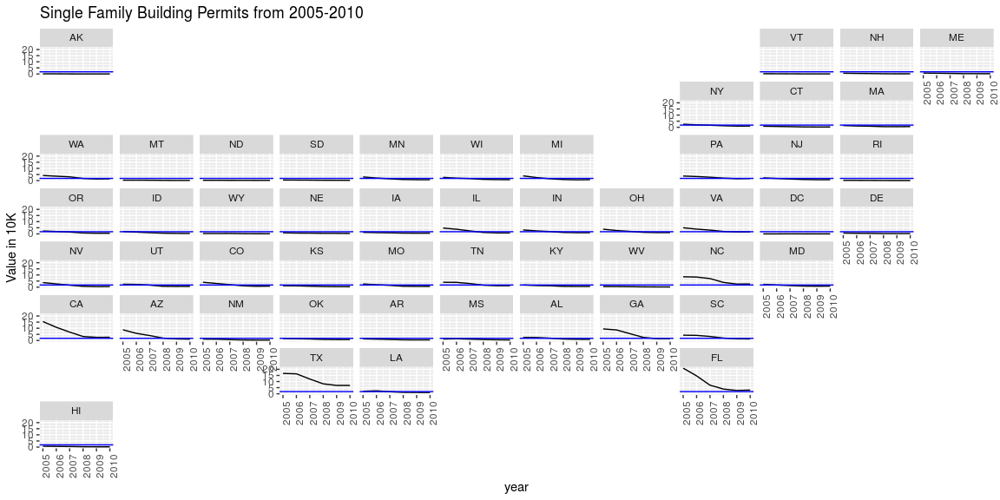

```r
# filtered Alaska an Hawaii
perm <- permits
# excluded Alaska, American Samoa, Guam, Puerto Rico, Hawaii
states <-us_states(map_date = NULL, states = c("Alabama", "Alaska", "Arizona", "Arkansas", "California", "Colorado", "Connecticut", "Delaware", "District of Columbia", "Florida", "Georgia", "Hawaii", "Idaho", "Illinois", "Indiana", "Iowa", "Kansas", "Kentucky", "Louisiana", "Maine", "Maryland", "Massachusetts", "Michigan", "Minnesota", "Minor Outlying Islands", "Mississippi", "Missouri", "Montana", "Nebraska", "Nevada", "New Hampshire", "New Jersey", "New Mexico", "New York", "North Carolina", "North Dakota", "Northern Mariana Islands", "Ohio", "Oklahoma", "Oregon", "Pennsylvania", "Rhode Island", "South Carolina", "South Dakota", "Tennessee", "Texas", "U.S. Virgin Islands", "Utah", "Vermont", "Virginia", "Washington", "West Virginia", "Wisconsin", "Wyoming"))
```

## Background

You have been asked to support a story for the local paper (that has a web presence) that looks back on the housing collapse and the early effects of residential construction. You have data on residential building permits from 1980 through 2010 for each county in the United States. Your colleague that is writing the article would like a few maps and graphics that highlight the single family building permit patterns across your state as well as the patterns in the US.

Remember the big story is the collapse of new building permits at the initial stages of the mortgage crisis (https://en.wikipedia.org/wiki/Subprime_mortgage_crisis). Make sure your graphics highlight the collapse in a clear and honest manner.
      
## Data Wrangling


```r
#narrow single family and years 2007 and after of the mortgage crisis
#setdiff(perm$StateAbbr,states$stusps)
perm <- filter(perm, variable == "Single Family" & year > 2004)
#perm <- pivot_wider(perm, names_from = year, values_from = value)
perm_state <- perm %>% group_by(StateAbbr, year) %>%
  summarise(sum(value))
#tidy colnames 
colnames(states)[5] = "StateAbbr"
colnames(perm_state)[3] = "value"

#join
general <- inner_join(states, perm_state, by = c("StateAbbr"))
```

## Data Visualization


```r
# Use this R-Chunk to plot & visualize your data!
ggplot(data = general, aes(year, value/10000)) + geom_line() +geom_hline(yintercept = mean(general$value/10000), color = "blue") + facet_geo(~ StateAbbr, grid = "us_state_grid2") + theme(axis.text.x = element_text(angle = 90, hjust = 1)) + labs(title = "Single Family Building Permits from 2005-2010", y = "Value in 10K")
```

<!-- -->

## Conclusions

We can observe that there was clearly a crisis during the 2007 which started as early as the 2005, there are states where this was more notorious like Florida, California, Arizona, North Carolina, and Texas.
