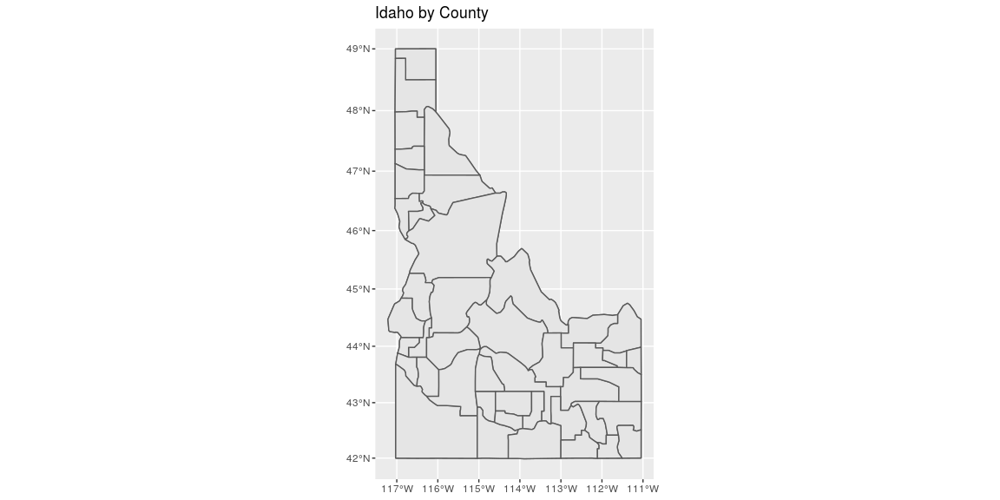
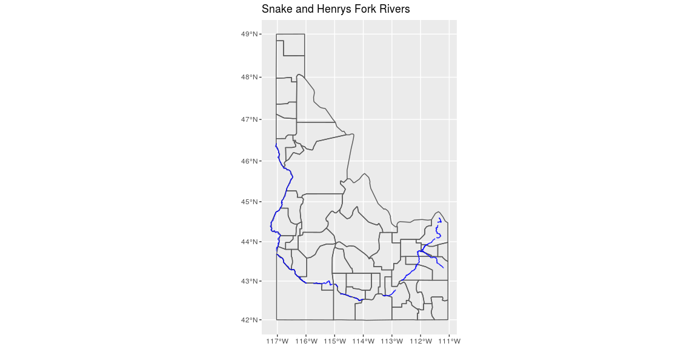
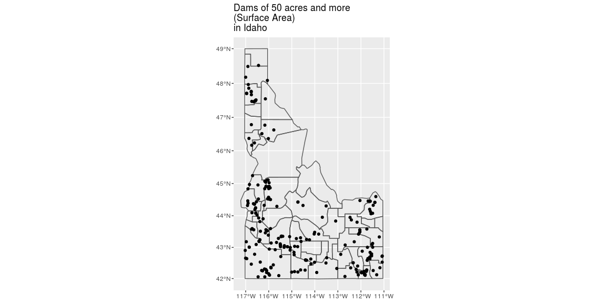
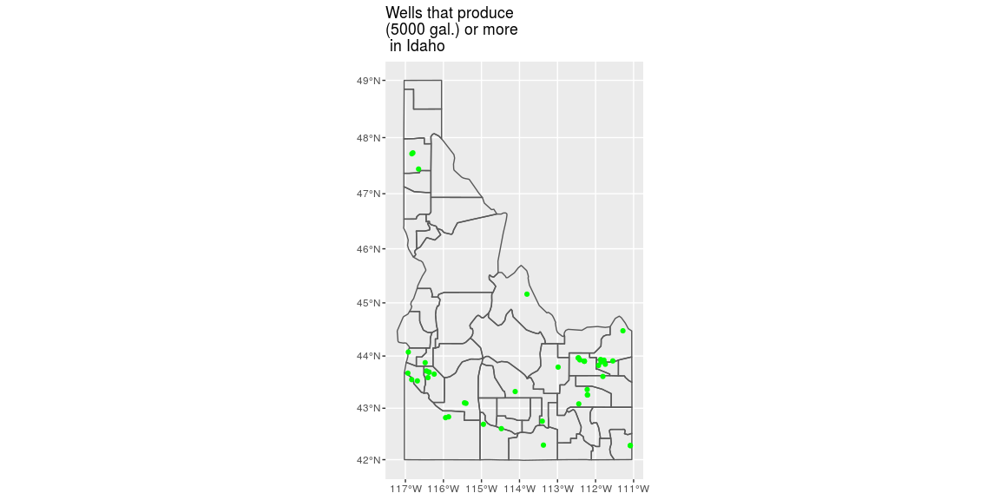
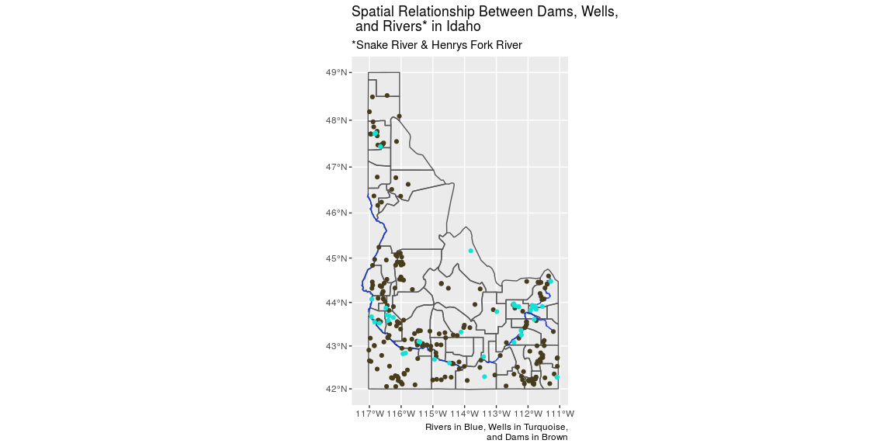

```r
# first shp for the whole map of the us
tmp <- tempfile(fileext = ".zip")
download(url = "https://byuistats.github.io/M335/data/shp.zip", destfile = tmp, mode="wb")
unzip(as.character(tmp), list = TRUE)
```

```
##                             Name  Length                Date
## 1 County-AK-HI-Moved-USA-Map.dbf 1648348 2018-04-20 13:03:00
## 2 County-AK-HI-Moved-USA-Map.prj     425 2018-04-20 13:03:00
## 3 County-AK-HI-Moved-USA-Map.qpj     579 2018-04-20 13:03:00
## 4 County-AK-HI-Moved-USA-Map.shp 1022864 2018-04-20 13:03:00
## 5 County-AK-HI-Moved-USA-Map.shx   25020 2018-04-20 13:03:00
```

```r
unzip(as.character(tmp))
states <- st_read("County-AK-HI-Moved-USA-Map.shp")
```

```
## Reading layer `County-AK-HI-Moved-USA-Map' from data source `/cloud/project/County-AK-HI-Moved-USA-Map.shp' using driver `ESRI Shapefile'
## Simple feature collection with 3115 features and 15 fields
## geometry type:  MULTIPOLYGON
## dimension:      XY
## bbox:           xmin: -2573301 ymin: -1889441 xmax: 2256474 ymax: 1565782
## proj4string:    +proj=aea +lat_1=29.5 +lat_2=45.5 +lat_0=37.5 +lon_0=-96 +x_0=0 +y_0=0 +datum=NAD83 +units=m +no_defs
```

```r
unlink(tmp)

# water map
tmp2 <- tempfile(fileext = ".zip")
download(url = "https://research.idwr.idaho.gov/gis/Spatial/Hydrography/streams_lakes/c_250k/hyd250.zip", destfile = tmp2, mode="wb")
unzip(as.character(tmp2), list = TRUE)
```

```
##             Name   Length                Date
## 1     hyd250.shx   240500 2011-12-19 13:36:00
## 2     hyd250.dbf 10818866 2011-12-19 13:36:00
## 3     hyd250.prj      429 2010-02-18 10:40:00
## 4     hyd250.sbn   289884 2004-02-10 10:50:00
## 5     hyd250.sbx    16732 2004-02-10 10:50:00
## 6     hyd250.shp 12615060 2011-12-19 13:36:00
## 7 hyd250.shp.xml   165016 2014-04-03 12:49:00
```

```r
unzip(as.character(tmp2))
water <- st_read("hyd250.shp")
```

```
## Reading layer `hyd250' from data source `/cloud/project/hyd250.shp' using driver `ESRI Shapefile'
## Simple feature collection with 30050 features and 26 fields
## geometry type:  LINESTRING
## dimension:      XY
## bbox:           xmin: 2241685 ymin: 1198722 xmax: 2743850 ymax: 1981814
## proj4string:    +proj=tmerc +lat_0=42 +lon_0=-114 +k=0.9996 +x_0=2500000 +y_0=1200000 +datum=NAD83 +units=m +no_defs
```

```r
unlink(tmp2)

# well
tmp3 <- tempfile(fileext = ".zip")
download(url = "https://opendata.arcgis.com/datasets/1abb666937894ae4a87afe9655d2ff83_1.zip", destfile = tmp3, mode="wb")
unzip(as.character(tmp3), list = TRUE)
```

```
##        Name    Length                Date
## 1 Wells.shp   5131688 2020-07-15 23:12:00
## 2 Wells.cpg         5 2020-07-15 23:12:00
## 3 Wells.xml     17495 2020-07-15 23:12:00
## 4 Wells.shx   1466268 2020-07-15 23:12:00
## 5 Wells.prj       143 2020-07-15 23:12:00
## 6 Wells.dbf 117661072 2020-07-15 23:12:00
```

```r
unzip(as.character(tmp3))
well <- st_read("Wells.shp")
```

```
## Reading layer `Wells' from data source `/cloud/project/Wells.shp' using driver `ESRI Shapefile'
## Simple feature collection with 183271 features and 33 fields
## geometry type:  POINT
## dimension:      XY
## bbox:           xmin: -117.3642 ymin: 41.02696 xmax: -111.0131 ymax: 49.00021
## CRS:            4326
```

```r
unlink(tmp3)

# water
tmp4 <- tempfile(fileext = ".zip")
download(url = "https://data-idwr.opendata.arcgis.com/datasets/e163d7da3b84410ab94700a92b7735ce_0.zip", destfile = tmp4, mode="wb")
unzip(as.character(tmp4), list = TRUE)
```

```
##                Name Length                Date
## 1 Dams_of_Idaho.prj    143 2020-07-15 23:07:00
## 2 Dams_of_Idaho.cpg      5 2020-07-15 23:07:00
## 3 Dams_of_Idaho.shx   9412 2020-07-15 23:07:00
## 4 Dams_of_Idaho.xml  16684 2020-07-15 23:07:00
## 5 Dams_of_Idaho.dbf 429122 2020-07-15 23:07:00
## 6 Dams_of_Idaho.shp  32692 2020-07-15 23:07:00
```

```r
unzip(as.character(tmp4))
dam <- st_read("Dams_of_Idaho.shp")
```

```
## Reading layer `Dams_of_Idaho' from data source `/cloud/project/Dams_of_Idaho.shp' using driver `ESRI Shapefile'
## Simple feature collection with 1164 features and 23 fields
## geometry type:  POINT
## dimension:      XY
## bbox:           xmin: -117.0866 ymin: 42.00059 xmax: -111.0725 ymax: 48.95204
## CRS:            4326
```

```r
unlink(tmp4)
```

## Background

We have been asked by the state of Idaho to visualize permitted well locations with a production of more than 5000 gallons and the spatial relationship of the large wells to the locations of large dams (surface area larger than 50 acres). They have provided a a shp file (https://byuistats.github.io/M335/data/shp.zip) for us and given us a web address for the well (https://data-idwr.opendata.arcgis.com/datasets/1abb666937894ae4a87afe9655d2ff83_1.zip), dam (https://data-idwr.opendata.arcgis.com/datasets/e163d7da3b84410ab94700a92b7735ce_0.zip), and water (https://research.idwr.idaho.gov/gis/Spatial/Hydrography/streams_lakes/c_250k/hyd250.zip) locations. They would like to have the Snake River and Henrys Fork rivers plotted.

Their US map is projected to show the entire US. You will need to subset the data to Idaho and then reproject the map, so Idaho is not tilted.

## Notes

-Using st_read
--nc <- st_read(fname)
--st_read("PG:dbname=postgis", "sids")
--st_read(fname, stringsAsFactors = FALSE)
--options(stringsAsFactors = FALSE)
--st_read(fname)

-Using st_write
--st_write(nc, "nc1.shp")
--st_write(nc, dsn = "nc1.shp", layer = "nc.shp", driver = "ESRI Shapefile")

-Dataset and layer reading or creation options
--st_write(st_as_sf(meuse), "PG:dbname=postgis", "meuse",
--layer_options = "OVERWRITE=true")

-Reading and writing directly to and from spatial databases
--"library(RPostgreSQL)
conn = dbConnect(PostgreSQL(), dbname = "postgis")
meuse = st_read(conn, "meuse")
meuse_1_3 = st_read(conn, query = "select * from meuse limit 3;")
dbDisconnect(conn)"
--"conn = dbConnect(PostgreSQL(), dbname = "postgis")
st_write(conn, meuse, drop = TRUE)
dbDisconnect(conn)"

-Conversion to other formats: WKT, WKB, sp
--"st_point(c(0,1))
--## POINT (0 1)
--st_linestring(matrix(0:9,ncol=2,byrow=TRUE))
--## LINESTRING (0 1, 2 3, 4 5, 6 7, 8 9)"

-We can create these well-known text strings explicitly using st_as_text:
      x = st_linestring(matrix(0:9,ncol=2,byrow=TRUE))
      str = st_as_text(x)
      x
      LINESTRING (0 1, 2 3, 4 5, 6 7, 8 9)

----------COORDINATE SYSTEMS---------------
-A coordinate system definition can be passed to a spatial object. It can either fill a spatial object’s empty CS definition or it can overwrite and existing definition (the latter should only be executed if there is good reason to believe that the original definition is erroneous)

-We’ll pretend that a CS definition was not assigned to s.sf and assign one manually using the st_set_crs() function.

    s.sf <- st_set_crs(s.sf, "+proj=utm +zone=19 +ellps=GRS80 +datum=NAD83") 
-To do the same with a raster object simply assign the PROJ4 string to the crs() function as follows (here too we’ll assume that the spatial object had a missing reference system or an incorrectly defined one).

    crs(elev.r) <- "+proj=utm +zone=19 +ellps=GRS80 +datum=NAD83"

-Transforming coordinate systems

-to transform the s.sf vector object to a geographic (lat/long) coordinate system, we’ll use sf’s st_transform function.

    s.sf.gcs <- st_transform(s.sf, "+proj=longlat +datum=WGS84")
    st_crs(s.sf.gcs)
    
-A geographic coordinate system is often desired when overlapping a web based mapping service such as Google, Bing or OpenStreetMap. To check that s.sf.gcs was properly transformed, we’ll overlay it on top of an OpenStreetMap using the leaflet package.
    
    library(leaflet)
    leaflet(s.sf.gcs) %>% 
      addPolygons() %>% 
      addTiles()
      
      
## Data Wrangling


```r
#narrow just to Idaho
idaho <- filter(states, StateName == "Idaho")
#flip the tilted initial layout
idaho <- st_transform(idaho, "+proj=merc +lon_0=0 +k=1 +x_0=0 +y_0=0 +ellps=WGS84 +datum=WGS84 +units=m +no_defs")
# narrow water to only 2 rivers
rivers <- filter(water, FEAT_NAME == "Snake River" | FEAT_NAME == "Henrys Fork")
#re-project rivers
rivers <- st_transform(rivers, "+proj=merc +lon_0=0 +k=1 +x_0=0 +y_0=0 +ellps=WGS84 +datum=WGS84 +units=m +no_defs")

#filter large wells
summary(well$Production)
```

```
##     Min.  1st Qu.   Median     Mean  3rd Qu.     Max.     NA's 
##     0.00     0.00    15.00    62.61    35.00 40000.00    41987
```

```r
well <- filter(well, Production >= 5000)

#filter large dams
summary(dam$SurfaceAre)
```

```
##     Min.  1st Qu.   Median     Mean  3rd Qu.     Max.     NA's 
##     0.00     0.75     4.00   648.40    32.00 94600.00       27
```

```r
dam <- filter(dam, SurfaceAre >= 50)
```

## Data Visualization


```r
# Use this R-Chunk to plot & visualize your data!
ggplot(data = idaho) + geom_sf(fill = NA)+ geom_sf(data = idaho) + labs(title = "Idaho by County")
```

<!-- -->

```r
ggplot(data = idaho) + geom_sf(fill = NA) + geom_sf(data = rivers, color = "blue") + labs(title = "Snake and Henrys Fork Rivers")
```

<!-- -->

```r
ggplot(data = idaho) + geom_sf(fill = NA)+ geom_sf(data = dam, color = "black") + labs(title = "Dams of 50 acres and more \n(Surface Area)\nin Idaho")
```

<!-- -->

```r
ggplot(data = idaho) + geom_sf(fill = NA)+ geom_sf(data = well, color = "green") + labs(title = "Wells that produce \n(5000 gal.) or more \n in Idaho")
```

<!-- -->

```r
#general plot
ggplot(data = idaho) + geom_sf(fill = NA) + geom_sf(data = rivers, colour = "#0b2fd3") + geom_sf(data = dam, colour = "#473c1c") + geom_sf(data = well, colour = "#14e1d5") + labs(title = "Spatial Relationship Between Dams, Wells,\n and Rivers* in Idaho", subtitle = "*Snake River & Henrys Fork River", caption = "Rivers in Blue, Wells in Turquoise,\nand Dams in Brown")
```

<!-- -->

## Conclusions

We can observe the agglomeration of big wells close to the Snake and Henrys Fork Rivers
